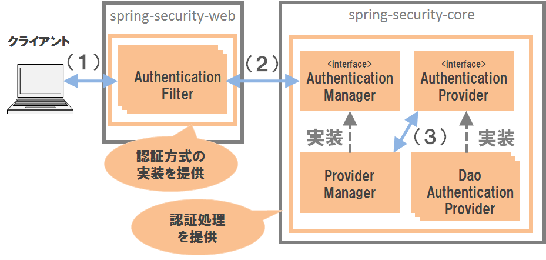
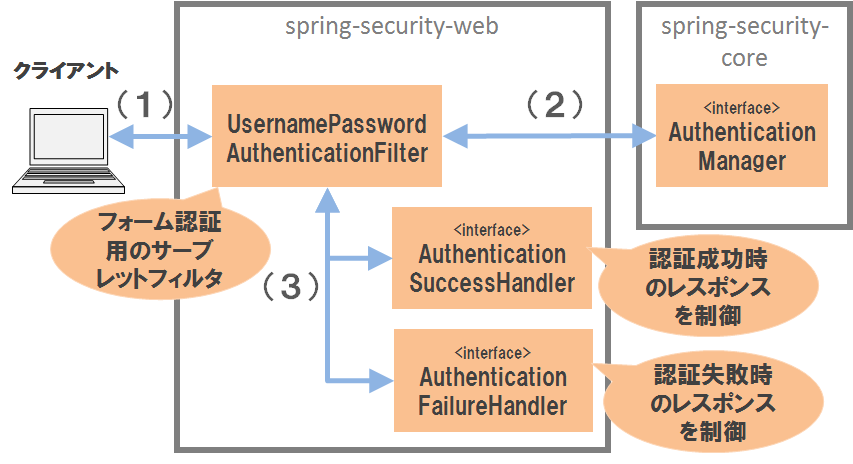
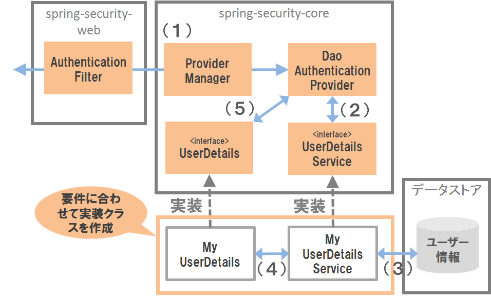
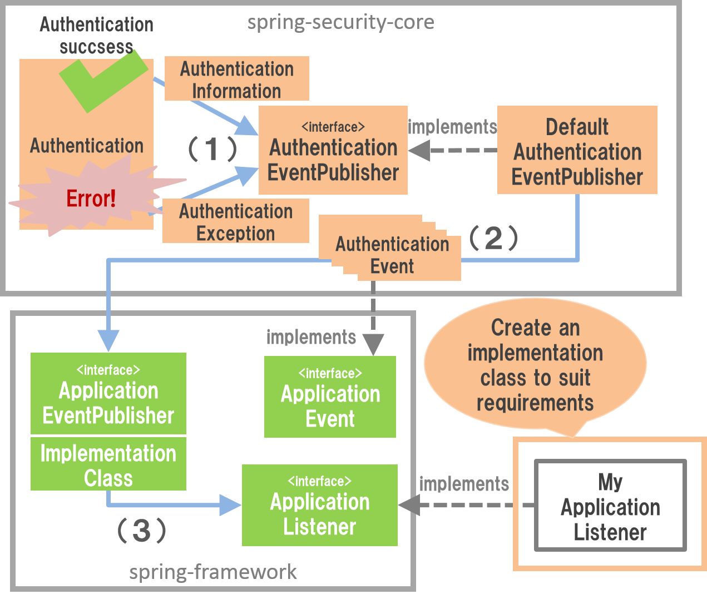
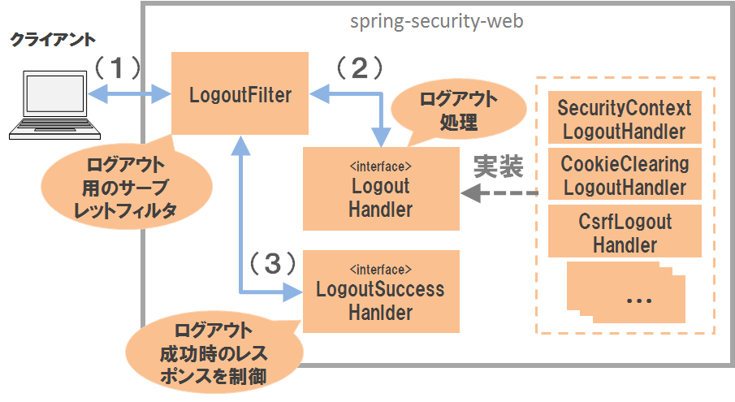

.. _SpringSecurityAuthentication:

認証
================================================================================

.. only:: html

 .. contents:: 目次
    :local:

.. _SpringSecurityAuthenticationOverview:

Overview
--------------------------------------------------------------------------------
本節では、Spring Securityで提供している認証機能について説明する。

認証処理とは、アプリケーションを利用するユーザーの正当性を確認するための処理である。

ユーザーの正当性を確認するためのもっとも標準的な方法は、アプリケーションを
使用できるユーザーをデータストアに登録しておき、利用者が入力した
認証情報（ユーザー名とパスワードなど）と照合する方法である。
ユーザーの情報を登録しておくデータストアには、リレーショナルデータベースを利用する
のが一般的だが、ディレクトリサービスや外部システムなどを利用するケースもある。

また、利用者に認証情報を入力してもらう方式もいくつか存在する。
HTMLの入力フォームを使う方式やRFCで定められているHTTP標準の認証方式
(Basic認証やDigest認証など)を利用のが一般的だが、OpenID認証やシングルサインオン認証
などの認証方式を利用するケースもある。

本節では、HTMLの入力フォームで入力した認証情報とリレーショナルデータベースに
格納されているユーザー情報を照合して認証処理を行う実装例を紹介しながら、
Spring Securityの認証機能の使い方を説明する。

|

認証処理
^^^^^^^^^^^^^^^^^^^^^^^^^^^^^^^^^^^^^^^^^^^^^^^^^^^^^^^^^^^^^^^^^^^^^^^^^^^^^^^^

Spring Securityは、以下のような流れで認証処理を行う。

    **認証機能のアーキテクチャ**

.. tabularcolumns:: |p{0.10\linewidth}|p{0.90\linewidth}|
.. list-table::
    :header-rows: 1
    :widths: 10 90

    * - 項番
      - 説明
    * - | (1)
      - | クライアントは、認証処理を行うパスに対して資格情報（ユーザー名とパスワード）を指定してリクエストを送信する。
    * - | (2)
      - | Authentication Filterは、リクエストから資格情報を取得して、\ ``AuthenticationManager``\ クラスの認証処理を呼び出す。
    * - | (3)
      - | \ ``ProviderManager``\ (デフォルトで使用される\ ``AuthenticationManager``\ の実装クラス)は、実際の認証処理を\ ``AuthenticationProvider``\ インタフェースの実装クラスに委譲する。

|

.. _SpringSecurityAuthenticationFilter:

Authentication Filter
""""""""""""""""""""""""""""""""""""""""""""""""""""""""""""""""""""""""""""""""

Authentication Filterは、認証方式に対する実装を提供するサーブレットフィルタである。
Spring Securityがサポートしている主な認証方式は以下の通り。

.. tabularcolumns:: |p{0.25\linewidth}|p{0.75\linewidth}|
.. list-table:: **Spring Securityが提供している主なAuthentication Filter**
    :header-rows: 1
    :widths: 25 75

    * - クラス名
      - 説明
    * - | \ ``UsernamePasswordAuthenticationFilter``\
      - | フォーム認証用のサーブレットフィルタクラスで、HTTPリクエストのパラメータから資格情報を取得する。
    * - | \ ``BasicAuthenticationFilter``\
      - | Basic認証用のサーブレットフィルタクラスで、HTTPリクエストの認証ヘッダから資格情報を取得する。
    * - | \ ``DigestAuthenticationFilter``\
      - | Digest認証用のサーブレットフィルタクラスで、HTTPリクエストの認証ヘッダから資格情報を取得する。
    * - | \ ``RememberMeAuthenticationFilter``\
      - | Remember Me認証用のサーブレットフィルタクラスで、HTTPリクエストのCookieから資格情報を取得する。
        | Remember Me認証を有効にすると、ブラウザを閉じたりセッションタイムアウトが発生しても、ログイン状態を保つことができる。

Spring Securityによってサポートされていない認証方式を実現する必要がある場合は、
認証方式を実現するための\ ``Authentication Filter``\ を作成し、Spring Securityに組み込むことで
実現することが可能である。

|

\ ``AuthenticationManager``\
""""""""""""""""""""""""""""""""""""""""""""""""""""""""""""""""""""""""""""""""

\ ``AuthenticationManager``\ は、認証処理を実行するためのインタフェースである。
Spring Securityが提供するデフォルト実装(\ ``ProviderManager``\ )では、
実際の認証処理は\ ``AuthenticationProvider``\ に委譲し、\ ``AuthenticationProvider``\
で行われた認証処理の処理結果をハンドリングする仕組みになっている。

|

\ ``AuthenticationProvider``\
""""""""""""""""""""""""""""""""""""""""""""""""""""""""""""""""""""""""""""""""

\ ``AuthenticationProvider``\ は、認証処理の実装を提供するためのインタフェースである。
Spring Securityが提供している主な\ ``AuthenticationProvider``\の実装クラスは以下の通り。

.. tabularcolumns:: |p{0.25\linewidth}|p{0.75\linewidth}|
.. list-table:: **Spring Securityが提供している主なAuthenticationProvider**
    :header-rows: 1
    :widths: 25 75

    * - クラス名
      - 説明
    * - | \ ``DaoAuthenticationProvider``\
      - | データストアに登録しているユーザーの資格情報とユーザーの状態をチェックして認証処理を行う実装クラス。
        | チェックで必要となる資格情報とユーザーの状態は\ ``UserDetails``\ というインタフェースを実装しているクラスから取得する。

Spring Securityが提供していない認証処理を実現する必要がある場合は、
認証処理を実現するための\ ``AuthenticationProvider``\を作成し、Spring Securityに
組み込むことで実現することが可能である。

|

.. _howtouse_springsecurity:

How to use
--------------------------------------------------------------------------------

認証機能を使用するために必要となるbean定義例や実装方法について説明する。
基本設定については、:ref:`SpringSecurityOverview`\ を参照されたい。

本項では :ref:`SpringSecurityAuthenticationOverview`\ で説明したとおり、
HTMLの入力フォームで入力した認証情報とリレーショナルデータベースに
格納されているユーザー情報を照合して認証処理を行う方法について説明する。

.. _form-login:

フォーム認証
^^^^^^^^^^^^^^^^^^^^^^^^^^^^^^^^^^^^^^^^^^^^^^^^^^^^^^^^^^^^^^^^^^^^^^^^^^^^^^^^

Spring Securityは、以下のような流れでフォーム認証を行う。

    **フォーム認証の仕組み**

.. tabularcolumns:: |p{0.10\linewidth}|p{0.90\linewidth}|
.. list-table::
    :header-rows: 1
    :widths: 10 90

    * - 項番
      - 説明
    * - | (1)
      - | クライアントは、フォーム認証を行うパスに対して資格情報（ユーザー名とパスワード）をリクエストパラメータとして送信する。
    * - | (2)
      - | \ ``UsernamePasswordAuthenticationFilter``\ クラスは、リクエストパラメータから資格情報を取得して、\ ``AuthenticationManager``\ の認証処理を呼び出す。
    * - | (3)
      - | \ ``UsernamePasswordAuthenticationFilter``\ クラスは、\ ``AuthenticationManager``\ から
        | から返却された認証結果をハンドリングする。
        | 認証処理が成功した場合は \ ``AuthenticationSuccessHandler``\ のメソッドを、認証処理が失敗した場合は\ ``AuthenticationFailureHandler``\ のメソッドを呼び出し画面遷移を行う。

|

.. _form-login-usage:

フォーム認証の使用
""""""""""""""""""""""""""""""""""""""""""""""""""""""""""""""""""""""""""""""""

フォーム認証を使用する場合は、以下のようなbean定義を行う。

* \ ``spring-security.xml``\ の定義例

.. code-block:: xml

    <sec:http>
        <sec:form-login />    <!-- (1) -->
        <!-- omitted -->
    </sec:http>

.. tabularcolumns:: |p{0.10\linewidth}|p{0.90\linewidth}|
.. list-table::
   :header-rows: 1
   :widths: 10 90

   * - 項番
     - 説明
   * - | (1)
     - | \ ``<form-login>``\ 要素を定義することで、フォーム認証が有効になる。
       | 項番(1)の設定のみでもフォーム認証のデフォルト機能は有効となるが、より詳細な設定を行うため、本要素を定義する。

.. note:: **auto-configについて**

  \ ``<sec:http>``\ では、デフォルトで \ ``auto-config="false"``\ となっている。
  \ ``auto-config="true"``\ で有効となる \ ``<form-login>``\ 、\ ``<http-basic>``\ 、\ ``<logout>``\ 要素について説明する。

    .. tabularcolumns:: |p{0.15\linewidth}|p{0.85\linewidth}|
    .. list-table::
       :header-rows: 1
       :widths: 15 85

       * - 要素名
         - 説明
       * - | ``<form-login>``\ 
         - | ``org.springframework.security.web.authentication.UsernamePasswordAuthenticationFilter``\ が有効になる。
           | \ ``UsernamePasswordAuthenticationFilter``\ は、ユーザー名とパスワードをリクエストパラメータから取り出して認証処理を行うServletFilterである。
           | ``auto-config="true"``\ の設定のみでも、Spring Securityのデフォルトのフォーム認証は利用可能である。
       * - | \ ``<http-basic>``\ 
         - | \ ``org.springframework.security.web.authentication.www.BasicAuthenticationFilter``\ が有効になる。
           | \ ``BasicAuthenticationFilter``\ は、RFC1945に準拠したBasic認証を行うServletFilterである。
           | 詳細な利用方法は、\ `BasicAuthenticationFilterのJavaDoc <http://docs.spring.io/spring-security/site/docs/4.0.3.RELEASE/apidocs/org/springframework/security/web/authentication/www/BasicAuthenticationFilter.html>`_\ を参照されたい。
       * - | \ ``<logout>``\ 
         - | \ ``org.springframework.security.web.authentication.logout.LogoutFilter``\ ,
           | \ ``org.springframework.security.web.authentication.logout.SecurityContextLogoutHandler``\ が有効になる。
           | \ ``LogoutFilter``\ は、ログアウト処理を行うServletFilterである。
           | \ ``SecurityContextLogoutHandler``\ (セッションの無効化)や、
           | \ ``org.springframework.security.web.authentication.rememberme.TokenBasedRememberMeServices``\ (Cookieの削除)などを呼び出している。
           | 詳細は、\ :ref:`SpringSecurityAuthenticationLogout`\ を参照されたい。

.. _form-login-default-operation:

デフォルトの動作
""""""""""""""""""""""""""""""""""""""""""""""""""""""""""""""""""""""""""""""""

Spring Securityのデフォルトの動作では、\ ``"/login"``\ に対してGETメソッドでアクセス
するとSpring Securityが用意しているデフォルトのログインフォームが表示され、
ログインボタンを押下すると\ ``"/login"``\ に対してPOSTメソッドでアクセスして認証処理を行う。

|

.. _SpringSecurityAuthenticationLoginForm:

ログインフォームの作成
""""""""""""""""""""""""""""""""""""""""""""""""""""""""""""""""""""""""""""""""
Spring Securityは、フォーム認証用のログインフォームをデフォルトで提供しているが、
そのまま利用するケースは少ない。
ここでは、自身で作成したログインフォームをSpring Securityに適用する方法を説明する。

まず、ログインフォームを表示するためのJSPを作成する。
ここでは、Spring MVCを使用し、loginフォルダ(\ ``/src/main/webapp/WEB-INF/views/login``\ )にJSPを配置する前提で以降の説明を行う。

* ログインフォームを表示するためのJSPの作成例(\ ``loginForm.jsp``\ )

.. code-block:: jsp

    <%@ page contentType="text/html;charset=UTF-8" pageEncoding="UTF-8" %>
    <%@ taglib prefix="c" uri="http://java.sun.com/jsp/jstl/core" %>
    <%@ taglib prefix="sec" uri="http://www.springframework.org/security/tags" %>
    <%-- omitted --%>
    

        <h3>ログインフォーム</h3>
        <%-- (1) --%>
        <c:if test="${param.error}"><!-- (1) -->
            <t:messagesPanel
                messagesAttributeName="SPRING_SECURITY_LAST_EXCEPTION"/><!-- (2) -->
        </c:if>
        <form action="<c:url value='/login' />" method="post"> <%-- (3) --%>
            <table>
                <tr>
                    <td><label for="username">ユーザー名</label></td>
                    <td><input type="text" id="username" name="username"></td>
                </tr>
                <tr>
                    <td><label for="password">パスワード</label></td>
                    <td><input type="password" id="password" name="password"></td>
                </tr>
                <tr>
                    <td>&nbsp;</td>
                    <td><button>ログイン</button></td>
                </tr>
            </table>
            <sec:csrfInput /> <%-- (4) --%>
        </form>
    

    <%-- omitted --%>

.. tabularcolumns:: |p{0.10\linewidth}|p{0.90\linewidth}|
.. list-table::
    :header-rows: 1
    :widths: 10 90

    * - 項番
      - 説明
    * - | (1)
      - | 認証エラーを表示するためのエリア。
        | 認証エラーが発生した場合は、セッション又はリクエストスコープに\ ``"SPRING_SECURITY_LAST_EXCEPTION"``\ という属性名で例外オブジェクトが格納される。
        | ここではリクエストパラメータに設定されたエラーメッセージ出力の判定を行っている。
    * - | (2)
      - | 認証エラー時に出力させる例外メッセージを出力する。
        | 共通ライブラリで提供している\ ``org.terasoluna.gfw.web.message.MessagesPanelTag``\ を指定して出力させることを推奨する。
        | 「\ ``<t:messagesPanel>``\ 」タグの使用方法は、\ :doc:`../ArchitectureInDetail/MessageManagement`\ を参照されたい。
    * - | (3)
      - | ユーザー名とパスワードを入力するためのログインフォーム。
        | ここではユーザー名を\ ``username``\、パスワードを\ ``passowrd``\ というリクエストパラメータで送信する。
    * - | (4)
      - | CSRF対策用のトークン値をリクエストパラメータ。
        | \ ``<sec:csrfInput />``\ については、「:ref:`SpringSecurityCsrf`」で説明する。

.. note:: **静的リソースへのアクセス**

    JSPでCSS等の静的リソースを使用している場合は、それらを格納するフォルダにアクセス権を付与する必要がある。
    詳細は、:ref:`SpringSecurityAutorizationNoAutorizationUrl` を参照されたい。 

作成したログインフォームをSpring Securityに適用する場合は、以下のようなbean定義をう。

* \ ``spring-security.xml``\ の定義例

.. code-block:: xml

    <sec:http>
      <sec:form-login 
          login-page="/login/loginForm"
          login-processing-url="/login" 
          authentication-failure-url="/login/loginForm?error" /> <!-- (1)(2)(3) 左記以外の属性は省略 -->
      <sec:intercept-url pattern="/login/**" access="permitAll"/>  <!-- (4) -->
      <sec:intercept-url pattern="/**" access="isAuthenticated()"/> <!-- (5) -->
    </sec:http>

.. tabularcolumns:: |p{0.10\linewidth}|p{0.90\linewidth}|
.. list-table::
    :header-rows: 1
    :widths: 10 90

    * - 項番
      - 説明
    * - | (1)
      - | \ ``loginPage``\ 属性を指定し、ログインフォームを表示するためのパスを指定する。
        | 匿名ユーザーが認証を必要とするリソースにアクセスした場合は、ここに指定したパスにリダイレクトしてログインフォームを表示する。
        | ここでは、Spring MVCでリクエストを受けてログインフォームを表示している。
        | 詳細は 「:ref:`spring-security-authentication-mvc`」を参照されたい。
    * - | (2)
      - | \ ``loginProcessingUrl``\ 属性を指定し、認証処理を行うためのパスを指定する。
        | デフォルトのパスも\ ``"/login"``\ であるが、ここでは明示的に指定することとする。
    * - | (3)
      - | \ ``authentication-failure-url``\ 属性をに認証失敗時に遷移するパスを指定する。
    * - | (4)
      - | ログインフォームが格納されている\ ``/login``\ パス配下に対し、すべてのユーザーがアクセスできる権限を付与する。
        | 詳細は\ :ref:`SpringSecurityAuthorization`\ を参照すること。
    * - | (5)
      - | アプリケーションで扱うWebリソースに対してアクセス権を付与する。本指定では、ルートパスの配下に対して、認証済みユーザーのみがアクセスできる権限を付与している。
        | 詳細は\ :ref:`SpringSecurityAuthorization`\ を参照すること。
 
|

.. _SpringSecurityAuthenticationScreenFlowOnSuccess:

認証成功時のレスポンス
^^^^^^^^^^^^^^^^^^^^^^^^^^^^^^^^^^^^^^^^^^^^^^^^^^^^^^^^^^^^^^^^^^^^^^^^^^^^^^^^

Spring Securityは、認証成功時のレスポンスを制御するためのコンポーネントとして、
\ ``AuthenticationSuccessHandler``\ というインタフェースと実装クラスを提供している。

.. tabularcolumns:: |p{0.35\linewidth}|p{0.65\linewidth}|
.. list-table:: **AuthenticationSuccessHandlerの実装クラス**
    :header-rows: 1
    :widths: 35 65

    * - 実装クラス
      - 説明
    * - | \ ``SavedRequestAwareAuthenticationSuccessHandler``\
      - | 認証前にアクセスを試みたURLにリダイレクトを行う実装クラス。
        | **デフォルトで使用される実装クラス。**
    * - | \ ``SimpleUrlAuthenticationSuccessHandler``\
      - | \ ``defaultTargetUrl``\ にリダイレクト又はフォワードを行う実装クラス。

デフォルトの動作
""""""""""""""""""""""""""""""""""""""""""""""""""""""""""""""""""""""""""""""""

Spring Securityのデフォルトの動作では、認証前にアクセスを拒否したリクエストをHTTP
セッションに保存しておいて、認証が成功した際にアクセスを拒否したリクエストを復元して
リダイレクトする。
認証したユーザーにリダイレクト先へのアクセス権があればページが表示され、アクセス権が
なければ認可エラーとなる。
この動作を実現するために使用されるのが、\ ``SavedRequestAwareAuthenticationSuccessHandler``\
クラスである。

ログインフォームを明示的に表示してから認証処理を行った後の遷移先はSpring Securityのデフォルトの
設定では、Webアプリケーションのルートパス(\ ``"/"``\ )となっているため、認証成功時は、
Webアプリケーションのルートパスにリダイレクトされる。

|

.. _SpringSecurityAuthenticationScreenFlowOnFailure:

認証失敗時のレスポンス
^^^^^^^^^^^^^^^^^^^^^^^^^^^^^^^^^^^^^^^^^^^^^^^^^^^^^^^^^^^^^^^^^^^^^^^^^^^^^^^^

Spring Securityは、認証失敗時のレスポンスを制御するためのコンポーネントとして、
\ ``AuthenticationFailureHandler``\ というインタフェースと実装クラスを提供している。

.. tabularcolumns:: |p{0.35\linewidth}|p{0.65\linewidth}|
.. list-table:: **AuthenticationFailureHandlerの実装クラス**
    :header-rows: 1
    :widths: 35 65

    * - 実装クラス
      - 説明
    * - | \ ``SimpleUrlAuthenticationFailureHandler``\
      - | \ ``defaultTargetUrl``\ にリダイレクト又はフォワードを行う実装クラス。
        | **デフォルトで使用される実装クラス。**
    * - | \ ``ExceptionMappingAuthenticationFailureHandler``\
      - | 認証例外と遷移先のURLをマッピングすることができる実装クラス。
        | Spring Securityはエラー原因毎に発生する例外クラスが異なるため、この実装クラスを使用するとエラーの種類毎に遷移先を切り替えることが可能である。
    * - | \ ``DelegatingAuthenticationFailureHandler``\
      - | 認証例外と\ ``AuthenticationFailureHandler``\ をマッピングすることができる実装クラス。 
        | \ ``ExceptionMappingAuthenticationFailureHandler``\ と似ているが、認証例外毎に\ ``AuthenticationFailureHandler``\ を指定できるので、より柔軟な振る舞いをサポートすることができる。

デフォルトの動作
""""""""""""""""""""""""""""""""""""""""""""""""""""""""""""""""""""""""""""""""

Spring Securityのデフォルトの動作では、ログインフォームを表示するためのパスに\ ``"error"``\ というクエリパラメータが付与されたURLにリダイレクトする。

例として、ログインフォームを表示するためのパスが\ ``"/login"``\ の場合は
\ ``"/login?error"``\ にリダイレクトされる。
  
.. note:: **ノート** 
    Java Configを使用した場合は上記動作となるが、XMLを使用してBean定義を行うと\ ``"error"``\ パラメータが付与されない。
    Java Configと同じ動作にするためには、\ ``authentication-failure-url``\ 属性に遷移先のパスを明示的に指定する必要がある。
    これはSpring Securityのバグで、4.0.4.RELEASE以降のバージョンで解決される。(執筆時は4.0.3.RELEASE) 

|

DB認証
^^^^^^^^^^^^^^^^^^^^^^^^^^^^^^^^^^^^^^^^^^^^^^^^^^^^^^^^^^^^^^^^^^^^^^^^^^^^^^^^

Spring Securityは、以下のような流れでDB認証を行う。

    **DB認証の仕組み**

.. tabularcolumns:: |p{0.10\linewidth}|p{0.90\linewidth}|
.. list-table::
    :header-rows: 1
    :widths: 10 90

    * - 項番
      - 説明
    * - | (1)
      - | Spring Securityはクライアントからの認証依頼を受け、\ ``DaoAuthenticationProvider``\ の認証処理を呼び出す。
    * - | (2)
      - | \ ``DaoAuthenticationProvider``\ は、\ ``UserDetailsService``\ のユーザー情報取得処理を呼び出す。
    * - | (3)
      - | ``UserDetailsService``\ の実装クラスは、データストアからユーザー情報を取得する。
    * - | (4)
      - | ``UserDetailsService``\ の実装クラスは、データストアから取得したユーザー情報から\ ``UserDetails``\ を生成する。
    * - | (5)
      - | \ ``DaoAuthenticationProvider``\ は、\ ``UserDetailsService``\ から返却された\ ``UserDetails``\ とクライアントが指定した認証情報との照合を行い、クライアントが指定したユーザーの正当性をチェックする。

.. note:: **Spring Securityが提供するDB認証**

    Spring Securityは、ユーザー情報をリレーショナルデータベースからJDBC経由で取得する
    ための実装クラスを提供している。

    * \ ``org.springframework.security.core.userdetails.User``\
    * \ ``org.springframework.security.core.userdetails.jdbc.JdbcDaoImpl``\

    これらの実装クラスは最低限の認証処理(パスワードの照合、有効ユーザーの判定)しか
    行わないため、そのまま利用できるケースは少ない。
    そのため、本ガイドラインでは、\ ``UserDetails``\ と\ ``UserDetailsService``\ の実装クラスを
    作成する方法について説明する。

DBのセットアップ
""""""""""""""""""""""""""""""""""""""""""""""""""""""""""""""""""""""""""""""""

まず、認証処理で必要となるユーザー情報を格納するためのアカウントテーブルを作成する。

* テーブルを作成するDDL文 (H2 Database用)

.. code-block:: sql

    DROP TABLE IF EXISTS t_account;

    CREATE TABLE t_account (
        username VARCHAR(255),
        user_uuid VARCHAR(36) NOT NULL,
        password VARCHAR(60) NOT NULL,
        first_name VARCHAR(255),
        last_name VARCHAR(255),
        enabled BOOLEAN NOT NULL,
        admin BOOLEAN NOT NULL,
        CONSTRAINT pk_t_account PRIMARY KEY (username)
    );

データアクセスクラスの作成
""""""""""""""""""""""""""""""""""""""""""""""""""""""""""""""""""""""""""""""""

\ ``UserDetails``\ と\ ``UserDetailsService``\ インタフェースの実装クラスを作成する
前に、アカウントテーブルからデータを取得するためのクラスを作成する。
データアクセス処理を\ ``UserDetailsService``\ の実装から分離することで、
\ ``UserDetailsService``\ の実装クラスのロジックをシンプルな状態に保ちやすくなる。

ここでは、MyBatis3を使って実装する方法を紹介する。

MyBatis3を使ってアカウントテーブルからデータを取得するために、
アカウントテーブルの１レコードを表現するEntityクラスとEntityクラスのCRUD操作を提供する
Repositoryインタフェースを作成する。
なお、MyBatis3のセットアップ方法や使い方については、「:ref:`DataAccessMyBatis3OverviewAboutMyBatis3`」を
参照されたい。

* Entityクラスの作成例

.. code-block:: java

    public class Account {
        @Id
        private String username;
        private String password;
        private String firstName;
        private String lastName;
        private boolean enabled;
        private boolean admin;
        // omitted setter / getter
    }

* Repositoryインタフェースの作成例

.. code-block:: java

    public interface AccountRepository{

        Account findOneByUsername(String username);

    }

* Accountを1件取得するためのSQL実装するMapperファイルの作成例

.. code-block:: xml

    <?xml version="1.0" encoding="UTF-8"?>
    <!DOCTYPE mapper PUBLIC "-//mybatis.org//DTD Mapper 3.0//EN"
        "http://mybatis.org/dtd/mybatis-3-mapper.dtd">
    <mapper namespace="com.example.security.domain.repository.account.AccountRepository">

        <resultMap id="accountResultMap" type="Account">
            <id property="username" column="username" />
            <result property="password" column="password" />
            <result property="firstName" column="first_name" />
            <result property="lastName" column="last_name" />
            <result property="enabled" column="enabled" />
            <result property="admin" column="admin" />
        </resultMap>

        <select id="findOneByUsername" parameterType="String" resultMap="accountResultMap">
            SELECT
                username,
                password,
                first_name,
                last_name,
                enabled,
                admin
            FROM
                account
            WHERE
                username = #{username}
        </select>
    </mapper>

\ ``UserDetails``\ の作成
""""""""""""""""""""""""""""""""""""""""""""""""""""""""""""""""""""""""""""""""

\ ``UserDetails``\ は、認証処理で必要となる資格情報(ユーザー名とパスワード)とユーザーの
状態を提供するためのインタフェースで、以下のメソッドが定義されている。
\ ``AuthenticationProvider``\ として\ ``DaoAuthenticationProvider``\ を使用する場合は、
アプリケーションの要件に合わせて\ ``UserDetails``\ の実装クラスを作成する。

* \ ``UserDetails``\ インタフェース

.. code-block:: java

    public interface UserDetails extends Serializable {
        String getUsername(); // (1)
        String getPassword(); // (2)
        boolean isEnabled(); // (3)
        boolean isAccountNonLocked(); // (4)
        boolean isAccountNonExpired(); // (5)
        boolean isCredentialsNonExpired(); // (6)
        Collection<? extends GrantedAuthority> getAuthorities(); // (7)
    }

.. tabularcolumns:: |p{0.10\linewidth}|p{0.25\linewidth}|p{0.65\linewidth}|
.. list-table::
    :header-rows: 1
    :widths: 10 25 65

    * - 項番
      - メソッド名
      - 説明
    * - | (1)
      - | \ ``getUsername``\
      - | ユーザー名を返却するメソッド。
    * - | (2)
      - | \ ``getPassword``\
      - | 登録されているパスワードを返却するメソッド。
        | このメソッドで返却したパスワードとクライアントから指定されたパスワードが一致しない場合は、\ ``DaoAuthenticationProvider``\ は\ ``BadCredentialsException``\ を発生させる。
    * - | (3)
      - | \ ``isEnabled``\
      - | 有効なユーザーかを判定するメソッドで、有効な場合は\ ``true``\ を返却する。
        | 無効なユーザーの場合は、\ ``DaoAuthenticationProvider``\ は\ ``DisabledException``\ を発生させる。
    * - | (4)
      - | \ ``isAccountNonLocked``\
      - | アカウントのロック状態を判定するメソッドで、ロックされていない場合は\ ``true``\ を返却する。
        | アカウントがロックされている場合は、\ ``DaoAuthenticationProvider``\ は\ ``LockedException``\ を発生させる。
    * - | (5)
      - | \ ``isAccountNonExpired``\
      - | アカウントの有効期限の状態を判定するメソッドで、有効期限内の場合は\ ``true``\ を返却する。
        | 有効期限切れの場合は、\ ``DaoAuthenticationProvider``\ は\ ``AccountExpiredException``\ を発生させる。
    * - | (6)
      - | \ ``isCredentialsNonExpired``\
      - | 資格情報の有効期限の状態を判定するメソッドで、有効期限内の場合は\ ``true``\ を返却する。
        | 有効期限切れの場合は、\ ``DaoAuthenticationProvider``\ は\ ``CredentialsExpiredException``\ を発生させる。
    * - | (7)
      - | \ ``getAuthorities``\
      - | ユーザーに与えられている権限リストを返却するメソッド。
        | このメソッドは認可処理で使用される。

.. note:: **認証例外による遷移先の切り替え**

    \ ``DaoAuthenticationProvider``\ が発生させる例外毎に画面遷移を切り替えたい場合は、
    \ ``AuthenticationFailureHandler``\ として\ ``ExceptionMappingAuthenticationFailureHandler``\
    を使用すると実現することができる。

    例として、ユーザーのパスワードの有効期限が切れた際にパスワード変更画面に遷移させたい場合は、
    \ ``ExceptionMappingAuthenticationFailureHandler``\ を使って\ ``CredentialsExpiredException``\
    をハンドリングすると画面遷移を切り替えることができる。
    
    詳細は、:ref:`SpringSecurityAuthenticationCustomizingScreenFlowOnFailure`\ を参照されたい。

.. note:: **Spring Securityが提供する資格情報**

    Spring Securityは、資格情報(ユーザー名とパスワード)とユーザーの状態を保持する
    ための実装クラス(\ ``org.springframework.security.core.userdetails.User``\ )
    を提供してるが、このクラスは認証処理に必要な情報しか保持することができない。

    一般的なアプリケーションでは、認証処理で使用しないユーザーの情報（ユーザーの氏名など）
    も必要になるケースが多いため、\ ``User``\ クラスをそのまま利用できるケースは少ない。

ここでは、アカウントの情報を保持する\ ``UserDetails``\ の実装クラスを作成する。

* \ ``UserDetails``\ の実装クラスの作成例

.. code-block:: java

    public class AccountUserDetails implements UserDetails { // (1)

        private final Account account;
        private final Collection<GrantedAuthority> authorities;

        public AccountUserDetails(
        　　　　Account account, Collection<GrantedAuthority> authorities) {
            // (2)
            this.account = account;
            this.authorities = authorities;
        }

        // (3)
        public String getPassword() {
            return account.getPassword();
        }
        public String getUsername() {
            return account.getUsername();
        }
        public boolean isEnabled() {
            return account.isEnabled();
        }
        public Collection<GrantedAuthority> getAuthorities() {
            return authorities;
        }

        // (4)
        public boolean isAccountNonExpired() {
            return true;
        }
        public boolean isAccountNonLocked() {
            return true;
        }
        public boolean isCredentialsNonExpired() {
            return true;
        }

        // (5)
        public Account getAccount() {
            return account;
        }

    }

.. tabularcolumns:: |p{0.10\linewidth}|p{0.90\linewidth}|
.. list-table::
    :header-rows: 1
    :widths: 10 90

    * - 項番
      - 説明
    * - | (1)
      - | \ ``UserDetails``\ インタフェースを実装したクラスを作成する。
    * - | (2)
      - | ユーザー情報と権限情報をプロパティに保持する。
    * - | (3)
      - | \ ``UserDetails``\ インタフェースに定義されているメソッドを実装する。
    * - | (4)
      - | 本節の例では、「アカウントのロック」「アカウントの有効期限切れ」「資格情報の有効期限切れ」に対するチェックは未実装であるが、要件に合わせて実装されたい。
    * - | (5)
      - | 認証処理成功後の処理でアカウント情報にアクセスできるようにするために、getterメソッドを用意する。

Spring Securityは、\ ``UserDetails``\ の実装クラスとして\ ``User``\ クラスを提供している。
\ ``User``\ クラスを継承すると資格情報とユーザーの状態を簡単に保持することができる。

* \ ``User``\ クラスを継承した\ ``UserDetails``\ の実装クラスの作成例

.. code-block:: java

    public class AccountUserDetails extends User {

        private final Account account;

        public AccountUserDetails(Account account, boolean accountNonExpired,
                boolean credentialsNonExpired, boolean accountNonLocked,
                Collection<GrantedAuthority> authorities) {
            super(account.getUsername(), account.getPassword(),
                    account.isEnabled(), true, true, true, authorities);
            this.account = account;
        }

        public Account getAccount() {
            return account;
        }
    }

|

.. _SpringSecurityAuthenticationUserDetailsService:

\ ``UserDetailsService``\ の作成
""""""""""""""""""""""""""""""""""""""""""""""""""""""""""""""""""""""""""""""""

\ ``UserDetailsService``\ は、認証処理で必要となる資格情報とユーザーの状態をデータストア
から取得するためのインタフェースで、以下のメソッドが定義されている。
\ ``AuthenticationProvider``\ として\ ``DaoAuthenticationProvider``\ を使用する場合は、
アプリケーションの要件に合わせて\ ``UserDetailsService``\ の実装クラスを作成する。

* \ ``UserDetailsService``\ インタフェース

.. code-block:: java

    public interface UserDetailsService {
        UserDetails loadUserByUsername(String username)
            throws UsernameNotFoundException;
    }

ここでは、データベースからアカウント情報を検索して、\ ``UserDetails``\ のインスタンス
を生成するためのサービスクラスを作成する。

* \ ``UserDetailsService``\ の実装クラスの作成例

.. code-block:: java

    // (1)
    @Service
    public class AccountUserDetailsService implements UserDetailsService {
        @Autowired
        AccountRepository accountRepository;

        @Transactional(readOnly = true)
        public UserDetails loadUserByUsername(String username)
                throws UsernameNotFoundException {
            // (2)
            Account account = accountRepository.findOneByUsername(username);
            if(account == null){
                throw new UsernameNotFoundException("user not found."));
            }
            // (3)
            return new AccountUserDetails(account, getAuthorities(account));
        }

        // (4)
        private Collection<GrantedAuthority> getAuthorities(Account account) {
            if (account.isAdmin()) {
                return AuthorityUtils.createAuthorityList("ROLE_USER", "ROLE_ADMIN");
            } else {
                return AuthorityUtils.createAuthorityList("ROLE_USER");
            }
        }
    }

.. tabularcolumns:: |p{0.10\linewidth}|p{0.90\linewidth}|
.. list-table::
    :header-rows: 1
    :widths: 10 90

    * - 項番
      - 説明
    * - | (1)
      - | \ ``UserDetailsService``\ インタフェースを実装したクラスを作成し、\ ``@Service``\ を付与する。
        | サンプルでは、コンポーネントスキャン機能を使って\ ``UserDetailsService``\ をDIコンテナに登録している。
    * - |  (2)
      - | データベースからアカウント情報を検索する。
        | アカウント情報が見つからない場合は、\ ``UsernameNotFoundException``\ を発生させる。
    * - | (3)
      - | アカウント情報が見つかった場合は、\ ``UserDetails``\ を生成する。
        | サンプルでは、ユーザー名、パスワード、ユーザーの有効状態はアカウント情報に保持している値を使用する。
    * - | (4)
      - | ユーザーが保持する権限(ロール)情報を生成する。ここで生成した権限(ロール)情報は、認可処理で使用する。

.. note:: **認可で使用する権限情報**

    Spring Securityの認可処理は、\ ``"ROLE_"``\ で始まる権限情報をロールとして扱う。
    そのため、ロールを使用してリソースへのアクセス制御を行う場合は、
    ロールとして扱う権限情報に\ ``"ROLE_"``\ プレフィックスを必ず付与してください。

.. note:: **認証例外情報の隠蔽**

    Spring Securityのデフォルトの動作では、\ ``UsernameNotFoundException``\ は\ ``BadCredentialsException``\ という例外に変換してからエラー処理を行う。
    \ ``BadCredentialsException``\ は、クライアントから指定された資格情報のいずれかの項目に誤りがあることを通知するための例外であり、具体的なエラー理由がクライアントに通知されることはない。

|

.. _AuthenticationProviderConfiguration:

認証処理の設定
""""""""""""""""""""""""""""""""""""""""""""""""""""""""""""""""""""""""""""""""

作成した\ ``UserDetailsService``\ を使用して認証処理を行うためには、
\ ``DaoAuthenticationProvider``\ を有効化して、作成した\ ``UserDetailsService``\ を適用する必要がある。

* \ ``spring-security.xml``\ の定義例

  .. code-block:: xml

      <sec:authentication-manager> <!-- (1) -->
          <sec:authentication-provider user-service-ref="accountUserDetailsService"> <!-- (2) -->
              <sec:password-encoder ref="passwordEncoder" /> <!-- (3) -->
          </sec:authentication-provider>
      </sec:authentication-manager>

      <bean id="passwordEncoder"
          class="org.springframework.security.crypto.bcrypt.BCryptPasswordEncoder" /> <!-- (4) -->

.. tabularcolumns:: |p{0.10\linewidth}|p{0.90\linewidth}|
.. list-table::
    :header-rows: 1
    :widths: 10 90

    * - 項番
      - 説明
    * - | (1)
      - | \ ``AuthenticationManager``\ をbean定義する。
    * - | (2)
      - | \ ``<sec:authentication-manager>``\ 要素内に ``<sec:authentication-provider>``\ 要素を定義する。
        | 本定義によりデフォルト設定の、\ ``DaoAuthenticationProvider``\ が有効になる。
        | ``user-service-ref``\ 属性には、 :ref:`SpringSecurityAuthenticationUserDetailsService` で作成した ``AccountUserDetailsService``\ を指定する。
    * - | (3)
      - | パスワード照合時に、フォームから入力されたパスワードのエンコードを行うクラスを指定する。
    * - | (4)
      - | パスワード照合時に、フォームから入力されたパスワードのエンコードを行うクラスをBean定義する。
        | サンプルでは、パスワードをBCryptアルゴリズムでハッシュ化する\ ``BCryptPasswordEncoder``\ を定義している。
        | パスワードのハッシュ化については、「:ref:`SpringSecurityAuthenticationPasswordHashing`」で説明する。

|

.. _SpringSecurityAuthenticationPasswordHashing:

パスワードのハッシュ化
^^^^^^^^^^^^^^^^^^^^^^^^^^^^^^^^^^^^^^^^^^^^^^^^^^^^^^^^^^^^^^^^^^^^^^^^^^^^^^^^

パスワードをデータベースなどに保存する場合は、パスワードそのものではなくパスワードの
ハッシュ値を保存するのが一般的である。

Spring Securityは、パスワードをハッシュ化するためのインタフェースと実装クラスを
提供しており、認証機能と連携して動作する。

Spring Securityが提供するインタフェースには、以下の2種類がある。

* \ ``org.springframework.security.crypto.password.PasswordEncoder``\
* \ ``org.springframework.security.authentication.encoding.PasswordEncoder``\

どちらも\ ``PasswordEncoder``\ という名前のインタフェースであるが、
\ ``org.springframework.security.authentication.encoding``\ パッケージの\ ``PasswordEncoder``\
は非推奨になっている。
パスワードのハッシュ化要件に制約がない場合は、\ ``org.springframework.security.crypto.password``\
パッケージの\ ``PasswordEncoder``\ インタフェースの実装クラスを使用することを推奨する。

.. tip:: **非推奨のPasswordEncoder**
  
    :ref:`SpringSecurityAuthenticationHowToExtend` で説明するが、Spring Securityでは、
    \ ``org.springframework.security.crypto.password.PasswordEncoder``\ の実装クラス、
    \ ``org.springframework.security.authentication.encoding.PasswordEncoder``\ の実装クラスの両方を
    設定することが可能である。
    そのため、従来の非推奨であるPasswordEncoder(authenticationパッケージ)から、
    推奨されているPasswordEncoder(cryptoパッケージ)に移行する際も、
    ユーザーのパスワード移行が完了していれば、使用する\ ``PasswordEncoder``\ を変更するだけで対応することができる。

|

\ ``PasswordEncoder``\ には、以下の2つのメソッドが定義されている。

.. code-block:: java

    public interface PasswordEncoder {
        String encode(CharSequence rawPassword);
        boolean matches(CharSequence rawPassword, String encodedPassword);
    }

.. tabularcolumns:: |p{0.15\linewidth}|p{0.85\linewidth}|
.. list-table:: **PasswordEncoderに定義されているメソッド**
    :header-rows: 1
    :widths: 15 85

    * - メソッド名
      - 説明
    * - | \ ``encode``\
      - | パスワードをハッシュ化するためのメソッド。
        | アカウントの登録処理やパスワード変更処理などでデータストアに保存するパスワードをハッシュ化する際に使用できる。
    * - | \ ``matches``\
      - | 平文のパスワードとハッシュ化されたパスワードを照合するためのメソッド。
        | このメソッドはSpring Securityの認証処理でも利用されるが、パスワード変更処理などで現在のパスワードや過去に使用していたパスワードと照合する際にも使用できる。

|

Spring Securityは、\ ``PasswordEncoder``\ インタフェースの実装クラスとして、
以下のクラスを提供している。

.. tabularcolumns:: |p{0.35\linewidth}|p{0.65\linewidth}|
.. list-table:: **PasswordEncoderの実装クラス**
    :header-rows: 1
    :widths: 35 65

    * - 実装クラス
      - 説明
    * - | \ ``BCryptPasswordEncoder``\
      - | BCryptアルゴリズムを使用してパスワードのハッシュ化及び照合を行う実装クラス。
        | **パスワードのハッシュ化要件に制約がない場合は、このクラスを使用することを推奨する。**
    * - | \ ``StandardPasswordEncoder``\
      - | SHA-256アルゴリズムを使用してパスワードのハッシュ化及び照合を行う実装クラス。
    * - | \ ``NoOpPasswordEncoder``\
      - | ハッシュ化しない実装クラス。
        | テスト用のクラスなであり、実際のアプリケーションで使用することはない。

本節では、Spring Securityが利用を推奨している\ ``BCryptPasswordEncoder``\ の使い方
について説明する。
\ ``StandardPasswordEncoder``\ 、\ ``NoOpPasswordEncoder``\については、公式ドキュメントを参照されたい。

*  \ `StandardPasswordEncoder Javadoc <http://docs.spring.io/autorepo/docs/spring-security/4.0.3.RELEASE/apidocs/index.html?org/springframework/security/crypto/password/StandardPasswordEncoder.html>`_\
*  \ `NoOpPasswordEncoder Javadoc <http://docs.spring.io/autorepo/docs/spring-security/4.0.3.RELEASE/apidocs/index.html?org/springframework/security/crypto/password/NoOpPasswordEncoder.html>`_\

|

\ ``BCryptPasswordEncoder``\
""""""""""""""""""""""""""""""""""""""""""""""""""""""""""""""""""""""""""""""""

\ ``BCryptPasswordEncoder``\ は、BCryptアルゴリズムを使用してパスワードのハッシュ化
及びパスワードの照合を行う実装クラスである。
:ref:`ソルト<SpringSecurityAuthenticationPasswordHashSalt>` には16バイトの乱数(\ ``java.security.SecureRandom``\ )が使用され、
デフォルトでは1,024(2の10乗)回 :ref:`ストレッチ<SpringSecurityAuthenticationPasswordHashStength>` を行う。

* \ ``applicationContext.xml``\ の定義例

.. code-block:: xml

  <bean id="passwordEncoder"
      class="org.springframework.security.crypto.bcrypt.BCryptPasswordEncoder" > <!-- (1) -->
      <constructor-arg name="strength" value="11" /> <!-- (2) -->
  </bean>

.. tabularcolumns:: |p{0.10\linewidth}|p{0.90\linewidth}|
.. list-table::
    :header-rows: 1
    :widths: 10 90

    * - 項番
      - 説明
    * - | (1)
      - | passwordEncoderのクラスに\ ``BCryptPasswordEncoder``\ を指定する。
    * - | (2)
      - | コンストラクタの引数に、ソルトのハッシュ化のラウンド（ストレッチ）数を指定する。
        | 本引数は省略可能であり、指定できる値は、4～31である。
        | 未指定時のデフォルト値は10である。

本節では説明を省略するが、引数として\ ``java.security.SecureRandom.SecureRandom``\ クラス、もしくはその派生クラスを
指定することも可能である。
詳細は\ `BCryptPasswordEncoderのJavaDoc <http://docs.spring.io/autorepo/docs/spring-security/4.0.3.RELEASE/apidocs/index.html?org/springframework/security/crypto/bcrypt/BCryptPasswordEncoder.html>`_\ を参照されたい。
    
.. warning:: **SecureRandomの使用について**
  
    Linux環境でSecureRandomを使用している場合、処理の遅延やタイムアウトが発生する場合がある。
    本問題の原因は乱数生成に関わるものであり、以下のJava Bug Databaseに説明がある。
  
    http://bugs.sun.com/bugdatabase/view_bug.do?bug_id=6202721
  
    JDK 7のb20以降のバージョンでは、修正されている。
  
    http://bugs.sun.com/bugdatabase/view_bug.do?bug_id=6521844
  
    本問題が発生する場合、JVMの起動引数に以下を設定することで、回避することができる。
  
    -Djava.security.egd=file:/dev/./urandom

|

\ ``BCryptPasswordEncoder``\ を使用して処理を行うクラスでは、\ ``PasswordEncoder``\ を
DIコンテナからインジェクションして使用する。

.. code-block:: java

    @Service
    public class AccountService {

        @Autowired
        AccountRepository accountRepository;
        @Autowired
        PasswordEncoder passwordEncoder; // (1)

        @Transactional
        public Account register(Account account) {
            // omitted
            String encodedPassword =
                    passwordEncoder.encode(account.getPassword()); // (2)
            account.setPassword(encodedPassword);
            // omitted
            return accountRepository.save(account);
        }

    }

.. tabularcolumns:: |p{0.10\linewidth}|p{0.90\linewidth}|
.. list-table::
    :header-rows: 1
    :widths: 10 90

    * - 項番
      - 説明
    * - | (1)
      - | \ ``PasswordEncoder``\ をインジェクションする。
    * - | (2)
      - | インジェクションした\ ``PasswordEncoder``\ のメソッドを呼び出す。
        | ここでは、データストアに保存するパスワードをハッシュ化していいる。

.. _SpringSecurityAuthenticationPasswordHashSalt:

.. note:: **ソルト**

    暗号化する元となるデータに追加する文字列である。
    ソルトをパスワードに付与することで、見かけ上、パスワード長を長くし、レインボークラックなどのパスワード解析を
    困難にするために利用する。 なお、複数のユーザーに対して同一のソルトを利用していると、同一パスワードを
    設定しているユーザーが存在した時に、ハッシュ値から同一のパスワードである事が分かってしまう。
    そのため、ソルトはユーザーごとに異なる値（ランダム値等）を設定することを推奨する。

.. _SpringSecurityAuthenticationPasswordHashStength:

.. note:: **ストレッチ**

    ハッシュ関数の計算を繰り返し行うことで、保管するパスワードに関する情報を繰り返し暗号化することである。
    パスワードの総当たり攻撃への対策として、パスワード解析に必要な時間を延ばすために行う。
    しかし、ストレッチはシステムの性能に影響を与えるので、システムの性能を考慮してストレッチ回数を決める必要がある。

    Spring Secutiyのデフォルトでは1,024(2の10乗)回ストレッチを行うが、この回数はコンストラクタの
    引数(\ ``strength``\ )で変更することができる。
    \ ``strength``\ には4(16回)から31(2,147,483,648回)を指定することが可能である。。
    ストレッチ回数が多いほどパスワードの強度は増すが、計算量が多くなるため性能に
    あたえる影響も大きくなる点を意識してストレッチ回数を指定すること。

|

.. _SpringSecurityAuthenticationEvent:

認証イベントのハンドリング
^^^^^^^^^^^^^^^^^^^^^^^^^^^^^^^^^^^^^^^^^^^^^^^^^^^^^^^^^^^^^^^^^^^^^^^^^^^^^^^^

Spring Securityは、Spring Frameworkが提供しているイベント通知の仕組みを利用して、
認証処理の処理結果を他のコンポーネントと連携する仕組みを提供している。

この仕組みを利用すると、以下のようなセキュリティ要件をSpring Securityの認証機能に
組み込むことが可能である。

* 認証成功、失敗などの認証履歴をデータベースやログに保存する。
* パスワードを連続して間違った場合にアカウントをロックする。

認証イベントの通知は、以下のような仕組みで行われる。

    **イベント通知の仕組み**

.. tabularcolumns:: |p{0.10\linewidth}|p{0.90\linewidth}|
.. list-table::
    :header-rows: 1
    :widths: 10 90

    * - 項番
      - 説明
    * - | (1)
      - | Spring Securityの認証機能は、認証結果(認証情報や認証例外)を
        | \ ``AuthenticationEventPublisher``\ に渡して認証イベントの発火依頼を行う。
    * - | (2)
      - | \ ``AuthenticationEventPublisher``\ インタフェースのデフォルトの実装クラス
        | \ ``DefaultAuthenticationEventPublisher``\ は、認証結果に対応する認証イベントクラスのインスタンスを生成し、\ ``ApplicationEventPublisher``\ に渡してイベントを発火する。
    * - | (3)
      - | \ ``ApplicationEventPublisher``\ インタフェースの実装クラスは、渡された認証イベント
        | クラスのインスタンスをイベントリスナに渡してイベントを通知する。

認証イベントをハンドリングして処理を追加したい場合は、イベントリスナの実装クラスを作成して
DIコンテナに登録しておくだけで実現することが可能である。

Spring Security使用しているイベントは、認証が成功したことを通知するイベントと
認証が失敗したことを通知するイベントの2種類に分類される。
以下にSpring Securityが用意しているイベントクラスを説明する。

|

認証成功イベント
""""""""""""""""""""""""""""""""""""""""""""""""""""""""""""""""""""""""""""""""

認証が成功した時にSpring Securityが発火する主なイベントは以下の3つである。
この3つのイベントは途中でエラーが発生しなければ、以下の順番ですべて発火される。

.. tabularcolumns:: |p{0.35\linewidth}|p{0.65\linewidth}|
.. list-table:: **認証が成功したことを通知するイベントクラス**
    :header-rows: 1
    :widths: 35 65

    * - イベントクラス
      - 説明
    * - \ ``AuthenticationSuccessEvent``\
      - \ ``AuthenticationProvider``\ による認証処理が成功したことを通知するための
        イベントクラス。
        このイベントをハンドリングすると、クライアントが正しい認証情報を指定したことを
        検知することが可能である。後続の認証処理でエラーになる可能性はある。
    * - \ ``SessionFixationProtectionEvent``\
      - セッション固定攻撃対策の処理(セッションIDの変更処理)が成功したことを通知する
        ためのイベントクラス。
        このイベントをハンドリングすると、変更後のセッションIDを検知することがで可能になる。
    * - \ ``InteractiveAuthenticationSuccessEvent``\
      - 認証処理がすべて成功したことを通知するためのイベントクラス。
        このイベントをハンドリングすると、画面遷移を除くすべての認証処理が成功したことを
        検知することが可能になる。

|

認証失敗イベント
""""""""""""""""""""""""""""""""""""""""""""""""""""""""""""""""""""""""""""""""

認証が失敗した時にSpring Securityが発火する主なイベントは以下の通り。
認証に失敗した場合は、いずれか一つのイベントが発火される。

.. tabularcolumns:: |p{0.35\linewidth}|p{0.65\linewidth}|
.. list-table:: **認証が失敗したことを通知するイベントクラス**
    :header-rows: 1
    :widths: 35 65

    * - イベントクラス
      - 説明
    * - | \ ``AuthenticationFailureBadCredentialsEvent``\
      - | \ ``BadCredentialsException``\ が発生したことを通知するためのイベントクラス。
    * - | \ ``AuthenticationFailureDisabledEvent``\
      - | \ ``DisabledException``\ が発生したことを通知するためのイベントクラス。
    * - | \ ``AuthenticationFailureLockedEvent``\
      - | \ ``LockedException``\ が発生したことを通知するためのイベントクラス。
    * - | \ ``AuthenticationFailureExpiredEvent``\
      - | \ ``AccountExpiredException``\ が発生したことを通知するためのイベントクラス。
    * - | \ ``AuthenticationFailureCredentialsExpiredEvent``\
      - | \ ``CredentialsExpiredException``\ が発生したことを通知するためのイベントクラス。
    * - | \ ``AuthenticationFailureServiceExceptionEvent``\
      - | \ ``AuthenticationServiceException``\ が発生したことを通知するためのイベントクラス。

|

イベントリスナの作成
""""""""""""""""""""""""""""""""""""""""""""""""""""""""""""""""""""""""""""""""

認証イベントの通知を受け取って処理を行いたい場合は、Spring Frameworkから提供されている
\ ``@org.springframework.context.event.EventListener``\ を付与したメソッドを実装したクラスを作成し、DIコンテナに登録する。

* イベントリスナクラスの実装例

.. code-block:: java

    @Component
    public class AuthenticationEventListeners {

        private static final Logger log =
                LoggerFactory.getLogger(AuthenticationEventListeners.class);

    @EventListener // (1) 
    public void handleBadCredentials( 
        AuthenticationFailureBadCredentialsEvent event) { // (2) 
        log.info("Bad credentials is detected. username : {}", event.getAuthentication().getName()); 
        // omitted 
    } 

.. tabularcolumns:: |p{0.10\linewidth}|p{0.90\linewidth}|
.. list-table::
    :header-rows: 1
    :widths: 10 90

    * - 項番
      - 説明
    * - | (1)
      - | ``@EventListener``\ をメソッドに付与したメソッドを作成する。
    * - | (2)
      - | メソッドの引数にハンドリングしたい認証イベントクラスを指定する。

ここでは、クライアントが指定した認証情報に誤りがあった場合に発火される
\ ``AuthenticationFailureBadCredentialsEvent``\ をハンドリングするクラスを作成する例
としているが、他のイベントも同じ要領でハンドリングすることが可能である。

|

.. _SpringSecurityAuthenticationLogout:

ログアウト
^^^^^^^^^^^^^^^^^^^^^^^^^^^^^^^^^^^^^^^^^^^^^^^^^^^^^^^^^^^^^^^^^^^^^^^^^^^^^^^^

Spring Securityは、以下のような流れでログアウト処理を行いう。

    **ログアウト処理の仕組み**

.. tabularcolumns:: |p{0.10\linewidth}|p{0.90\linewidth}|
.. list-table::
    :header-rows: 1
    :widths: 10 90

    * - 項番
      - 説明
    * - | (1)
      - | クライアントは、ログアウト処理を行うためのパスにリクエストを送信する。
    * - | (2)
      - | \ ``LogoutFilter``\ は、\ ``LogoutHandler``\ のメソッドを呼び出し、実際のログアウト処理を行う。
    * - | (3)
      - | \ ``LogoutFilter``\ は、\ ``LogoutSuccessHandler``\ のメソッドを呼び出し、画面遷移を行う。

|

\ ``LogoutHandler``\ の実装クラスは複数存在し、それぞれ以下の役割をもっている。

.. tabularcolumns:: |p{0.35\linewidth}|p{0.65\linewidth}|
.. list-table:: **主なLogoutHandlerの実装クラス**
    :header-rows: 1
    :widths: 35 65

    * - 実装クラス
      - 説明
    * - | \ ``SecurityContextLogoutHandler``\
      - | ログインユーザーの認証情報のクリアとセッションの破棄を行うクラス。
    * - | \ ``CookieClearingLogoutHandler``\
      - | 指定したクッキーを削除するためのレスポンスを行うクラス。
    * - | \ ``CsrfLogoutHandler``\
      - | CSRF対策用トークンの破棄を行うクラス。

これらの\ ``LogoutHandler``\ は、Spring Securityが提供しているbean定義をサポートする
クラスが自動で\ ``LogoutFilter``\ に設定する仕組みになっているため、基本的には
アプリケーションの開発者が直接意識する必要はない。
また、:ref:`Remember Me機能<SpringSecurityAuthenticationRememberMe>` を有効にすると、Remember Me用のトークンを
破棄するためのクラスも\ ``LogoutFilter``\ に設定される。

|

ログアウト処理の適用
""""""""""""""""""""""""""""""""""""""""""""""""""""""""""""""""""""""""""""""""

ログアウト処理を適用するためには、以下のようなbean定義を行う。

* \ ``spring-security.xml``\ の定義例

.. code-block:: xml

  <sec:http>
    <!-- omitted -->
    <sec:logout /> <!-- (1) -->
    <!-- omitted -->
  </sec:http>

.. tabularcolumns:: |p{0.10\linewidth}|p{0.90\linewidth}|
.. list-table::
   :header-rows: 1
   :widths: 10 90

   * - 項番
     - 説明
   * - | (1)
     - | \ ``logout``\ 要素を定義する。本定義により、デフォルトのログアウト機能が有効となる。

.. note:: **cookieの削除**

   本節では説明を割愛するが、 \ ``<sec:logout />``\ 要素にはログアウト時に、指定のcookieを削除するための\ ``delete-cookies``\ 属性が存在する。
   ただし、本属性を使用しても、サーブレットコンテナの仕様によっては、正常にcookieを削除できない場合がある。詳細は下記を参照されたい。

       https://jira.spring.io/browse/SEC-2091 

デフォルトの動作
""""""""""""""""""""""""""""""""""""""""""""""""""""""""""""""""""""""""""""""""

Spring Securityのデフォルトの動作では、\ ``"/logout"``\ というパスにリクエストを送るとログアウト処理が行われる。
ログアウト処理では、ログインユーザーの認証情報のクリア、セッションの破棄が行われ、CSRF対策を行っている場合は、CSRF対策用トークンの破棄も行わる。
また、Remember Me機能を使用している場合は、Remember Me用のトークンの破棄も行われる。

.. _SpringSecurityAuthenticationLogoutForm:

* ログアウト処理を呼び出すためのJSPの実装例

.. code-block:: jsp

    <%@ taglib prefix="c" uri="http://java.sun.com/jsp/jstl/core" %>
    <%@ taglib prefix="sec" uri="http://www.springframework.org/security/tags" %>
    <%-- omitted --%>
    <form action="<c:url value='/logout'/>" method="post"> <%-- (1) --%>
        <sec:csrfInput/>  <%-- (2) --%>
        <button>ログアウト</button>
    </form>

.. tabularcolumns:: |p{0.10\linewidth}|p{0.90\linewidth}|
.. list-table::
    :header-rows: 1
    :widths: 10 90

    * - 項番
      - 説明
    * - | (1)
      - | ログアウト用のフォームを作成する。
    * - | (2)
      - | CSRF対策用のトークン値をリクエストパラメータに埋め込む。
        | \ ``<sec:csrfInput />``\ については、「:ref:`SpringSecurityCsrf`」で説明する。

.. note:: **CSRFトークンの送信**

    CSRF対策を有効にしている場合は、CSRF対策用のトークンをPOSTメソッドを使って送信する必要がる。

|

ログアウト成功時のレスポンス
^^^^^^^^^^^^^^^^^^^^^^^^^^^^^^^^^^^^^^^^^^^^^^^^^^^^^^^^^^^^^^^^^^^^^^^^^^^^^^

Spring Securityは、ログアウト成功時のレスポンスを制御するためのコンポーネントとして、
\ ``LogoutSuccessHandler``\ というインタフェースと実装クラスを提供している。

.. tabularcolumns:: |p{0.35\linewidth}|p{0.65\linewidth}|
.. list-table:: **AuthenticationFailureHandlerの実装クラス**
    :header-rows: 1
    :widths: 35 65

    * - 実装クラス
      - 説明
    * - | \ ``SimpleUrlLogoutSuccessHandler``\
      - | 指定したURL(\ ``defaultTargetUrl``\ )にリダイレクトを行う実装クラス。
        | **デフォルトで使用される実装クラス。**

デフォルトの動作
""""""""""""""""""""""""""""""""""""""""""""""""""""""""""""""""""""""""""""""""

Spring Securityのデフォルトの動作では、ログインフォームを表示するためのパスに\ ``"logout"``\
というクエリパラメータが付与されたURLにリダイレクトする。

例として、ログインフォームを表示するためのパスが\ ``"/login"``\ の場合は\ ``"/login?logout"``\
にリダイレクトされる。

|

.. _SpringSecurityAuthenticationAccess:

認証情報へのアクセス
^^^^^^^^^^^^^^^^^^^^^^^^^^^^^^^^^^^^^^^^^^^^^^^^^^^^^^^^^^^^^^^^^^^^^^^^^^^^^

認証されたユーザーの認証情報は、Spring Securityのデフォルト実装ではセッションに格納される。
セッションに格納された認証情報は、リクエスト毎に\ ``SecurityContextPersistenceFilter``\ クラスによって\ ``SecurityContextHolder``\ というクラスに格納され、同一スレッド内であればどこからでもアクセスすることができるようになる。

ここでは、認証情報から\ ``UserDetails``\ を取得し、取得した\ ``UserDetails``\ が保持している情報にアクセスする方法を説明する。

Javaからのアクセス
""""""""""""""""""""""""""""""""""""""""""""""""""""""""""""""""""""""""""""""""

一般的な業務アプリケーションでは、「いつ」「誰が」「どのデータに」「どのようなアクセスをしたか」を記録する監査ログを取得することがある。
このような要件を実現する際の「誰が」は、認証情報から取得することができる。

* Javaから認証情報へアクセスする実装例

.. code-block:: java

    Authentication authentication =
            SecurityContextHolder.getContext().getAuthentication(); // (1)
    String userUuid = null;
    if (authentication.getPrincipal() instanceof AccountUserDetails) {
        AccountUserDetails userDetails =
                AccountUserDetails.class.cast(authentication.getPrincipal()); // (2)
        userUuid = userDetails.getAccount().getUserUuid(); // (3)
    }
    if (log.isInfoEnabled()) {
        log.info("type:Audit\tuserUuid:{}\tresource:{}\tmethod:{}",
                userUuid, httpRequest.getRequestURI(), httpRequest.getMethod());
    }

.. tabularcolumns:: |p{0.10\linewidth}|p{0.90\linewidth}|
.. list-table::
    :header-rows: 1
    :widths: 10 90

    * - 項番
      - 説明
    * - | (1)
      - | \ ``SecurityContextHolder``\ から認証情報(\ ``Authentication``\ オブジェクト) を取得する。
    * - | (2)
      - | \ ``Authentication#getPrincipal()``\ メソッドを呼び出して、\ ``UserDetails``\ オブジェクトを取得する。
        | 認証済みでない場合(匿名ユーザーの場合)は、匿名ユーザーであることを示す文字列が返却されるため注意されたい。
    * - | (3)
      - | \ ``UserDetails``\ から処理に必要な情報を取得する。
        | ここでは、ユーザーを一意に識別するための値(UUID)を取得している。

.. warning:: **認証情報へのアクセスと結合度**

    Spring Securityのデフォルト実装では、認証情報をスレッドローカルの変数に格納しているため、リクエストを受けたスレッドと同じスレッドであればどこからでもアクセス可能である。
    この仕組みは便利ではあるが、認証情報を必要とするクラスが\ ``SecurityContextHolder``\ クラスに直接依存してしまうため、乱用するとコンポーネントの疎結合性が低下するので注意が必要である。

    Spring Securityでは、Spring MVCの機能と連携してコンポーネント間の疎結合性を保つための仕組みを別途提供している。
    Spring MVCとの連携方法については、「:ref:`SpringSecurityAuthenticationIntegrationWithSpringMVC`」で説明する。

|

JSPからのアクセス
""""""""""""""""""""""""""""""""""""""""""""""""""""""""""""""""""""""""""""""""

一般的なWebアプリケーションでは、ログインユーザーのユーザー情報などを画面に表示することがある。
このような要件を実現する際のログインユーザーのユーザー情報は、認証情報から取得することができる。

* JSPから認証情報へアクセスする実装例

.. code-block:: jsp

    <%@ taglib prefix="sec" uri="http://www.springframework.org/security/tags" %>
    <%-- omitted --%>
    ようこそ、
    <sec:authentication property="principal.account.lastName"/> <%-- (1) --%>
    さん。

.. tabularcolumns:: |p{0.10\linewidth}|p{0.90\linewidth}|
.. list-table::
    :header-rows: 1
    :widths: 10 90

    * - 項番
      - 説明
    * - | (1)
      - | Spring Securityから提供されている\ ``<sec:authentication>``\ タグを使用して、認証情報(\ ``Authentication``\ オブジェクト) を取得する。
        | \ ``property``\ 属性にアクセスしたいプロパティへのパスを指定する。
        | ネストしているオブジェクトへアクセスしたい場合は、プロパティ名を\ ``"."``\ でつなげること。

.. tip:: **認証情報の表示方法**

    ここでは、認証情報が保持するユーザー情報を表示する際の実装例を説明したが、\ ``var``\ 属性と\ ``scope``\ 属性を組み合わせて任意のスコープ変数に値を格納することも可能である。
    ログインユーザーの状態によって表示内容を切り替えたい場合は、ユーザー情報を変数に格納しておき、JSTLのタグライブラリなどを使って表示を切り替えることが可能である。

|

.. _SpringSecurityAuthenticationIntegrationWithSpringMVC:

認証処理とSpring MVCの連携
^^^^^^^^^^^^^^^^^^^^^^^^^^^^^^^^^^^^^^^^^^^^^^^^^^^^^^^^^^^^^^^^^^^^^^^^^^^^^

Spring Securityは、Spring MVCと連携するためのコンポーネントをいくつか提供している。
ここでは、認証処理と連携するためのコンポーネントの使い方を説明する。

認証情報へのアクセス
""""""""""""""""""""""""""""""""""""""""""""""""""""""""""""""""""""""""""""""""

Spring Securityは、認証情報(\ ``UserDetails``\ )をSpring MVCのコントローラーのメソッドに引き渡すためのコンポーネントとして、\ ``AuthenticationPrincipalArgumentResolver``\ クラスを提供している。
\ ``AuthenticationPrincipalArgumentResolver``\ を使用すると、コントローラーのメソッド引数として\ ``UserDetails``\ インタフェースまたはその実装クラスのインスタンスを受け取ることができるため、コンポーネントの疎結合性を高めることができる。

認証情報(\ ``UserDetails``\ )をコントローラーの引数として受け取るためには、まず\ ``AuthenticationPrincipalArgumentResolver``\ をSpring MVCに適用する必要がある。
\ ``AuthenticationPrincipalArgumentResolver``\ を適用するためのbean定義は以下の通りである。

* \ ``spring-mvc.xml``\ の定義例

.. code-block:: xml

  <mvc:annotation-driven>
    <mvc:argument-resolvers>
      <!-- omitted -->
      <!-- (1) -->
      <bean class="org.springframework.security.web.method.annotation.AuthenticationPrincipalArgumentResolver" />
      <!-- omitted -->
    </mvc:argument-resolvers>
  </mvc:annotation-driven>

.. tabularcolumns:: |p{0.10\linewidth}|p{0.90\linewidth}|
.. list-table::
    :header-rows: 1
    :widths: 10 90

    * - 項番
      - 説明
    * - | (1)
      - | クラスアノテーションとして、\ ``AuthenticationPrincipalArgumentResolver``\ をSpring MVCに適用する。

|

認証情報(\ ``UserDetails``\ )をコントローラーのメソッドで受け取る際は、以下のようなメソッドを作成する。

* 認証情報(\ ``UserDetails``\ )を受け取るメソッドの作成例

.. code-block:: java

    @RequestMapping("account")
    @Controller
    public class AccountController {

        public String view(
                @AuthenticationPrincipal AccountUserDetails userDetails, // (1)
                Model model) {
            model.addAttribute(userDetails.getAccount());
            return "profile";
        }

    }

.. tabularcolumns:: |p{0.10\linewidth}|p{0.90\linewidth}|
.. list-table::
    :header-rows: 1
    :widths: 10 90

    * - 項番
      - 説明
    * - | (1)
      - | 認証情報(\ ``UserDetails``\ ) を受け取るための引数を宣言し、\ ``@org.springframework.security.core.annotation.AuthenticationPrincipal``\を引数アノテーションとして指定する。
        | \ ``AuthenticationPrincipalArgumentResolver``\ は、\ ``@AuthenticationPrincipal``\ が付与されている引数に認証情報(\ ``UserDetails``\ )が設定される。

|

.. _SpringSecurityAuthenticationHowToExtend:

How to extend
--------------------------------------------------------------------------------

本節では、Spring Securityが用意しているカスタマイズポイントや拡張方法について説明する。

Spring Securityは、多くのカスタマイズポイントを提供しているため、すべてのカスタマイズポイントを紹介することはできないため、ここでは代表的なカスタマイズポイントに絞って説明を行う。

|

.. _SpringSecurityAuthenticationCustomizingForm:

フォーム認証
^^^^^^^^^^^^^^^^^^^^^^^^^^^^^^^^^^^^^^^^^^^^^^^^^^^^^^^^^^^^^^^^^^^^^^^^^^^^^^^^

フォーム認証処理のカスタマイズポイントを説明する。

認証パスの変更
""""""""""""""""""""""""""""""""""""""""""""""""""""""""""""""""""""""""""""""""

Spring Securityのデフォルトでは、認証処理を実行するためのパスは「\ ``"/login"``\」であるが、
以下のようなbean定義を行うことで変更することが可能である。

* \ ``spring-security.xml``\ の定義例

.. code-block:: xml

  <sec:http>
    <sec:form-login login-processing-url="/authentication" /> <!-- (1) --> 
    <!-- omitted -->
  </sec:http>

.. tabularcolumns:: |p{0.10\linewidth}|p{0.90\linewidth}|
.. list-table::
    :header-rows: 1
    :widths: 10 90

    * - 項番
      - 説明
    * - | (1)
      - | \ ``login-processing-url``\ 属性を指定し、認証処理を行うためのパスを指定する。

認証処理のパスを変更した場合は、:ref:`ログインフォーム<SpringSecurityAuthenticationLoginForm>` の
リクエスト先を変更する必要があるので、注意されたい。

|

資格情報を送るリクエストパラメータ名の変更
""""""""""""""""""""""""""""""""""""""""""""""""""""""""""""""""""""""""""""""""

Spring Securityのデフォルトでは、資格情報(ユーザー名とパスワード)を送るためのリクエスト
パラメータは「\ ``username``\」と「\ ``password``\ 」であるが、以下のようなbean定義を
行うことで変更することがで可能である。

* \ ``spring-security.xml``\ の定義例

.. code-block:: xml

  <sec:http>
    <sec:form-login
      username-parameter="uid"
      password-parameter="pwd" /> <!-- 属性の指定順番で(1)～(2) -->
    <!-- omitted -->
  </sec:http>

.. tabularcolumns:: |p{0.10\linewidth}|p{0.90\linewidth}|
.. list-table::
    :header-rows: 1
    :widths: 10 90

    * - 項番
      - 説明
    * - | (1)
      - | \ ``username-parameter``\ 属性を指定し、ユーザー名を送信するリクエストパラメータ名を指定する。
    * - | (2)
      - | \ ``password-parameter``\ 属性を指定し、パスワードを送信するリクエストパラメータ名を指定する。

リクエストパラメータ名を変更した場合は、:ref:`ログインフォーム<SpringSecurityAuthenticationLoginForm>` のリクエストパラメータ名を変更する必要があるので、注意されたい。

|

認証成功時のレスポンス
^^^^^^^^^^^^^^^^^^^^^^^^^^^^^^^^^^^^^^^^^^^^^^^^^^^^^^^^^^^^^^^^^^^^^^^^^^^^^^^^

認証成功時のレスポンスのカスタマイズポイントを説明する。

デフォルト遷移先の変更
""""""""""""""""""""""""""""""""""""""""""""""""""""""""""""""""""""""""""""""""

ログインフォームを自分で表示して認証処理を行った後の遷移先(デフォルトURL)は、
Webアプリケーションのルートパス(\ ``"/"``\ )だが、以下のようなbean定義を行うことで変更することが可能である。

* \ ``spring-security.xml``\ の定義例

.. code-block:: xml

  <sec:http>
    <sec:form-login default-target-url="/menu" /> <!-- (1) -->
  </sec:http>

.. list-table::
    :header-rows: 1
    :widths: 10 90

    * - 項番
      - 説明
    * - | (1)
      - | \ ``default-target-url``\ 属性を指定し、認証成功時に遷移するデフォルトのパスを指定する。

|

遷移先の固定化
""""""""""""""""""""""""""""""""""""""""""""""""""""""""""""""""""""""""""""""""

Spring Securityのデフォルトの動作では、未認証時にリクエストは、一旦HTTPセッションに保存される。
認証成功時にリクエストを復元してリダイレクトするが、以下のようなbean定義を行うことで常に
同じ画面に遷移させることが可能である。

* \ ``spring-security.xml``\ の定義例

.. code-block:: xml

  <sec:http>
    <sec:form-login 
        default-target-url="menu"
        always-use-default-target="true" /> <!-- (1) -->
  </sec:http>

.. tabularcolumns:: |p{0.10\linewidth}|p{0.90\linewidth}|
.. list-table::
    :header-rows: 1
    :widths: 10 90

    * - 項番
      - 説明
    * - | (1)
      - | \ ``always-use-default-target``\ 属性をに、\ ``true``\ を指定すると、認証成功時の遷移先（``default-target-url``\）が常にデフォルトURLに指定したパスになる

|

\ ``AuthenticationSuccessHandler``\ の適用
""""""""""""""""""""""""""""""""""""""""""""""""""""""""""""""""""""""""""""""""

Spring Securityが提供しているデフォルトの動作をカスタマイズする仕組みだけでは要件を
みたせない場合は、以下のようなbean定義を行うことで\ ``AuthenticationSuccessHandler``\
インタフェースの実装クラスを直接適用することができる。

.. warning:: **AuthenticationSuccessHandlerの責務**

    \ ``AuthenticationSuccessHandler``\ は、認証成功時におけるWeb層の処理
    (主に画面遷移に関する処理)を行うためのインタフェースである。
    そのため、認証失敗回数のクリアなどのビジネスルールに依存する処理（ビジネスロジック）
    をこのインタフェースの実装クラスを経由して呼び出すべきではない。

    ビジネスルールに依存する処理の呼び出しは、前節で紹介している「:ref:`認証イベントのハンドリング<SpringSecurityAuthenticationEvent>`」
    の仕組みを使用されたい。

* \ ``spring-security.xml``\ の定義例

.. code-block:: xml

  <bean id="authenticationSuccessHandler" class="com.example.app.security.handler.MyAuthenticationSuccessHandler"> <!-- (1) -->

  <sec:http>
    <sec:form-login authentication-success-handler-ref="authenticationSuccessHandler" /> <!-- (2) -->
  </sec:http>

.. tabularcolumns:: |p{0.10\linewidth}|p{0.90\linewidth}|
.. list-table::
    :header-rows: 1
    :widths: 10 90

    * - 項番
      - 説明
    * - | (1)
      - | \ ``AuthenticationSuccessHandler``\ インタフェースの実装クラスをbean定義する。
    * - | (2)
      - | ``authentication-success-handler-ref``\ 属性に、定義した\ ``authenticationSuccessHandler``\ を指定する。

|

.. _SpringSecurityAuthenticationCustomizingScreenFlowOnFailure:

認証失敗時のレスポンス
^^^^^^^^^^^^^^^^^^^^^^^^^^^^^^^^^^^^^^^^^^^^^^^^^^^^^^^^^^^^^^^^^^^^^^^^^^^^^^^^

認証失敗時のレスポンスのカスタマイズポイントを説明する。

遷移先の変更
""""""""""""""""""""""""""""""""""""""""""""""""""""""""""""""""""""""""""""""""

Spring Securityのデフォルトの動作では、ログインフォームを表示するためのパスに\ ``"error"``\
というクエリパラメータが付与されたURLにリダイレクトする、以下のようなbean定義を行うことで変更することが可能である。

* \ ``spring-security.xml``\ の定義例

.. code-block:: xml

  <sec:http>
    <sec:form-login authentication-failure-url="/loginFailure" /> <!-- (1) -->
  </sec:http>

.. tabularcolumns:: |p{0.10\linewidth}|p{0.90\linewidth}|
.. list-table::
    :header-rows: 1
    :widths: 10 90

    * - 項番
      - 説明
    * - |  (1)
      - | \ ``authentication-failure-url``\ 属性を指定し、認証失敗時に遷移するパスを指定する。

|

\ ``AuthenticationFailureHandler``\ の適用
""""""""""""""""""""""""""""""""""""""""""""""""""""""""""""""""""""""""""""""""

Spring Securityが提供しているデフォルトの動作をカスタマイズする仕組みだけでは要件を
みたせない場合は、以下のようなbean定義を行うことで\ ``AuthenticationFailureHandler``\
インタフェースの実装クラスを直接適用することができる。

* \ ``spring-security.xml``\ の定義例

.. code-block:: xml

   <!-- (1) -->
  <bean id="authenticationFailureHandler"
    class="org.springframework.security.web.authentication.ExceptionMappingAuthenticationFailureHandler" />
    <property name="defaultFailureUrl" value="/login/systemError" /> <!-- (2) -->
    <property name="exceptionMappings"> <!-- (3) -->
      <props>
        <prop key=
          "org.springframework.security.authentication.BadCredentialsException"><!-- (4) -->
            /login/badCredentials
        </prop>
        <prop key=
          "org.springframework.security.core.userdetails.UsernameNotFoundException"><!-- (5) -->
            /login/usernameNotFound
        </prop>
        <prop key=
          "org.springframework.security.authentication.DisabledException"><!-- (6) -->
            /login/disabled
        </prop>
        <!-- omitted -->
      </props>
    </property>
  </bean>

  <sec:http>
    <sec:form-login authentication-failure-handler-ref="authenticationFailureHandler" /> <!-- (7) -->
  </sec:http>

.. tabularcolumns:: |p{0.20\linewidth}|p{0.80\linewidth}|
.. list-table::
    :header-rows: 1
    :widths: 20 80

    * - | 項番
      - | 説明
    * - | (1)
      - | \ ``AuthenticationFailureHandler``\ インタフェースの実装クラスをbean定義する。
    * - | (2)
      - | \ ``defaultFailureUrl``\ 属性に、デフォルトの遷移先のURLを指定する。
        | 下記（4）～（6）にで定義する例外に合致しない例外が発生した際は本設定の遷移先に遷移する。
    * - | (3)
      - | \ ``exceptionMappings``\ プロパティにハンドルする\ ``org.springframework.security.authentication.AuthenticationServiceException``\ の実装クラスと例外発生時の遷移先を \ ``Map``\ 形式で設定する。
        | キーに\ ``org.springframework.security.authentication.AuthenticationServiceException``\ 実装クラスを設定し、値に遷移先URLを設定する。
    * - | (4)
      - | \ ``BadCredentialsException``\ 
        | パスワード照合失敗による認証エラー時にスローされる。
    * - | (5)
      - | \ ``UsernameNotFoundException``\ 
        | 不正ユーザーID（存在しないユーザーID）による認証エラー時にスローされる。
        | ``org.springframework.security.authentication.dao.AbstractUserDetailsAuthenticationProvider``\ を
        | 継承したクラスを認証プロバイダに指定している場合、``hideUserNotFoundExceptions``\ プロパティを\ ``false``\ に変更しないと本例外は、\ ``BadCredentialsException``\ に変更される。
    * - | (6)
      - | \  ``DisabledException``\
        | 無効ユーザーIDによる認証エラー時にスローされる。
    * - | (7)
      - | \ ``authentication-failure-handler-ref``\ 属性に、``authenticationFailureHandler``\ を設定する。

|

ログアウト
^^^^^^^^^^^^^^^^^^^^^^^^^^^^^^^^^^^^^^^^^^^^^^^^^^^^^^^^^^^^^^^^^^^^^^^^^^^^^^^^

ログアウト処理のカスタマイズポイントを説明する。

ログアウトパスの変更
""""""""""""""""""""""""""""""""""""""""""""""""""""""""""""""""""""""""""""""""

Spring Securityのデフォルトでは、ログアウト処理を実行するためのパスは「\ ``"/logout"``\」であるが、
以下のようなbean定義を行うことで変更することが可能である。

* \ ``spring-security.xml``\ の定義例

.. code-block:: xml

  <sec:http>
    <!-- omitted -->
    <sec:logout logout-url="/auth/logout" /> <!-- (1) -->
    <!-- omitted -->
  </sec:http>

.. tabularcolumns:: |p{0.10\linewidth}|p{0.90\linewidth}|
.. list-table::
    :header-rows: 1
    :widths: 10 90

    * - 項番
      - 説明
    * - | (1)
      - | \ ``logout-url``\ 属性を設定し、ログアウト処理を行うパスを指定する。

ログアウトパスを変更した場合は、:ref:`ログアウトフォーム<SpringSecurityAuthenticationLogoutForm>` の
リクエスト先を変更する必要があるので、注意されたい。

.. note:: **システムエラー発生時の振る舞い**
    システムエラーが発生した場合は、業務継続不可となるケースが多いと考えられる。
    システムエラー発生後、業務を継続させたくない場合は、以下のような対策を講じることを推奨する。
    
      * システムエラー発生時にセッション情報をクリアする。
      * システムエラー発生時に認証情報をクリアする。
    
    ここでは、Terasolunaの例外ハンドリング機能を使用してシステム例外発生時に認証情報をクリアする例を説明する。
    例外ハンドリング機能の詳細についは「\ :doc:`../ArchitectureInDetail/ExceptionHandling`\」を参照されたい。

      .. code-block:: java

        // (1)
        public class LogoutSystemExceptionResolver extends SystemExceptionResolver {
            // (2)
            @Override
            protected ModelAndView doResolveException(HttpServletRequest request,
                    HttpServletResponse response, java.lang.Object handler,
                    java.lang.Exception ex) {

                // SystemExceptionResolverの処理を行う
                ModelAndView resulut = super.doResolveException(request, response,
                        handler, ex);

                // 認証情報をクリアする (2)
                SecurityContextHolder.clearContext();

                return resulut;
            }
        }

      .. tabularcolumns:: |p{0.10\linewidth}|p{0.90\linewidth}|
      .. list-table::
          :header-rows: 1
          :widths: 10 90
      
          * - 項番
            - 説明
          * - | (1)
            - | \ ``org.terasoluna.gfw.web.exception.SystemExceptionResolver.SystemExceptionResolver``\ を拡張する。
          * - | (2)
            - | \ 認証情報をクリアする。

    なお、認証情報をクリアする方法以外にも、セッションをクリアすることでも、同様の要件を満たすことができる。
    プロジェクトの要件に合わせて実装されたい。

|

.. _SpringSecurityLogoutCustomizingScreenFlowOnSuccess:

ログアウト成功時のレスポンス
^^^^^^^^^^^^^^^^^^^^^^^^^^^^^^^^^^^^^^^^^^^^^^^^^^^^^^^^^^^^^^^^^^^^^^^^^^^^^^^^

ログアウト処理成功時のレスポンスのカスタマイズポイントを説明する。

遷移先の変更
""""""""""""""""""""""""""""""""""""""""""""""""""""""""""""""""""""""""""""""""

* \ ``spring-security.xml``\ の定義例

.. code-block:: xml

  <sec:http>
    <!-- omitted -->
    <sec:logout logout-success-url="/logoutSuccess" /> <!-- (1) -->
    <!-- omitted -->
  </sec:http>

.. tabularcolumns:: |p{0.10\linewidth}|p{0.90\linewidth}|
.. list-table::
    :header-rows: 1
    :widths: 10 90

    * - 項番
      - 説明
    * - | (1)
      - | \ ``logout-success-url``\ 属性を設定し、ログアウト成功時に遷移するパスを指定する。

|

\ ``LogoutSuccessHandler``\ の適用
""""""""""""""""""""""""""""""""""""""""""""""""""""""""""""""""""""""""""""""""

* \ ``spring-security.xml``\ の定義例

.. code-block:: xml
  
  <!-- (1) -->
  <bean id="logoutSuccessHandler" class="com.example.app.security.handler.MyLogoutSuccessHandler" /> 

  <sec:http>
    <!-- omitted -->
    <sec:logout success-handler-ref="logoutSuccessHandler" /> <!-- (2) -->
    <!-- omitted -->
  </sec:http>

.. tabularcolumns:: |p{0.10\linewidth}|p{0.90\linewidth}|
.. list-table::
    :header-rows: 1
    :widths: 10 90

    * - 項番
      - 説明
    * - | (1)
      - | \ ``LogoutSuccessHandler``\ インタフェースの実装クラスをbean定義する。
    * - | (2)
      - | ``success-handler-ref``\ 属性に\ ``LogoutSuccessHandler``\ を設定する。

|

.. _SpringSecurityAuthenticationCustomizingMessage:

エラーメッセージ
^^^^^^^^^^^^^^^^^^^^^^^^^^^^^^^^^^^^^^^^^^^^^^^^^^^^^^^^^^^^^^^^^^^^^^^^^^^^^^^^

認証に失敗した場合、Spring Securityが用意しているエラーメッセージが表示されるが、
このエラーメッセージは変更することが可能である。

メッセージ変更方法の詳細については、\ :doc:`../ArchitectureInDetail/MessageManagement`\ を参照されたい。

システムエラー時のメッセージ
""""""""""""""""""""""""""""""""""""""""""""""""""""""""""""""""""""""""""""""""

認証処理の中で予期しないエラー（システムエラーなど）が発生した場合、\ ``InternalAuthenticationServiceException``\ という例外が発生する。
\ ``InternalAuthenticationServiceException``\ が保持するメッセージには、原因例外のメッセージが設定されるため、画面にそのまま表示するのは適切ではない。

例として、ユーザー情報をデーターベースから取得する時にDBアクセスエラーが発生した場合、\ ``SQLException``\ が保持する例外メッセージが画面に表示されることになる。

システムエラーの例外メッセージを画面に表示させないためには、以下のような対応を行う必要がある。

\ ``ExceptionMappingAuthenticationFailureHandler``\ を使用して、\ ``InternalAuthenticationServiceException``\
をハンドリングし、システムエラーが発生したことを通知するパスに遷移させる。

* \ ``spring-security.xml``\ の定義例

.. code-block:: xml

  <bean id="authenticationFailureHandler"
    class="org.springframework.security.web.authentication.ExceptionMappingAuthenticationFailureHandler">
    <property name="defaultFailureUrl" value="/login?error" />
    <property name="exceptionMappings">
      <props>
        <prop key=
          "org.springframework.security.authentication.InternalAuthenticationServiceException">
            /login?systemError
        </prop>
        <!-- omitted -->
      </props>
    </property>
  </bean>

  <sec:http>
    <sec:form-login authentication-failure-handler-ref="authenticationFailureHandler />
  </sec:http>

ここでは、システムエラーが発生したことを識別するためのクエリパラメータ(\ ``systemError``\ )
を付けてログインフォームに遷移させている。
遷移先に指定したログインフォームでは、クエリパラメータに\ ``systemError``\
が指定されている場合は、認証例外のメッセージを表示するのではなく、固定のエラーメッセージ
を表示するようにしている。

* ログインフォームの実装例

.. code-block:: jsp

    <c:choose>
        <c:when test="${param.containsKey('error')}">
            
                <c:out value="${SPRING_SECURITY_LAST_EXCEPTION.message}"/>
            
        </c:when>
        <c:when test="${param.containsKey('systemError')}">
            
                システムエラーが発生しました。
            
        </c:when>
    </c:choose>

ここでは、ログインフォームに遷移させる場合の実装例を紹介したが、システムエラー画面に遷移させてもよい。

|

業務処理への適用例
^^^^^^^^^^^^^^^^^^^^^^^^^^^^^^^^^^^^^^^^^^^^^^^^^^^^^^^^^^^^^^^^^^^^^^^^^^^^^^^^

Spring Securityから提供されている\ `認証プロバイダ <http://docs.spring.io/spring-security/site/docs/4.0.3.RELEASE/apidocs/org/springframework/security/authentication/AuthenticationProvider.html>`_\ で対応できない業務要件がある場合、\ ``org.springframework.security.authentication.AuthenticationProvider``\ インタフェースを実装したクラスを作成する必要がある。

ここでは、ユーザー名、パスワード、\ **会社識別子(独自の認証パラメータ)**\ の3つのパラメータを使用してDB認証を行うための拡張例を示す。

.. figure:: ./images_Authentication/Authentication_HowToExtends_LoginForm.png
   :alt: Authentication_HowToExtends_LoginForm
   :width: 50%

上記の要件を実現するためには、以下に示すクラスを作成する必要がある。

.. tabularcolumns:: |p{0.10\linewidth}|p{0.90\linewidth}|
.. list-table::
    :header-rows: 1
    :widths: 10 90

    * - 項番
      - 説明
    * - | (1)
      - | ユーザー名、パスワード、会社識別子(独自の認証パラメータ)を保持する\ ``org.springframework.security.core.Authentication``\ インタフェースの実装クラス。
        | 
        | ここでは、\ ``org.springframework.security.authentication.UsernamePasswordAuthenticationToken``\ クラスを継承して作成する。
    * - | (2)
      - | ユーザー名、パスワード、会社識別子(独自の認証パラメータ)を使用してDB認証を行う\ ``org.springframework.security.authentication.AuthenticationProvider``\ の実装クラス。
        | 
        | ここでは、\ ``org.springframework.security.authentication.dao.DaoAuthenticationProvider``\ クラスを継承して作成する。
    * - | (3)
      - | ユーザー名、パスワード、会社識別子(独自の認証パラメータ)をリクエストパラメータから取得して、\ ``AuthenticationManager``\ (\ ``AuthenticationProvider``\ )に渡す\ ``Authentication``\ を生成するためのサーブレットフィルタクラス。
        | 
        | ここでは、\ ``org.springframework.security.web.authentication.UsernamePasswordAuthenticationFilter``\ クラスを継承して作成する。

.. tip::

    ここでは、認証用のパラメータとして独自のパラメータを追加する例にしているため、
    \ ``Authentication``\ インタフェースの実装クラスと\ ``Authentication``\ を生成するためのサーブレットフィルタクラスの拡張が必要となる。

    ユーザー名とパスワードのみで認証する場合は、\ ``AuthenticationProvider``\ インタフェースの実装クラスを作成するだけで、
    認証処理を拡張することができる。

|

\ 認証資格情報
""""""""""""""""""""""""""""""""""""""""""""""""""""""""""""""""""""""""""""""""

ここでは、\ ``UsernamePasswordAuthenticationToken``\ クラスを継承し、ユーザー名とパスワードに加えて、会社識別子(独自の認証パラメータ)を保持するクラスを作成する。

.. code-block:: java

    // import omitted
    public class CompanyIdUsernamePasswordAuthenticationToken extends
        UsernamePasswordAuthenticationToken {

        private static final long serialVersionUID = SpringSecurityCoreVersion.SERIAL_VERSION_UID;

        // (1)
        private final String companyId;

        // (2)
        public CompanyIdUsernamePasswordAuthenticationToken(
                Object principal, Object credentials, String companyId) {
            super(principal, credentials);

            this.companyId = companyId;
        }

        // (3)
        public CompanyIdUsernamePasswordAuthenticationToken(
                Object principal, Object credentials, String companyId,
                Collection<? extends GrantedAuthority> authorities) {
            super(principal, credentials, authorities);
            this.companyId = companyId;
        }

        public String getCompanyId() {
            return companyId;
        }

    }

.. tabularcolumns:: |p{0.10\linewidth}|p{0.90\linewidth}|
.. list-table::
   :header-rows: 1
   :widths: 10 90

   * - 項番
     - 説明
   * - | (1)
     - | 会社識別子を保持するフィールドを作成する。
   * - | (2)
     - | 認証前の情報(リクエストパラメータで指定された情報)を保持するインスタンスを作成する際に使用するコンストラクタを作成する。
   * - | (3)
     - | 認証済みの情報を保持するインスタンスを作成する際に使用するコンストラクタを作成する。
       | 親クラスのコンストラクタの引数に認可情報を渡すことで、認証済みの状態となる。

|

認証処理
""""""""""""""""""""""""""""""""""""""""""""""""""""""""""""""""""""""""""""""""

ここでは、\ ``DaoAuthenticationProvider``\ クラスを継承し、
ユーザー名、パスワード、会社識別子を使用してDB認証を行うクラスを作成する。

.. code-block:: java

    // import omitted
    public class CompanyIdUsernamePasswordAuthenticationProvider extends
        DaoAuthenticationProvider {

        // omitted

        @Override
        protected void additionalAuthenticationChecks(UserDetails userDetails,
                UsernamePasswordAuthenticationToken authentication)
                throws AuthenticationException {

            // (1)
            super.additionalAuthenticationChecks(userDetails, authentication);

            // (2)
            CompanyIdUsernamePasswordAuthenticationToken companyIdUsernamePasswordAuthentication =
                (CompanyIdUsernamePasswordAuthenticationToken) authentication;
            String requestedCompanyId = companyIdUsernamePasswordAuthentication.getCompanyId();
            String companyId = ((SampleUserDetails) userDetails)
                    .getAccount().getCompanyId();
            if (!companyId.equals(requestedCompanyId)) {
                throw new BadCredentialsException(messages.getMessage(
                        "AbstractUserDetailsAuthenticationProvider.badCredentials",
                        "Bad credentials"));
            }
        }

        @Override
        protected Authentication createSuccessAuthentication(Object principal,
                Authentication authentication, UserDetails user) {
            String companyId = ((SampleUserDetails) user).getAccount()
                    .getCompanyId();
            // (3)
            return new CompanyIdUsernamePasswordAuthenticationToken(user,
                    authentication.getCredentials(), companyId,
                    user.getAuthorities());
        }

        @Override
        public boolean supports(Class<?> authentication) {
            // (4)
            return CompanyIdUsernamePasswordAuthenticationToken.class
                    .isAssignableFrom(authentication);
        }

    }

.. tabularcolumns:: |p{0.10\linewidth}|p{0.90\linewidth}|
.. list-table::
   :header-rows: 1
   :widths: 10 90

   * - 項番
     - 説明
   * - | (1)
     - | 親クラスのメソッドを呼び出し、Spring Securityが提供しているチェック処理を実行する。
       | この処理にはパスワード認証処理も含まれる。
   * - | (2)
     - | パスワード認証が成功した場合は、会社識別子(独自の認証パラメータ)の妥当性をチェックする。
       | 上記例では、リクエストされた会社識別子とテーブルに保持している会社識別子が一致するかをチェックしている。
   * - | (3)
     - | パスワード認証及び独自の認証処理が成功した場合は、認証済み状態の\ ``CompanyIdUsernamePasswordAuthenticationToken``\ を作成して返却する。
   * - | (4)
     - | \ ``CompanyIdUsernamePasswordAuthenticationToken``\ にキャスト可能な\ ``Authentication``\ が指定された場合に、本クラスを使用して認証処理を行うようにする。

.. tip::

    ユーザーの存在チェック、ユーザーの状態チェック(無効ユーザー、ロック中ユーザー、利用期限切れユーザーなどのチェック)は、
    \ ``additionalAuthenticationChecks``\ メソッドが呼び出される前に、親クラスの処理として行われる。

|

.. _authentication_custom_usernamepasswordauthenticationfilter:

エントリポイント
""""""""""""""""""""""""""""""""""""""""""""""""""""""""""""""""""""""""""""""""

ここでは、\ ``UsernamePasswordAuthenticationFilter``\ クラスを継承し、
認証情報(ユーザー名、パスワード、会社識別子)を\ ``AuthenticationProvider``\ に引き渡すためのサーブレットフィルタクラスを作成する。

\ ``attemptAuthentication``\ メソッドの実装は、\ ``UsernamePasswordAuthenticationFilter``\ クラスのメソッドをコピーして、カスタマイズしたものである。

.. code-block:: java

    // import omitted
    public class CompanyIdUsernamePasswordAuthenticationFilter extends
        UsernamePasswordAuthenticationFilter {

        @Override
        public Authentication attemptAuthentication(HttpServletRequest request,
                HttpServletResponse response) throws AuthenticationException {

            if (!request.getMethod().equals("POST")) {
                throw new AuthenticationServiceException("Authentication method not supported: "
                        + request.getMethod());
            }

            // (1)
            // Obtain UserName, Password, CompanyId
            String username = super.obtainUsername(request);
            String password = super.obtainPassword(request);
            String companyId = obtainCompanyId(request);
            if (username == null) {
                username = "";
            } else {
                username = username.trim();
            }
            if (password == null) {
                password = "";
            }
            CompanyIdUsernamePasswordAuthenticationToken authRequest =
                new CompanyIdUsernamePasswordAuthenticationToken(username, password, companyId);

            // Allow subclasses to set the "details" property
            setDetails(request, authRequest);

            return this.getAuthenticationManager().authenticate(authRequest); // (2)
        }

        // (3)
        protected String obtainCompanyId(HttpServletRequest request) {
            return request.getParameter("companyid");
        }
    }

.. tabularcolumns:: |p{0.10\linewidth}|p{0.90\linewidth}|
.. list-table::
   :header-rows: 1
   :widths: 10 90

   * - 項番
     - 説明
   * - | (1)
     - | リクエストパラメータから取得した認証情報(ユーザー名、パスワード、会社識別子)より、\ ``CompanyIdUsernamePasswordAuthenticationToken``\ のインスタンスを生成する。
   * - | (2)
     - | リクエストパラメータで指定された認証情報(\ ``CompanyIdUsernamePasswordAuthenticationToken``\ のインスタンス)を指定して、\ ``org.springframework.security.authentication.AuthenticationManager``\ の\ ``authenticate``\ メソッドを呼び出す。
       | 
       | \ ``AuthenticationManager``\ のメソッドを呼び出すと、\ ``AuthenticationProvider``\ の認証処理が呼び出される。
   * - | (3)
     - | 会社識別子は、\ ``"companyid"``\ というリクエストパラメータより取得する。

.. note:: **認証情報の入力チェックについて**

    DBサーバへの負荷軽減等で、あきらかな入力誤りに対しては、事前にチェックを行いたい場合がある。
    その場合は、\ :ref:`authentication_custom_usernamepasswordauthenticationfilter`\ のように、
    \ ``UsernamePasswordAuthenticationFilter``\ を拡張することで、入力チェック処理を行うことができる。
    なお、上記例では入力チェックは行っていない。
    
    また、Bean Validationを使用した入力チェックも可能である。
    以下にBean Validationを使用した入力チェックの例を説明する。
    Bean Validationに関する記述は割愛する。詳細は \ :doc:`../ArchitectureInDetail/Validation`\ を参照すること。

    * コントローラクラスの実装例

        .. code-block:: java

            @RequestMapping(value = "login")
            public String login(@LoginForm form, BindingResult result) {
                // omitted
                if (result.hasErrors()) {
                    // omitted
                }
                return "forward:authenticate"; // (1)
            }

        .. tabularcolumns:: |p{0.10\linewidth}|p{0.90\linewidth}|
        .. list-table::
            :header-rows: 1
            :widths: 10 90

            * - 項番
              - 説明
            * - | (1)
              - | forwardで\ ``<sec:form-login>``\ 要素の\ ``login-processing-url``\ 属性に指定したパスに **Forward** する。
                | 認証に関する設定は、\ :ref:`SpringSecurityAuthenticationCustomizingForm`\を参照すること。
    
    加えて、Forwardによる遷移でもSpring Securityの処理が行われるよう、認証パスをSpring Securityサーブレットフィルタに追加する。
    サーブレットフィルタに関する設定は \ :ref:`Spring Securityを適用するためのセットアップ方法<SpringSecurityAuthenticationHowToUse>`\ を参照すること。

    * \ ``web.xml``\ の設定例

        .. code-block:: xml

            <filter>
                <filter-name>springSecurityFilterChain</filter-name>
                <filter-class>
                    org.springframework.web.filter.DelegatingFilterProxy
                </filter-class>
            </filter>
            <filter-mapping>
                <filter-name>springSecurityFilterChain</filter-name>
                <url-pattern>/*</url-pattern>
            </filter-mapping>
            <!-- (1) -->
            <filter-mapping>
                <filter-name>springSecurityFilterChain</filter-name>
                <url-pattern>/authenticate</url-pattern>
                <dispatcher>FORWARD</dispatcher>
            </filter-mapping>    

        .. tabularcolumns:: |p{0.10\linewidth}|p{0.90\linewidth}|
        .. list-table::
            :header-rows: 1
            :widths: 10 90

            * - 項番
              - 説明
            * - | (1)
              - | forwardで認証するためのパターンを指定する
                | ここでは認証パスである"/authenticate"を指定している。

|

ログインフォーム
""""""""""""""""""""""""""""""""""""""""""""""""""""""""""""""""""""""""""""""""

ここでは、\ :ref:`SpringSecurityAuthenticationLoginForm`\ で紹介した画面(JSP)に対して、会社識別子を追加する。

.. code-block:: jsp
    :emphasize-lines: 5-6

    <form action="<c:url value="/login" />" method="post">
        <!-- omitted -->
        User Id 
        <input type="text" id="username" name="j_username"> 
        Company Id 
        <input type="text" id="companyid" name="companyid">   <!-- (1) -->
        Password 
        <input type="password" id="password" name="j_password"> 
        <!-- omitted -->
    </form:form>

.. tabularcolumns:: |p{0.10\linewidth}|p{0.90\linewidth}|
.. list-table::
    :header-rows: 1
    :widths: 10 90

    * - 項番
      - 説明
    * - | (1)
      - | 会社識別子の入力フィールド名に、\ ``"companyid"``\ を指定する。

|

適用
""""""""""""""""""""""""""""""""""""""""""""""""""""""""""""""""""""""""""""""""

ユーザー名、パスワード、会社識別子(独自の認証パラメータ)を使用したDB認証機能をSpring Securityに適用する。

* \ ``spring-security.xml``\ の定義例

.. code-block:: xml

    <!-- omitted -->

    <!-- (1) -->
    <sec:http
        auto-config="false"
        entry-point-ref="loginUrlAuthenticationEntryPoint">

        <!-- omitted -->

        <!-- (2) -->
        <sec:custom-filter
            position="FORM_LOGIN_FILTER"
            ref="companyIdUsernamePasswordAuthenticationFilter" />

        <!-- omitted -->

        <sec:csrf token-repository-ref="csrfTokenRepository" />

        <sec:logout
            logout-url="/logout"
            logout-success-url="/login" />

        <!-- omitted -->

        <sec:intercept-url pattern="/login" access="permitAll" />
        <sec:intercept-url pattern="/**" access="isAuthenticated()" />

        <!-- omitted -->

    </sec:http>

    <!-- (3) -->
    <bean id="loginUrlAuthenticationEntryPoint"
        class="org.springframework.security.web.authentication.LoginUrlAuthenticationEntryPoint">
        <constructor-arg value="/login" />
    </bean>

    <!-- (4) -->
    <bean id="companyIdUsernamePasswordAuthenticationFilter"
        class="com.example.app.common.security.CompanyIdUsernamePasswordAuthenticationFilter">
        <!-- (5) -->
        <property name="requiresAuthenticationRequestMatcher">
            <bean class="org.springframework.security.web.util.matcher.AntPathRequestMatcher">
                <constructor-arg index="0" value="/authentication" />
                <constructor-arg index="1" value="POST" />
            </bean>
        </property>
        <!-- (6) -->
        <property name="authenticationManager" ref="authenticationManager" />
        <!-- (7) -->
        <property name="sessionAuthenticationStrategy" ref="sessionAuthenticationStrategy" />
        <!-- (8) -->
        <property name="authenticationFailureHandler">
            <bean class="org.springframework.security.web.authentication.SimpleUrlAuthenticationFailureHandler">
                <constructor-arg value="/login?error=true" />
            </bean>
        </property>
        <!-- (9) -->
        <property name="authenticationSuccessHandler">
            <bean class="org.springframework.security.web.authentication.SimpleUrlAuthenticationSuccessHandler" />
        </property>
    </bean>

    <!-- (6') -->
    <sec:authentication-manager alias="authenticationManager">
        <sec:authentication-provider ref="companyIdUsernamePasswordAuthenticationProvider" />
    </sec:authentication-manager>
    <bean id="companyIdUsernamePasswordAuthenticationProvider"
        class="com.example.app.common.security.CompanyIdUsernamePasswordAuthenticationProvider">
        <property name="userDetailsService" ref="sampleUserDetailsService" />
        <property name="passwordEncoder" ref="passwordEncoder" />
    </bean>

    <!-- (7') -->
    <bean id="sessionAuthenticationStrategy"
        class="org.springframework.security.web.authentication.session.CompositeSessionAuthenticationStrategy">
        <constructor-arg>
            <util:list>
                <bean class="org.springframework.security.web.csrf.CsrfAuthenticationStrategy">
                    <constructor-arg ref="csrfTokenRepository" />
                </bean>
                <bean class="org.springframework.security.web.authentication.session.SessionFixationProtectionStrategy" />
            </util:list>
        </constructor-arg>
    </bean>

    <bean id="csrfTokenRepository"
        class="org.springframework.security.web.csrf.HttpSessionCsrfTokenRepository" />

    <!-- omitted -->

.. tabularcolumns:: |p{0.10\linewidth}|p{0.90\linewidth}|
.. list-table::
    :header-rows: 1
    :widths: 10 90

    * - 項番
      - 説明
    * - | (1)
      - | (2)の\ ``custom-filter``\ 要素を使用して"FORM_LOGIN_FILTER"を差し替える場合は、\ ``http``\ 要素の属性に、以下の設定を行う必要がある。

        * 自動設定を使用することができないため、\ ``auto-config="false"``\ を指定するか、\ ``auto-config``\ 属性を削除する。
        * \ ``auto-config``\ が \ ``false``\ となり、\ ``form-login``\ 要素を使用できないため、\ ``entry-point-ref``\ 属性を使用して、使用する\ ``AuthenticationEntryPoint``\ を明示的に指定する。
    * - | (2)
      - | \ ``custom-filter``\ 要素を使用して"FORM_LOGIN_FILTER"を差し替える。
        | 
        | \ ``custom-filter``\ 要素の\ ``position``\ 属性に\ ``"FORM_LOGIN_FILTER"``\を指定し、\ ``ref``\ 属性に拡張したサーブレットフィルタのbeanを指定する。
    * - | (3)
      - | \ ``http``\ 要素の\ ``entry-point-ref``\ 属性に指定する\ ``AuthenticationEntryPoint``\ のbeanを定義する。
        | 
        | ここでは、\ ``form-login``\ 要素を指定した際に使用される\ ``org.springframework.security.web.authentication.LoginUrlAuthenticationEntryPoint``\ クラスのbeanを定義している。
    * - | (4)
      - | "FORM_LOGIN_FILTER"として使用するサーブレットフィルタのbeanを定義する。
        | 
        | ここでは、拡張したサーブレットフィルタクラス(\ ``CompanyIdUsernamePasswordAuthenticationFilter``\ )のbeanを定義している。
    * - | (5)
      - | \ ``requiresAuthenticationRequestMatcher``\ プロパティに、認証処理を行うリクエストを検出するための\ ``RequestMatcher``\ インスタンスを指定する。
        | 
        | ここでは、\ ``/authentication``\ というパスにリクエストがあった場合に認証処理を行うように設定している。
        | これは、\ ``form-login``\ 要素の\ ``login-processing-url``\ 属性に\ ``"/authentication"``\ を指定したのと同義である。
    * - | (6)
      - | \ ``authenticationManager``\ プロパティに、\ ``authentication-manager``\ 要素の\ ``alias``\ 属性に設定した値を指定する。
        | 
        | \ ``authentication-manager``\ 要素の\ ``alias``\ 属性を指定すると、
        | Spring Securityが生成した\ ``AuthenticationManager``\ のbeanを、他のbeanへDIすることができる様になる。
    * - | (6')
      - | Spring Securityが生成する\ ``AuthenticationManager``\ に対して、拡張した\ ``AuthenticationProvider``\ (\ ``CompanyIdUsernamePasswordAuthenticationProvider``\ )を設定する。
    * - | (7)
      - | \ ``sessionAuthenticationStrategy``\ プロパティに、認証成功時のセッションの取扱いを制御するコンポーネント(\ ``SessionAuthenticationStrategy``\ )のbeanを指定する。
        | 
    * - | (7')
      - | 認証成功時のセッションの取扱いを制御するコンポーネント(\ ``SessionAuthenticationStrategy``\ )のbeanを定義する。
        | 
        | ここでは、Spring Securityから提供されている、
         
        * CSRFトークンを作り直すコンポーネント(\ ``CsrfAuthenticationStrategy``\ )
        * セッション・フィクセーション攻撃を防ぐために新しいセッションを生成するコンポーネント(\ ``SessionFixationProtectionStrategy``\ )
        
        | を有効化している。
    * - | (8)
      - | \ ``authenticationFailureHandler``\ プロパティに、認証失敗時に呼ばれるハンドラクラスを指定する。
    * - | (9)
      - | \ ``authenticationSuccessHandler``\ プロパティに、認証成功時に呼ばれるハンドラクラスを指定する。

.. note:: **auto-configについて**

    \ ``auto-config="false"``\ を指定した場合、もしくは未指定の場合、\ ``<sec:http-basic>``\ 要素と\ ``<sec:logout>``\ 要素は、明示的に定義しないと有効にならない。

|

パスワードハッシュの拡張
^^^^^^^^^^^^^^^^^^^^^^^^^^^^^^^^^^^^^^^^^^^^^^^^^^^^^^^^^^^^^^^^^^^^^^^^^^^^^^^^

業務要件によっては、前述した\ ``PasswordEncoder``\ を実装したクラスでは実現できない場合がある。
特に、既存のアカウント情報で使用しているハッシュ化方式を踏襲したい場合などは、前述の\ ``PasswordEncoder``\ では要件を満たせないことが多い。

例として、既存のハッシュ方式が、以下のような場合が考えられる。
 * アルゴリズムがSHA-512である。
 * ストレッチ回数が1000回である。
 * ソルトはアカウントテーブルのカラムに格納されており、\ ``PasswordEncoder``\ の外から渡す必要がある。

その場合、\ ``org.springframework.security.crypto.password.PasswordEncoder``\ を実装したクラスではなく、
異なるパッケージの\ ``org.springframework.security.authentication.encoding.PasswordEncoder``\ を実装したクラスの使用を推奨する。

 .. warning::

     Spring Security 3.1.4以前では、\ ``org.springframework.security.authentication.encoding.PasswordEncoder``\
     を実装したクラスをハッシュ化に使用していたが、3.1.4以降ではDeprecatedとなっている。
     そのため、Spring Securityが推奨しているパターンとは異なる。

ShaPasswordEncoderを使用した例
""""""""""""""""""""""""""""""""""""""""""""""""""""""""""""""""""""""""""""""""

業務要件が以下の場合、
アルゴリズムはSHA-512を使用し、ストレッチを1000回を行う。
\ :doc:`Authentication`\ で説明した、
DaoAuthenticationProviderを使用した、認証処理を例に説明する。

* \ ``applicationContex.xml``\ の定義例

  .. code-block:: xml
  
    <bean id ="passwordEncoder"
        class="org.springframework.security.authentication.encoding.ShaPasswordEncoder"> <!-- (1) -->
        <constructor-arg value="512" /> <!-- (2) -->
        <property name="iterations" value="1000" /> <!-- (3) -->
    </bean>
  
  
  .. tabularcolumns:: |p{0.10\linewidth}|p{0.90\linewidth}|
  .. list-table::
     :header-rows: 1
     :widths: 10 90
  
     * - 項番
       - 説明
     * - | (1)
       - | passwordEncoderには、\ ``org.springframework.security.authentication.encoding.ShaPasswordEncoder``\ を指定する。
         | passwordEncoderに指定する、クラスは使用するアルゴリズムに合わせて変更すること。
     * - | (2)
       - | コンストラクタの引数に、SHAアルゴリズムの種類を設定する
         | 指定可能な値は、「1、256、384、512」である。省略した場合は、「1」が設定される。
     * - | (3)
       - | ハッシュ化時のストレッチングの回数を指定する。
         | 省略した場合は、0回となる。

* \ ``spring-security.xml``\ の定義例

  .. code-block:: xml
  
    <bean id="authenticationProvider"
        class="org.springframework.security.authentication.dao.DaoAuthenticationProvider">
        <!-- omitted -->
        <property name="saltSource" ref="saltSource" /> <!-- (1) -->
        <property name="userDetailsService" ref="userDetailsService" />
        <property name="passwordEncoder" ref="passwordEncoder" /> <!-- (2) -->
    </bean>
  
    <bean id="saltSource"
        class="org.springframework.security.authentication.dao.ReflectionSaltSource"> <!-- (3) -->
        <property name="userPropertyToUse" value="username" /> <!-- (4) -->
    </bean>
  
  .. tabularcolumns:: |p{0.10\linewidth}|p{0.90\linewidth}|
  .. list-table::
     :header-rows: 1
     :widths: 10 90
  
     * - 項番
       - 説明
     * - | (1)
       - | ソルトを外部定義したい場合、\ ``org.springframework.security.authentication.dao.SaltSource``\ を実装したクラスのBeanIdを設定する。
         | 本例では、 ユーザー情報クラスに設定された値をリフレクションで取得する、\ ``org.springframework.security.authentication.dao.ReflectionSaltSource``\ を定義している。
     * - | (2)
       - | passwordEncoderには、\ ``org.springframework.security.authentication.encoding.ShaPasswordEncoder``\ を指定する。
         | passwordEncoderに指定する、クラスは使用するアルゴリズムに合わせて変更すること。
     * - | (3)
       - | ソルトの作成方法を決める\ ``org.springframework.security.authentication.dao.SaltSource``\ を指定する。
         | ここでは\ ``UserDetails``\ オブジェクトのプロパティをリフレクションで取得する\ ``ReflectionSaltSource``\ を使用する。
     * - | (4)
       - | \ ``UserDetails``\ オブジェクトの\ ``usernamte``\ プロパティをsaltとして使用する。

* Javaクラス

  .. code-block:: java
  
      @Inject
      PasswordEncoder passwordEncoder;
  
      public String register(Customer customer, String rawPassword, String userSalt) {
          // omitted
          String password = passwordEncoder.encodePassword(rawPassword,
                  userSalt); // (1)
          customer.setPassword(password);
          // omitted
      }
  
      public boolean matches(Customer customer, String rawPassword, String userSalt) {
          return passwordEncoder.isPasswordValid(customer.getPassword(),
                     rawPassword, userSalt); // (2)
      }
  
  .. tabularcolumns:: |p{0.10\linewidth}|p{0.90\linewidth}|
  .. list-table::
     :header-rows: 1
     :widths: 10 90
  
     * - 項番
       - 説明
     * - | (1)
       - | パスワードをハッシュ化する場合、\ ``org.springframework.security.authentication.encoding.PasswordEncoder``\ を実装したクラスでは、\ ``encodePassword``\ メソッドの引数にパスワードと、ソルト文字列を指定する。
     * - | (2)
       - | パスワードを照合する場合、\ ``isPasswordValid``\ メソッドを使用し、引数にハッシュ化されたパスワード、平文のパスワード、ソルト文字列を指定することで、ハッシュ化されたパスワードと平文のパスワードを比較する。

|

Appendix
--------------------------------------------------------------------------------

遷移先の指定が可能な認証成功ハンドラ
^^^^^^^^^^^^^^^^^^^^^^^^^^^^^^^^^^^^^^^^^^^^^^^^^^^^^^^^^^^^^^^^^^^^^^^^^^^^^^^^

Spring Securityを使用した認証では、認証に成功した場合は、

* bean定義ファイル(\ ``spring-security.xml``\ )に記述したパス(\ ``<form-login>``\ 要素の\ ``default-target-url``\ 属性に指定したパス)
* ログイン前にアクセスした「認証が必要な保護ページ」を表示するためのパス

に遷移する。

共通ライブラリでは、Spring Securityが提供している機能に加えて、
遷移先のパスをリクエストパラメータで指定できるクラス(\ ``org.terasoluna.gfw.security.web.RedirectAuthenticationHandler``\ )を提供している。

\ ``RedirectAuthenticationHandler``\ は、以下のような仕組みを実現するために作成されたクラスである。

* ページを表示するためにログインを行う必要がある
* ログイン後の遷移先のページをJSP側(遷移元のJSP)で指定したい

.. figure:: ./images_Authentication/Authentication_Appendix_ScreenFlow.png
   :alt: Authentication_Appendix_Screen_Flow
   :width: 70%
   :align: center

   **Picture - Screen_Flow**

| \ ``RedirectAuthenticationHandler``\ の使用例を、下記に示す。

**遷移元画面のJSPの記述例**

.. code-block:: jsp

  <form:form action="${pageContext.request.contextPath}/login" method="get">
      <!-- omitted -->
    <input type="hidden" name="redirectTo"
      value="${pageContext.request.contextPath}/reservetour/read?
      ${f:query(reserveTourForm)}&page.page=${f:h(param['page.page'])}
      &page.size=${f:h(param['page.size'])}" />  <!-- (1) -->
  </form:form>

.. tabularcolumns:: |p{0.10\linewidth}|p{0.90\linewidth}|
.. list-table::
   :header-rows: 1
   :widths: 10 90

   * - 項番
     - 説明
   * - | (1)
     - | hidden項目として、「ログイン成功後に遷移するページのURL」を設定する。
       | hidden項目のフィールド名(リクエストパラメータ名)は「\ ``redirectTo``\ 」を指定する。
       |
       | フィールド名(リクエストパラメータ名)は、\ ``RedirectAuthenticationHandler``\ の\ ``targetUrlParameter``\ プロパティの値と一致させる必要がある。

**ログイン画面のJSPの記述例**

.. code-block:: jsp

  <form:form action="${pageContext.request.contextPath}/authentication" method="post">
       <!-- omitted -->
       <input type="submit"
         value="Login">
       <input type="hidden" name="redirectTo" value="${f:h(param.redirectTo)}" />  <!-- (1) -->
       <!-- omitted -->
  </form:form>

.. tabularcolumns:: |p{0.10\linewidth}|p{0.90\linewidth}|
.. list-table::
   :header-rows: 1
   :widths: 10 90

   * - 項番
     - 説明
   * - | (1)
     - | hidden項目として、遷移元画面からリクエストパラメータで渡された「ログイン成功後に遷移するページのURL」を設定する。
       | hidden項目のフィールド名(リクエストパラメータ名)は「\ ``redirectTo``\ 」を指定する。
       |
       | フィールド名(リクエストパラメータ名)は、\ ``RedirectAuthenticationHandler``\ の\ ``targetUrlParameter``\ プロパティの値と一致させる必要がある。

* \ ``spring-security.xml``\ の定義例

.. code-block:: xml

  <sec:http>
      <!-- omitted -->
      <!-- (1) -->
      <sec:form-login
          login-page="/login"
          login-processing-url="/authentication"
          authentication-failure-handler-ref="authenticationFailureHandler"
          authentication-success-handler-ref="authenticationSuccessHandler" />
      <!-- omitted -->
  </sec:http>

  <!-- (2) -->
  <bean id="authenticationSuccessHandler"
      class="org.terasoluna.gfw.security.web.RedirectAuthenticationHandler">
  </bean>

  <!-- (3) -->
  <bean id="authenticationFailureHandler"
      class="org.springframework.security.web.authentication.ExceptionMappingAuthenticationFailureHandler">
      <property name="defaultFailureUrl" value="/login?error=true"/> <!-- (4) -->
      <property name="useForward" value="true"/> <!-- (5) -->
  </bean>

.. tabularcolumns:: |p{0.10\linewidth}|p{0.90\linewidth}|
.. list-table::
   :header-rows: 1
   :widths: 10 90

   * - 項番
     - 説明
   * - | (1)
     - | \ ``authentication-failure-handler-ref``\ (認証エラー時のハンドラ設定)と\ ``authentication-success-handler-ref``\ (認証成功時のハンドラ設定)のBeanIdを指定する。
   * - | (2)
     - | \ ``authentication-success-handler-ref``\ から参照されるbeanとして\ ``org.terasoluna.gfw.security.web.RedirectAuthenticationHandler``\ を定義する。
   * - | (3)
     - | \ ``authentication-failure-handler-ref``\ から参照されるbeanとして\ ``org.springframework.security.web.authentication.ExceptionMappingAuthenticationFailureHandler``\ を定義する。
   * - | (4)
     - | 認証失敗時の遷移先パスを指定する。
       | 本例では、ログイン画面のパスと認証エラー後の遷移であることを示すクエリ(\ ``error=true``\ )を設定している。
   * - | (5)
     - | **本機能を使用する場合はuseForwardをtrueに指定する必要がある。**
       | \ ``true``\に指定することで、認証失敗時に表示する画面(ログイン画面)に遷移する際に、RedirectではなくForwardが使用される。
       | 
       | これは、認証処理を行うリクエストのリクエストパラメータの中に「ログイン成功後に遷移するページのURL」を含める必要があるためである。
       | Redirectを使用して認証エラー画面を表示してしまうと、「ログイン成功後に遷移するページのURL」がリクエストパラメータから引き継ぎことが出来ないため、ログインが成功しても指定した画面に遷移することができない。
       | この事象を回避するためには、Forwardを使用して「ログイン成功後に遷移するページのURL」をリクエストパラメータから引き継げるようにしておく必要がある。

.. tip::

  \ ``RedirectAuthenticationHandler``\ は、オープンリダイレクタ脆弱性対策が施されているため、
  「http://google.com」のような外部サイトへ遷移をすることはできない。
  外部サイトへ移動したい場合は、\ ``org.springframework.security.web.RedirectStrategy``\ を実装したクラスを作成し、
  \ ``RedirectAuthenticationHandler``\ の\ ``targetUrlParameterRedirectStrategy``\ プロパティにインジェクションすることで実現する事ができる。

  拡張する際の注意点としては、\ ``redirectTo``\ の値を改竄されても問題が発生しないようにする必要がある。
  たとえば、以下のような対策が考えられる。

  * 遷移先のURLを直接指定するのではなく、ページ番号などのIDを指定してIDに対応するURLにリダイレクトする。
  * 遷移先のURLをチェックし、ホワイトリストに一致するURLのみリダイレクトする。

|

.. _spring-security-authentication-mvc:

Spring MVCでリクエストを受けてログインフォームを表示する
^^^^^^^^^^^^^^^^^^^^^^^^^^^^^^^^^^^^^^^^^^^^^^^^^^^^^^^^^^^^^^^^^^^^^^^^^^^^^^^^
Spring MVCでリクエストを受けてログインフォームを表示する方法を説明する。

* spring-mvc.xml

  ログインフォームを表示するControllerの定義例。

  .. code-block:: xml

    <mvc:view-controller path="/login" view-name="login" /><!-- (1) -->
  
  .. tabularcolumns:: |p{0.10\linewidth}|p{0.90\linewidth}|
  .. list-table::
     :header-rows: 1
     :widths: 10 90

     * - 項番
       - 説明
     * - | (1)
       - | "/login"にアクセスされたら、view名として"login"を返却するだけのControllerを定義する。\ ``InternalResourceViewResolver``\ によってsrc/main/webapp/WEB-INF/views/login.jspが出力される。
         | この単純なコントローラはJavaによる実装が不要である。
         
   
  .. tip::
   
      上記の設定は次のControllerと同義である。
      
        .. code-block:: java
        
          @Controller
          @RequestMapping("/login")
          public class LoginController {
          
              @RequestMapping
              public String index() {
                  return "login";
              }
          }

      単純にview名を返すだけのメソッドが一つだけあるControllerが必要であれば、\ ``<mvc:view-controller>``\ を使用すればよい。

|

.. _SpringSecurityAuthenticationRememberMe:

\ Remeber Meの使用
^^^^^^^^^^^^^^^^^^^^^^^^^^^^^^^^^^^^^^^^^^^^^^^^^^^^^^^^^^^^^^^^^^^^^^^^^^^^^^^^

「\ `Remeber Me <http://docs.spring.io/spring-security/site/docs/4.0.3.RELEASE/reference/htmlsingle/#remember-me>`_\ 」とは、
websiteに頻繁にアクセスするユーザーの利便性を高めるための機能の一つとして、ログイン状態を保持する機能である。
本機能は、ユーザーがログイン状態を保持することを許可していた場合、ブラウザを閉じた後も
cookieにログイン情報を保持し、ユーザー名、パスワードを再入力しなくともログインすることができる機能である。

* \ ``spring-security.xml``\ の定義例

.. code-block:: xml

  <sec:http>
    <!-- omitted -->
    <sec:remember-me key="terasoluna-tourreservation-km/ylnHv"
            token-validity-seconds="#{30 * 24 * 60 * 60}" />  <!-- 属性の指定順番で(1)～(2) -->
    <!-- omitted -->
  </sec:http>

.. tabularcolumns:: |p{0.10\linewidth}|p{0.90\linewidth}|
.. list-table::
   :header-rows: 1
   :widths: 10 90

   * - 項番
     - 説明
   * - | (1)
     - | \ ``key``\ 属性に、Remeber Me用のcookieを保持しておくためのユニークなキーを指定する。
       | 指定が無い場合、ユニークなキーを起動時に生成するため、起動時間向上を考えた場合指定しておくことを推奨する。
   * - | (2)
     - | \ ``token-validity-seconds``\ 属性に、Remeber Me用のcookieの有効時間を秒単位で指定する。この例では30日間を設定している。
       | 指定が無い場合、デフォルトで14日間が有効期限になる。

上記以外の属性については、\ `Spring Securityのマニュアル <http://docs.spring.io/spring-security/site/docs/4.0.3.RELEASE/reference/htmlsingle/#nsa-remember-me>`_\ を参照されたい。

ログインフォームには以下のように「Remeber Me」機能を有効にするためのフラグを用意する必要がある。

.. code-block:: jsp
  :emphasize-lines: 7-9

  <form method="post"
    action="${pageContext.request.contextPath}/authentication">
      <!-- omitted -->
      <label for="remember-me">Remember Me : </label>
      <input name="remember-me"
        id="remember-me" type="checkbox"
        checked="checked"> <!-- (1) -->
      <input type="submit" value="LOGIN">
      <!-- omitted -->
  </form>

.. tabularcolumns:: |p{0.10\linewidth}|p{0.90\linewidth}|
.. list-table::
   :header-rows: 1
   :widths: 10 90

   * - 項番
     - 説明
   * - | (1)
     - | HTTPパラメータに、\ ``remember_me``\ を設定することで、
       | \ ``true``\ でリクエストされた場合、次回の認証を回避することができる。

.. raw:: latex

   \newpage

