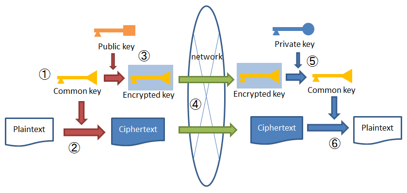

暗号化
================================================================================

.. only:: html

 .. contents:: 目次
    :local:

Overview
--------------------------------------------------------------------------------
| Spring Securityの主機能は「認証」、「認可」であるが、暗号化に関するユーティリティも含まれている。
| ただし、提供される機能は限定的なものであるため、Spring Securityが対応していない暗号化処理については、別途実装する必要がある。
| 本ガイドラインでは、Spring Securityを利用した共通鍵暗復号処理と疑似乱数の生成処理、および、Java (JCA)での公開鍵暗復号処理、そして、ハイブリッド暗復号処理について説明する。

| Spring Securityにおける暗号化機能の詳細については\ `公式リファレンス <http://docs.spring.io/spring-security/site/docs/3.2.5.RELEASE/reference/htmlsingle/#crypto>`_\ を参照されたい。

暗号化方式
^^^^^^^^^^^^^^^^^^^^^^^^^^^^^^^^^^^^^^^^^^^^^^^^^^^^^^^^^^^^^^^^^^^^^^^^^^^^^^^^
| 暗号化方式について説明する。

共通鍵暗号化方式
""""""""""""""""""""""""""""""""""""""""""""""""""""""""""""""""""""""""""""""""
| 暗号化、および、復号の際に同じ鍵を利用する方式である。
| 暗復号処理のコストは低いが、復号側であらかじめ鍵を保持しておく必要があり、鍵を安全に受け渡すことが難しいというデメリットがある。

公開鍵暗号化方式
""""""""""""""""""""""""""""""""""""""""""""""""""""""""""""""""""""""""""""""""
| 公開されている鍵(公開鍵)で暗号化し、非公開の鍵(秘密鍵)で復号する方式である。
| 鍵の受け渡しが不要であるためセキュリティ的には優れるが、暗復号処理のコストは高い。

ハイブリッド暗号化方式
""""""""""""""""""""""""""""""""""""""""""""""""""""""""""""""""""""""""""""""""
| 共通鍵暗号化方式の暗復号処理のコストは低いという利点と、公開鍵暗号化方式の鍵の管理・配布が容易でセキュリティ的に優れるという利点の両方を組み合わせた方式である。
| SSL/TLSなどで利用されている。たとえば、HTTPSでは、クライアント側が、共通鍵をサーバ側の公開鍵で暗号化したうえで送信し、受信側（サーバ側）で秘密鍵を利用して共通鍵を復号する。
  その後は、その共通鍵を利用して暗号化通信を行う、という仕組みである。

ハイブリッド暗号化方式における、暗号化から復号までの処理フローを、以下の図に示す。

1. 送信側が、平文を暗号化するための共通鍵を生成する。
2. 送信側が、生成した共通鍵で平文を暗号化する。
3. 送信側が、受信側の公開鍵で共通鍵を暗号化する。
4. 送信側が、暗号化した共通鍵とともに暗号文を送信する。
5. 受信側が、受信側の秘密鍵で暗号化された共通鍵を復号する。
6. 受信側が、復号した共通鍵で暗号文を復号する。

|

暗号化アルゴリズム
^^^^^^^^^^^^^^^^^^^^^^^^^^^^^^^^^^^^^^^^^^^^^^^^^^^^^^^^^^^^^^^^^^^^^^^^^^^^^^^^
| 暗号化アルゴリズムについて説明する。

DES / 3DES
""""""""""""""""""""""""""""""""""""""""""""""""""""""""""""""""""""""""""""""""
| DES (Data Encryption Standard)
| 3DES (トリプルDES)

DES (Data Encryption Standard) は共通暗号化方式のアルゴリズムとして、アメリカ合衆国の標準規格として規格化されたものである。鍵長が56ビットと短いことから、現在では推奨されていない。3DES、トリプルDESは、鍵を変えながらDESを繰り返す暗号化アルゴリズムである。

.. _encryption_overview_aes:

AES
""""""""""""""""""""""""""""""""""""""""""""""""""""""""""""""""""""""""""""""""
| AES (Advanced Encryption Standard)は共通鍵暗号化方式のアルゴリズムである。DESの後継として制定された暗号化規格であり、暗号化における現在のデファクトスタンダードとして利用されている。
| また、ブロック長より長いメッセージを暗号化するメカニズムである暗号利用モードとしてECB (Electronic Codebook)、CBC (Cipher Block Chaining)、OFB (Output Feedback)など存在する中で、最も広く利用されているものはCBCである。

.. note:: **AES with GCM**

  GCM (Galois Counter Mode) は並列処理が可能であり、CBCより、処理効率が優れた暗号利用モードであると一般的にいわれている。

RSA
""""""""""""""""""""""""""""""""""""""""""""""""""""""""""""""""""""""""""""""""
| RSAは公開鍵暗号化方式のアルゴリズムである。素因数分解の困難性に基づいているため、計算機の能力向上により危殆化することとなる。いわゆる「暗号化アルゴリズムの2010年問題」として指摘されているように充分な長さが必要であり、現時点では2048ビットが標準的に利用されている。

DSA / ECDSA
""""""""""""""""""""""""""""""""""""""""""""""""""""""""""""""""""""""""""""""""
| DSA (Digital Signature Algorithm) は、デジタル署名のための標準規格である。離散対数問題の困難性に基づいている。ECDSA (Elliptic Curve DSA : 楕円曲線DSA)は、楕円曲線暗号を用いたDSAの変種である。楕円曲線暗号においては、セキュリティレベルを確保するために必要となる鍵長が短くなるというメリットがある。

疑似乱数 (生成器)
^^^^^^^^^^^^^^^^^^^^^^^^^^^^^^^^^^^^^^^^^^^^^^^^^^^^^^^^^^^^^^^^^^^^^^^^^^^^^^^^
| 暗号においては、鍵の生成などで乱数が用いられる。
| このとき、乱数として生成される値が予測可能であると、暗号の安全性が保てなくなるため、結果の予測が困難な乱数(疑似乱数)を利用する必要がある。
| 疑似乱数の生成に用いられるのが疑似乱数生成器である。

javax.crypto.Cipherクラス
^^^^^^^^^^^^^^^^^^^^^^^^^^^^^^^^^^^^^^^^^^^^^^^^^^^^^^^^^^^^^^^^^^^^^^^^^^^^^^^^
| javax.crypto.Cipherクラスは、暗号化および復号の機能を提供する。AESやRSAなどの暗号化アルゴリズム、ECBやCBCなどの暗号利用モード、PKCS1などのパディング方式の組み合わせを指定する。
| Javaアプリケーションでは、\ ``"<暗号化アルゴリズム>/<暗号利用モード>/<パディング方式>"``\ または、\ ``"<暗号化アルゴリズム>"``\ という形で組み合わせを指定する。たとえば、\ ``"AES/CBC/PKCS5Padding"``\ または、\ ``"RSA"``\ となる。
  詳細は、\ `Oracle JavaDoc Cipher <https://docs.oracle.com/javase/8/docs/api/javax/crypto/Cipher.html>`_\ を参照されたい。

Spring Securityにおける暗号化機能
^^^^^^^^^^^^^^^^^^^^^^^^^^^^^^^^^^^^^^^^^^^^^^^^^^^^^^^^^^^^^^^^^^^^^^^^^^^^^^^^
| Spring Securityでは、共通鍵暗号化方式での暗号化および復号の機能を提供している。
| 暗号化アルゴリズムは256-bit AES using PKCS #5’s PBKDF2 (Password-Based Key Derivation Function #2)である。

| 共通鍵暗号化方式であるため、鍵を受け渡す必要がない状況における暗号化、または、公開鍵暗号化方式と組み合わせた形での利用に限定することが望ましい。

| Spring Securityでは、共通鍵暗号化方式での暗号化および復号の機能として、以下のインターフェイスが用意されている。

* \ ``org.springframework.security.crypto.encrypt.TextEncryptor``\ 
* \ ``org.springframework.security.crypto.encrypt.BytesEncryptor``\ 

| これらの実装クラスとして、テキスト用の\ ``org.springframework.security.crypto.encrypt.HexEncodingTextEncryptor``\ クラスやバイト配列用の\ ``org.springframework.security.crypto.encrypt.AesBytesEncryptor``\ クラスが提供されている。なお、これらの実装クラスの内部ではCipherクラスのインスタンスが生成されて保持されている。

| \ ``TextEncryptor``\ / \ ``BytesEncryptor``\ の仕組みとして、\ ``encrypt``\ メソッドで暗号化処理を行い、\ ``decrypt(byte[] encryptedBytes)``\ メソッドで復号処理を行う。
  
| また、乱数(鍵)生成の機能として、以下のインターフェイスが用意されている。

* \ ``org.springframework.security.crypto.keygen.StringKeyGenerator``\ 
* \ ``org.springframework.security.crypto.keygen.BytesKeyGenerator``\ 

| 前者の実装クラスとして、テキスト用の \ ``org.springframework.security.crypto.keygen.HexEncodingStringKeyGenerator``\ クラスが提供されており、後者の実装クラスとして、バイト配列用の以下のクラスが提供されている。

* \ ``org.springframework.security.crypto.keygen.SecureRandomBytesKeyGenerator``\ 
* \ ``org.springframework.security.crypto.keygen.SharedKeyGenerator``\ 

| \ ``StringKeyGenerator``\ / \ ``BytesKeyGenerator``\ の仕組みとして、\ ``generateKey``\ メソッドで乱数(鍵)の生成を行う。

.. note:: **Spring Security Rsa**

   \ `spring-security-rsaプロジェクト <https://github.com/dsyer/spring-security-rsa>`_\ は、暗号化アルゴリズムRSAを使用した公開鍵暗号化方式とハイブリッド暗号化方式を実装したAPIを提供している。
   github上では、公式なspring-securityのリポジトリではないため、今後、spring-securityリポジトリ配下に移動した際は、本ガイドラインで利用方法を説明する予定である。

   spring-security-rsaプロジェクトでは以下２つのクラスを提供している。

   * \ ``org.springframework.security.crypto.encrypt.RsaRawEncryptor``\ 

     公開鍵暗号化方式による暗号化および復号の機能を提供するクラス。

   * \ ``org.springframework.security.crypto.encrypt.RsaSecretEncryptor``\ 

     ハイブリッド暗号化方式による暗号化および復号の機能を提供するクラス。

|

How to use
--------------------------------------------------------------------------------

| 事前準備として、JavaでAESの鍵長256ビットを扱うためには、強度が無制限のJCE管轄ポリシーファイルを適用する必要がある。

.. note:: **JCE管轄ポリシーファイル**

   輸入規制の関係上、Javaではデフォルトの暗号化アルゴリズム強度が制限されている。より強力なアルゴリズムを利用する場合は、強度が無制限のJCE管轄ポリシーファイルを入手し、JDK/JREにインストールする必要がある。詳細については、\ `Java 暗号化アーキテクチャー Oracle プロバイダのドキュメント <http://docs.oracle.com/javase/jp/7/technotes/guides/security/SunProviders.html#importlimits>`_\を参照されたい。

   JCE管轄ポリシーファイルのダウンロード先

   * \ `Java 8 用 <http://www.oracle.com/technetwork/java/javase/downloads/jce8-download-2133166.html>`_\
   * \ `Java 7 用 <http://www.oracle.com/technetwork/java/embedded/embedded-se/downloads/jce-7-download-432124.html>`_\

共通鍵暗号化方式
^^^^^^^^^^^^^^^^^^^^^^^^^^^^^^^^^^^^^^^^^^^^^^^^^^^^^^^^^^^^^^^^^^^^^^^^^^^^^^^^
| 暗号化アルゴリズムとしてAESを利用した方法について説明する。

暗号化（文字列）
""""""""""""""""""""""""""""""""""""""""""""""""""""""""""""""""""""""""""""""""

- TextEncryptorによりテキスト（文字列）を暗号化する。

  .. code-block:: java

    public static String encryptText(
        String secret, String salt, String plainText) {
        TextEncryptor encryptor = Encryptors.text(secret, salt); // (1)

        return encryptor.encrypt(plainText); // (2)
    }

  .. tabularcolumns:: |p{0.10\linewidth}|p{0.90\linewidth}|
  .. list-table::
     :header-rows: 1
     :widths: 10 90
  
     * - 項番
       - 説明
     * - | (1)
       - | 共通鍵とソルトを指定して\ ``Encryptors#text``\ メソッドを呼び出し、\ ``TextEncryptor``\ クラスのインスタンスを生成する。
         | 生成したインスタンスの暗号利用モードはCBCとなる。
         | このときに指定した共通鍵とソルトは、復号時にも同じものを利用する。

     * - | (2)
       - | 平文を\ ``encrypt``\ メソッドで暗号化する。

| 

- 同一の暗号化結果を取得する。

  この方法は、暗号化した結果を用いてデータベースの検索を行うようなケースで利用できる。
  ただし、セキュリティ強度が落ちる点を踏まえ、使用の可否を検討してほしい。

  .. code-block:: java

    public static void encryptTextResult(
        String secret, String salt, String rawText) {
        TextEncryptor encryptor1 = Encryptors.text(secret, salt); // (1)
        TextEncryptor encryptor2 = Encryptors.queryableText(secret, salt); // (2)

        System.out.println(encryptor1.encrypt(rawText)); // (3)
        System.out.println(encryptor1.encrypt(rawText)); // 
        System.out.println(encryptor2.encrypt(rawText)); // (4)
        System.out.println(encryptor2.encrypt(rawText)); //
    }

  .. tabularcolumns:: |p{0.10\linewidth}|p{0.90\linewidth}|
  .. list-table::
     :header-rows: 1
     :widths: 10 90
  
     * - 項番
       - 説明
     * - | (1)
       - | \ ``Encryptors#text``\ メソッドで生成される\ ``TextEncryptor``\ クラスのインスタンスは、初期化ベクトルがランダムであるため、暗号化の際に異なる結果を返す。生成されたインスタンスの暗号利用モードはCBCとなる。

     * - | (2)
       - | 暗号化した結果として同じ値が必要な場合は、\ ``Encryptors#queryableText``\ メソッドを利用して\ ``TextEncryptor``\ クラスのインスタンスを生成する。

     * - | (3)
       - | \ ``Encryptors#text``\ メソッドで生成したインスタンスは、\ ``encrypt``\ メソッドでの暗号化の結果として異なる値を返す。ただし、当然のことながら、鍵とソルトが同一であれば、暗号化の結果が異なっている場合でも、復号処理の結果は同一になる(正しく復号できる)。
	 
     * - | (4)
       - | \ ``Encryptors#queryableText``\ メソッドで生成したインスタンスは、\ ``encrypt``\ メソッドでの暗号化の結果として同一の値を返す。

| 

- GCMを用いたAESによりテキスト（文字列）を暗号化する。

  GCMを用いたAESはSpring Security4.0.2以降で利用可能である。\ :ref:`encryption_overview_aes`\ で説明したとおり、CBCより処理効率が良い。

  .. code-block:: java

    public static String encryptTextByAesWithGcm(String secret, String salt, String plainText) {
        TextEncryptor aesTextEncryptor = Encryptors.delux(secret, salt); // (1)

        return aesTextEncryptor.encrypt(plainText); // (2)
    }

  .. tabularcolumns:: |p{0.10\linewidth}|p{0.90\linewidth}|
  .. list-table::
     :header-rows: 1
     :widths: 10 90
  
     * - 項番
       - 説明
     * - | (1)
       - | 共通鍵とソルトを指定して\ ``Encryptors#delux``\ メソッドを呼び出し、\ ``TextEncryptor``\ クラスのインスタンスを生成する。
         | このときに指定する共通鍵とソルトは、復号時にも同じものを利用する。

     * - | (2)
       - | 平文を\ ``encrypt``\ メソッドで暗号化する。

|

復号（文字列）
""""""""""""""""""""""""""""""""""""""""""""""""""""""""""""""""""""""""""""""""

- TextEncryptorによりテキスト（文字列）を復号する。

  .. code-block:: java

    public static String decryptText(String secret, String salt, String cipherText) {
        TextEncryptor decryptor = Encryptors.text(secret, salt); // (1)

        return decryptor.decrypt(cipherText); // (2)
    }

  .. tabularcolumns:: |p{0.10\linewidth}|p{0.90\linewidth}|
  .. list-table::
     :header-rows: 1
     :widths: 10 90
  
     * - 項番
       - 説明
     * - | (1)
       - | 共通鍵とソルトを指定して\ ``Encryptors#text``\ メソッドを呼び出し、\ ``TextEncryptor``\ クラスのインスタンスを生成する。
         | 共通鍵とソルトは、暗号化した際に利用したものを指定する。

     * - | (2)
       - | 暗号文を\ ``decrypt``\ メソッドで復号する。

|

- GCMを用いたAESによりテキスト（文字列）を復号する。

  .. code-block:: java

    public static String decryptTextByAesWithGcm(String secret, String salt, String cipherText) {
        TextEncryptor aesTextEncryptor = Encryptors.delux(secret, salt); // (1)

        return aesTextEncryptor.encrypt(cipherText); // (2)
    }

  .. tabularcolumns:: |p{0.10\linewidth}|p{0.90\linewidth}|
  .. list-table::
     :header-rows: 1
     :widths: 10 90
  
     * - 項番
       - 説明
     * - | (1)
       - | 共通鍵とソルトを指定して\ ``Encryptors#delux``\ メソッドを呼び出し、\ ``TextEncryptor``\ クラスのインスタンスを生成する。
         | 共通鍵とソルトは、暗号化した際に利用したものを指定する。

     * - | (2)
       - | 暗号文を\ ``decrypt``\ メソッドで復号する。

|

暗号化（バイト配列）
""""""""""""""""""""""""""""""""""""""""""""""""""""""""""""""""""""""""""""""""

- BytesEncryptorによりバイト配列を暗号化する。

  .. code-block:: java

    public static byte[] encryptBytes(String secret, String salt, byte[] plainBytes) {
        BytesEncryptor encryptor = Encryptors.standard(secret, salt); // (1)

        return encryptor.encrypt(plainBytes); // (2)
    }

  .. tabularcolumns:: |p{0.10\linewidth}|p{0.90\linewidth}|
  .. list-table::
     :header-rows: 1
     :widths: 10 90
  
     * - 項番
       - 説明
     * - | (1)
       - | 共通鍵とソルトを指定して\ ``Encryptors#standard``\ メソッドを呼び出し、\ ``BytesEncryptor``\ クラスのインスタンスを生成する。
         | このときに指定した共通鍵とソルトは、復号時にも同じものを利用する。

     * - | (2)
       - | 平文（バイト配列）を\ ``encrypt``\ メソッドで暗号化する。

|

- GCMを用いたAESによりバイト配列を暗号化する。

  .. code-block:: java

    public static byte[] encryptBytesByAesWithGcm(String secret, String salt, byte[] plainBytes) {
        BytesEncryptor aesBytesEncryptor = Encryptors.stronger(secret, salt); // (1)

        return aesBytesEncryptor.encrypt(plainBytes); // (2)
    }

  .. tabularcolumns:: |p{0.10\linewidth}|p{0.90\linewidth}|
  .. list-table::
     :header-rows: 1
     :widths: 10 90
  
     * - 項番
       - 説明
     * - | (1)
       - | 共通鍵とソルトを指定して\ ``Encryptors#stronger``\ メソッドを呼び出し、\ ``BytesEncryptor``\ クラスのインスタンスを生成する。
         | このときに指定した共通鍵とソルトは、復号時にも同じものを利用する。

     * - | (2)
       - | 平文（バイト配列）を\ ``encrypt``\ メソッドで暗号化する。

|

復号（バイト配列）
""""""""""""""""""""""""""""""""""""""""""""""""""""""""""""""""""""""""""""""""

- BytesEncryptorによりバイト配列を復号する。

  .. code-block:: java

    public static byte[] decryptBytes(String secret, String salt, byte[] cipherBytes) {
        BytesEncryptor decryptor = Encryptors.standard(secret, salt); // (1)

        return decryptor.decrypt(cipherBytes); // (2)
    }

  .. tabularcolumns:: |p{0.10\linewidth}|p{0.90\linewidth}|
  .. list-table::
     :header-rows: 1
     :widths: 10 90
  
     * - 項番
       - 説明
     * - | (1)
       - | 共通鍵とソルトを指定して\ ``Encryptors#standard``\ メソッドを呼び出し、\ ``BytesEncryptor``\ クラスのインスタンスを生成する。
         | 共通鍵とソルトは、暗号化した際に利用したものを指定する。

     * - | (2)
       - | 暗号文（バイト配列）を\ ``decrypt``\ メソッドで復号する。

|

- GCMを用いたAESによりバイト配列を復号する。

  .. code-block:: java

    public static byte[] decryptBytesByAesWithGcm(String secret, String salt, byte[] cipherBytes) {
        BytesEncryptor aesBytesEncryptor = Encryptors.stronger(secret, salt); // (1)

        return aesBytesEncryptor.decrypt(cipherBytes); // (2)
    }

  .. tabularcolumns:: |p{0.10\linewidth}|p{0.90\linewidth}|
  .. list-table::
     :header-rows: 1
     :widths: 10 90
  
     * - 項番
       - 説明
     * - | (1)
       - | 共通鍵とソルトを指定して\ ``Encryptors#stronger``\ メソッドを呼び出し、\ ``BytesEncryptor``\ クラスのインスタンスを生成する。
         | 共通鍵とソルトは、暗号化した際に利用したものを指定する。

     * - | (2)
       - | 暗号文（バイト配列）を\ ``decrypt``\ メソッドで復号する。

|

公開鍵暗号化方式
^^^^^^^^^^^^^^^^^^^^^^^^^^^^^^^^^^^^^^^^^^^^^^^^^^^^^^^^^^^^^^^^^^^^^^^^^^^^^^^^

| Spring Securityでは公開鍵暗号化方式に関する機能は提供されていないため、Java(JCA)、および、OpenSSL を利用した方法をサンプルコードを用いて説明する。

事前準備（JCAによるキーペアの生成）
""""""""""""""""""""""""""""""""""""""""""""""""""""""""""""""""""""""""""""""""

- JCA (Java Cryptography Architecture)でキーペア(公開鍵 / 秘密鍵の組み合わせ)を生成し、公開鍵で暗号化、秘密鍵で復号処理を行う。

  .. code-block:: java

    public void generateKeysByJCA() {
        try {
            KeyPairGenerator generator = KeyPairGenerator.getInstance("RSA"); // (1)
            generator.initialize(2048); // (2)
            KeyPair keyPair = generator.generateKeyPair(); // (3)
            PublicKey publicKey = keyPair.getPublic();
            PrivateKey privateKey = keyPair.getPrivate();

            byte[] encryptedBytes = encryptByPublicKey("Hello World!", publicKey);  // (4)
            System.out.println(Base64.getEncoder().encodeToString(encryptedBytes));
            String decryptedText = decryptByPrivateKey(encryptedBytes, privateKey); // (5)
            System.out.println(decryptedText);
        } catch (NoSuchAlgorithmException ignored) {
            throw new IllegalStateException("Should not be happend!", ignored);
        }
    }

  .. tabularcolumns:: |p{0.10\linewidth}|p{0.90\linewidth}|
  .. list-table::
     :header-rows: 1
     :widths: 10 90
  
     * - 項番
       - 説明
     * - | (1)
       - | RSAアルゴリズムを指定して\ ``KeyPairGenerator``\ クラスのインスタンスを生成する。

     * - | (2)
       - | 鍵長として2048ビットを指定する。

     * - | (3)
       - | キーペアを生成する。

     * - | (4)
       - | 公開鍵を利用して暗号化処理を行う。処理内容は後述する。

     * - | (5)
       - | 秘密鍵を利用して復号処理を行う。処理内容は後述する。

|

暗号化
""""""""""""""""""""""""""""""""""""""""""""""""""""""""""""""""""""""""""""""""

- 公開鍵を利用して文字列を暗号化する。

  .. code-block:: java

    public byte[] encryptByPublicKey(String rawText, PublicKey publicKey) {
        try {
            Cipher cipher = Cipher.getInstance("RSA/ECB/PKCS1Padding"); // (1)
            cipher.init(Cipher.ENCRYPT_MODE, publicKey);                       // (2)
            return cipher.doFinal(rawText.getBytes(StandardCharsets.UTF_8)); //
        } catch (NoSuchAlgorithmException | NoSuchPaddingException ignored) {
            throw new IllegalStateException("Should not be happened!", ignored);
        } catch (InvalidKeyException |
                 IllegalBlockSizeException |
                 BadPaddingException e) {
            throw new IllegalArgumentException(e);
        }
    }

  .. tabularcolumns:: |p{0.10\linewidth}|p{0.90\linewidth}|
  .. list-table::
     :header-rows: 1
     :widths: 10 90
  
     * - 項番
       - 説明
     * - | (1)
       - | 暗号化アルゴリズム、暗号利用モード、パディング方式を指定して、\ ``Cipher``\ クラスのインスタンスを生成する。

     * - | (2)
       - | 暗号化処理を実行する。

|

復号
""""""""""""""""""""""""""""""""""""""""""""""""""""""""""""""""""""""""""""""""

- 秘密鍵を利用してバイト配列を復号する。

  .. code-block:: java

    public String decryptByPrivateKey(byte[] encryptedBytes, PrivateKey privateKey) {
        try {
            Cipher cipher = Cipher.getInstance("RSA/ECB/PKCS1Padding"); // (1)
            cipher.init(Cipher.DECRYPT_MODE, privateKey);           // (2)
            byte[] decryptedBytes = cipher.doFinal(encryptedBytes); //
            return new String(decryptedBytes, StandardCharsets.UTF_8);
        } catch (NoSuchAlgorithmException | NoSuchPaddingException ignored) {
            throw new IllegalStateException("Should not be happened!", ignored);
        } catch (InvalidKeyException |
                 IllegalBlockSizeException |
                 BadPaddingException e) {
            throw new IllegalArgumentException(e);
        }
    }

  .. tabularcolumns:: |p{0.10\linewidth}|p{0.90\linewidth}|
  .. list-table::
     :header-rows: 1
     :widths: 10 90
  
     * - 項番
       - 説明
     * - | (1)
       - | 暗号化アルゴリズム、暗号利用モード、パディング方式を指定して、\ ``Cipher``\ クラスのインスタンスを生成する。

     * - | (2)
       - | 復号処理を実行する。

|

OpenSSL
""""""""""""""""""""""""""""""""""""""""""""""""""""""""""""""""""""""""""""""""

| Cipherが同一であれば、公開鍵暗号化方式は別の方法で暗号化および復号を行うことが可能である。
| ここでは、OpenSSLを利用してあらかじめキーペアを作成しておき、その公開鍵を利用してJCAによる暗号化を行う。
  そして、その秘密鍵を利用してOpenSSLで復号処理を行う方法を説明する。

.. note:: **OpenSSL**

   OpenSSLでキーペアを作成する際はソフトウェアをインストールしておく必要がある。下記サイトよりダウンロードできる。

   OpenSSLのダウンロード先

   * \ `Linux 用 <https://www.openssl.org/source/>`_\
   * \ `Windows 用 <http://slproweb.com/products/Win32OpenSSL.html>`_\

|

- 事前準備として、OpenSSLでキーペアを作成する。

  .. code-block:: console

     $ openssl genrsa -out private.pem 2048  # (1)

     $ openssl pkcs8 -topk8 -nocrypt -in private.pem -out private.pk8 -outform DER  # (2)

     $ openssl rsa -pubout -in private.pem -out public.der -outform DER  # (3)

  .. tabularcolumns:: |p{0.10\linewidth}|p{0.90\linewidth}|
  .. list-table::
     :header-rows: 1
     :widths: 10 90
  
     * - 項番
       - 説明
     * - | (1)
       - | OpenSSLで2048ビットの秘密鍵(DER形式)を生成する。

     * - | (2)
       - | Javaアプリケーションから読み込むために、秘密鍵をPKCS #8形式に変換する。

     * - | (3)
       - | 秘密鍵から公開鍵(DER形式)を生成する。

|

- OpenSSLを利用してキーペアを作成済みであるため、アプリケーションでは公開鍵の読み込み、および、その公開鍵を利用した暗号化処理を行う。

  .. code-block:: java

    public void useOpenSSLDecryption() {
        try {
            KeySpec publicKeySpec = new X509EncodedKeySpec(
                    Files.readAllBytes(Paths.get("public.der"))); // (1)
            KeyFactory keyFactory = KeyFactory.getInstance("RSA");
            PublicKey publicKey = keyFactory.generatePublic(publicKeySpec); // (2)

            byte[] encryptedBytes = encryptByPublicKey("Hello World!", publicKey); // (3)

            Files.write(Paths.get("encryptedByJCA.txt"), encryptedBytes);
            System.out.println("Please execute the following command:");
            System.out
                    .println("openssl rsautl -decrypt -inkey hoge.pem -in encryptedByJCA.txt");
        } catch (IOException e) {
            throw new UncheckedIOException(e);
        } catch (NoSuchAlgorithmException ignored) {
            throw new IllegalStateException("Should not be happend!", ignored);
        } catch (InvalidKeySpecException e) {
            throw new IllegalArgumentException(e);
        }
    }

  .. tabularcolumns:: |p{0.10\linewidth}|p{0.90\linewidth}|
  .. list-table::
     :header-rows: 1
     :widths: 10 90
  
     * - 項番
       - 説明
     * - | (1)
       - | 公開鍵ファイルからバイナリデータを読み込む。

     * - | (2)
       - | バイナリデータから\ ``PublicKey``\ クラスのインスタンスを生成する。

     * - | (3)
       - | 公開鍵を利用して暗号化処理を行う。

|

- プログラム実行後に以下の処理を実行する。

  .. code-block:: console

     $ openssl rsautl -decrypt -inkey private.pem -in encryptedByJCA.txt  # (1)

  .. tabularcolumns:: |p{0.10\linewidth}|p{0.90\linewidth}|
  .. list-table::
     :header-rows: 1
     :widths: 10 90
  
     * - 項番
       - 説明
     * - | (1)
       - | 秘密鍵を利用してOpenSSLで復号する。

|

| 続いて、OpenSSLで作成したキーペアを利用してOpenSSLで暗号化、JCAで復号する方法を説明する。

- 事前準備として、OpenSSLでキーペアを作成する。

  .. code-block:: console

     $ openssl genrsa -out private.pem 2048  # (1)

     $ openssl pkcs8 -topk8 -nocrypt -in private.pem -out private.pk8 -outform DER  # (2)

     $ openssl rsa -pubout -in private.pem -out public.der -outform DER  # (3)

     $ echo Hello | openssl rsautl -encrypt -keyform DER -pubin -inkey public.der -out encryptedByOpenSSL.txt  # (4)
     
  .. tabularcolumns:: |p{0.10\linewidth}|p{0.90\linewidth}|
  .. list-table::
     :header-rows: 1
     :widths: 10 90
  
     * - 項番
       - 説明
     * - | (1)
       - | OpenSSLで2048ビットの秘密鍵(DER形式)を生成する。

     * - | (2)
       - | Javaアプリケーションから読み込むために、秘密鍵をPKCS #8形式に変換する。
     * - | (3)
       - | 秘密鍵から公開鍵(DER形式)を生成する。

     * - | (4)
       - | 公開鍵を利用してOpenSSLで暗号化する。

|

- OpenSSLを利用してキーペアを作成済みであるため、アプリケーションでは秘密鍵の読み込み、および、その秘密鍵を利用した復号処理を行う。

  .. code-block:: java

    public void useOpenSSLEncryption() {
        try {
            KeySpec privateKeySpec = new PKCS8EncodedKeySpec(
                    Files.readAllBytes(Paths.get("private.pk8"))); // (1)
            KeyFactory keyFactory = KeyFactory.getInstance("RSA");
            PrivateKey privateKey = keyFactory.generatePrivate(privateKeySpec); // (2)

            String decryptedText = decryptByPrivateKey(
                   Files.readAllBytes(Paths.get("encryptedByOpenSSL.txt")),
                   privateKey); // (3)
            System.out.println(decryptedText);
        } catch (IOException e) {
            throw new UncheckedIOException(e);
        } catch (NoSuchAlgorithmException ignored) {
            throw new IllegalStateException("Should not be happend!", ignored);
        } catch (InvalidKeySpecException e) {
            throw new IllegalArgumentException(e);
        }
    }

  .. tabularcolumns:: |p{0.10\linewidth}|p{0.90\linewidth}|
  .. list-table::
     :header-rows: 1
     :widths: 10 90
  
     * - 項番
       - 説明
     * - | (1)
       - | PKCS #8形式の秘密鍵ファイルからバイナリデータを読み込み\ ``PKCS8EncodedKeySpec``\ クラスのインスタンスを生成する。

     * - | (2)
       - | \ ``KeyFactory``\ クラスから\ ``PrivateKey``\ クラスのインスタンスを生成する。

     * - | (3)
       - | 秘密鍵を利用して復号処理を行う。

|

ハイブリッド暗号化方式
^^^^^^^^^^^^^^^^^^^^^^^^^^^^^^^^^^^^^^^^^^^^^^^^^^^^^^^^^^^^^^^^^^^^^^^^^^^^^^^^

| 公開鍵暗号化方式と同様、Spring Securityではハイブリッド暗号化方式に関する機能は提供されていないため、サンプルコードを用いて説明する。
| このサンプルコードは、\ `spring-security-rsaリポジトリ <https://github.com/dsyer/spring-security-rsa/>`_\ の\ ``RsaSecretEncryptor``\ クラスを参考にしている。

暗号化
""""""""""""""""""""""""""""""""""""""""""""""""""""""""""""""""""""""""""""""""

  .. code-block:: java

    public byte[] encrypt(byte[] text, PublicKey key, String alg,
            String salt) {
        byte[] random = KeyGenerators.secureRandom(16).generateKey(); // (1)
        BytesEncryptor aes = Encryptors.standard(
                new String(Hex.encode(random)), salt); // (2)

        try (ByteArrayOutputStream result = new ByteArrayOutputStream()) {
            final Cipher cipher = Cipher.getInstance(alg); // (3)
            cipher.init(Cipher.ENCRYPT_MODE, key); // (4)
            byte[] secret = cipher.doFinal(random); // (5)

            byte[] data = new byte[2]; // (6)
            data[0] = (byte) ((secret.length >> 8) & 0xFF); //
            data[1] = (byte) (secret.length & 0xFF); //
            result.write(data); //

            result.write(secret); // (7)
            result.write(aes.encrypt(text)); // (8)

            return result.toByteArray(); // (9)
        } catch (NoSuchAlgorithmException | NoSuchPaddingException ignored) {
            throw new IllegalStateException("Should not be happened!", ignored);
        } catch (InvalidKeyException | IllegalBlockSizeException
                | BadPaddingException e) {
            throw new IllegalArgumentException(e);
        } catch (IOException e) {
            throw new UncheckedIOException(e);
        }
    }

  .. tabularcolumns:: |p{0.10\linewidth}|p{0.90\linewidth}|
  .. list-table::
     :header-rows: 1
     :widths: 10 90
  
     * - 項番
       - 説明
     * - | (1)
       - | 鍵長として16バイトを指定して\ ``KeyGenerators#secureRandom``\ メソッドを呼び出し、\ ``BytesKeyGenerator``\ クラスのインスタンスを生成する。
         | \ ``BytesKeyGenerator#generateKey``\ メソッドを呼び出し、共通鍵を生成する。
         | 詳細については、\ :ref:`encryption_how_to_use_generate_random_key`\ を参照されたい。

     * - | (2)
       - | 生成した共通鍵とソルトを指定して\ ``BytesEncryptor``\ クラスのインスタンスを生成する。

     * - | (3)
       - | 暗号化アルゴリズム、暗号利用モード、パディング方式を指定して、\ ``Cipher``\ クラスのインスタンスを生成する。

     * - | (4)
       - | 暗号化モード定数と公開鍵を指定して\ ``Cipher``\ クラスのインスタンスを初期化する。

     * - | (5)
       - | 共通鍵の暗号化処理を実行する。この暗号化処理は公開鍵暗号化方式となる。

     * - | (6)
       - | 暗号化した共通鍵の長さを（バイト配列に変換して）戻り値に格納する。格納された共通鍵の長さは復号時に使用される。

     * - | (7)
       - | 暗号化した共通鍵を戻り値に格納する。

     * - | (8)
       - | 暗号化対象を暗号化して戻り値に格納する。この暗号化処理は共通鍵暗号化方式となる。

     * - | (9)
       - | 戻り値を（バイト配列に変換して）返却する。

|

復号
""""""""""""""""""""""""""""""""""""""""""""""""""""""""""""""""""""""""""""""""

  .. code-block:: java

    public byte[] decrypt(byte[] text, PrivateKey key, String alg,
            String salt) {

        try (ByteArrayInputStream input = new ByteArrayInputStream(text);
                ByteArrayOutputStream output = new ByteArrayOutputStream()) {
            byte[] b = new byte[2]; // (1)
            input.read(b); //
            int length = ((b[0] & 0xFF) << 8) | (b[1] & 0xFF); //

            byte[] random = new byte[length]; // (2)
            input.read(random); //
            final Cipher cipher = Cipher.getInstance(alg); // (3)
            cipher.init(Cipher.DECRYPT_MODE, key); // (4)
            String secret = new String(Hex.encode(cipher.doFinal(random))); // (5)
            byte[] buffer = new byte[text.length - random.length - 2]; // (6)
            input.read(buffer); //
            BytesEncryptor aes = Encryptors.standard(secret, salt); // (7)
            output.write(aes.decrypt(buffer)); // (8)

            return output.toByteArray(); // (9)
        } catch (IOException e) {
            throw new UncheckedIOException(e);
        } catch (NoSuchAlgorithmException | NoSuchPaddingException ignored) {
            throw new IllegalStateException("Should not be happened!", ignored);
        } catch (InvalidKeyException | IllegalBlockSizeException
                | BadPaddingException e) {
            throw new IllegalArgumentException(e);
        }
    }

  .. tabularcolumns:: |p{0.10\linewidth}|p{0.90\linewidth}|
  .. list-table::
     :header-rows: 1
     :widths: 10 90
  
     * - 項番
       - 説明
     * - | (1)
       - | 暗号化された共通鍵の長さを取得する。

     * - | (2)
       - | 暗号化された共通鍵を取得する。

     * - | (3)
       - | 暗号化アルゴリズム、暗号利用モード、パディング方式を指定して、\ ``Cipher``\ クラスのインスタンスを生成する。

     * - | (4)
       - | 復号モード定数と秘密鍵を指定して\ ``Cipher``\ クラスのインスタンスを初期化する。

     * - | (5)
       - | 共通鍵の復号処理を実行する。この復号処理は公開鍵暗号化方式となる。

     * - | (6)
       - | 復号対象を取得する。

     * - | (7)
       - | 復号した共通鍵とソルトを指定して\ ``BytesEncryptor``\ クラスのインスタンスを生成する。

     * - | (8)
       - | 復号処理を実行する。この復号処理は共通鍵暗号化方式となる。

     * - | (9)
       - | 戻り値を（バイト配列に変換して）返却する。

|

.. _encryption_how_to_use_generate_random_key:

乱数生成
^^^^^^^^^^^^^^^^^^^^^^^^^^^^^^^^^^^^^^^^^^^^^^^^^^^^^^^^^^^^^^^^^^^^^^^^^^^^^^^^

ByteKeyGeneratorによるバイト配列型の疑似乱数 / 鍵生成
""""""""""""""""""""""""""""""""""""""""""""""""""""""""""""""""""""""""""""""""

  .. code-block:: java

    public static void createDifferentBytesKey() {
        BytesKeyGenerator generator = KeyGenerators.secureRandom(); // (1)
        System.out.println(Arrays.toString(generator.generateKey())); // (2)
        System.out.println(Arrays.toString(generator.generateKey())); //
    }

  .. tabularcolumns:: |p{0.10\linewidth}|p{0.90\linewidth}|
  .. list-table::
     :header-rows: 1
     :widths: 10 90
  
     * - 項番
       - 説明
     * - | (1)
       - | 鍵(疑似乱数)生成器\ ``BytesKeyGenerator``\ クラスのインスタンスを生成する。
         | この生成器で鍵を生成すると、毎回異なる値が生成される。
         |
         | 鍵長を指定しない場合、デフォルトで8バイトの鍵が生成される。

     * - | (2)
       - | \ ``generateKey``\ メソッドで鍵(疑似乱数)を生成する。

  .. code-block:: java

    public static void createSameBytesKey() {
        BytesKeyGenerator generator = KeyGenerators.shared(16); // (1)
        System.out.println(Arrays.toString(generator.generateKey())); // (2)
        System.out.println(Arrays.toString(generator.generateKey())); //
    }

  .. tabularcolumns:: |p{0.10\linewidth}|p{0.90\linewidth}|
  .. list-table::
     :header-rows: 1
     :widths: 10 90
  
     * - 項番
       - 説明
     * - | (1)
       - | 鍵生成器\ ``BytesKeyGenerator``\ クラスのインスタンスを生成する。
         | この生成器で鍵を生成すると、毎回同じ値が生成される。
         |
         | 鍵長の指定は必須である。

     * - | (2)
       - | \ ``generateKey``\ メソッドで鍵を生成する。

|

StringKeyGeneratorによる String 型の疑似乱数生成
""""""""""""""""""""""""""""""""""""""""""""""""""""""""""""""""""""""""""""""""

  .. code-block:: java

    public static void createStringKey() {
        StringKeyGenerator generator = KeyGenerators.string(); // (1)
        System.out.println(generator.generateKey()); // (2)
        System.out.println(generator.generateKey()); //
    }

  .. tabularcolumns:: |p{0.10\linewidth}|p{0.90\linewidth}|
  .. list-table::
     :header-rows: 1
     :widths: 10 90
  
     * - 項番
       - 説明
     * - | (1)
       - | 鍵 (疑似乱数) 生成器\ ``BytesKeyGenerator``\ クラスのインスタンスを生成する。
         | この生成器で鍵を生成すると、毎回異なる値が生成される。
         |
         | 鍵長は指定できず、常に8バイトの鍵が生成される。

     * - | (2)
       - | \ ``generateKey``\ メソッドで鍵を生成する。

|

.. raw:: latex

   \newpage

