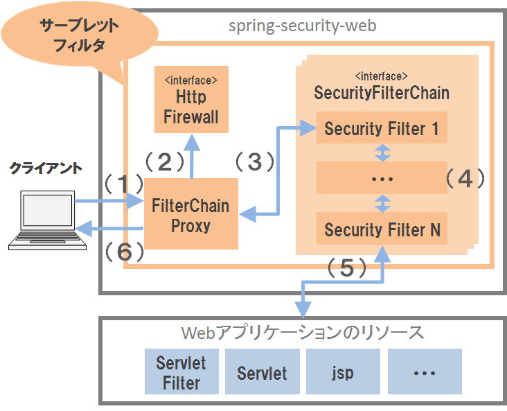

.. _SpringSecurityOverview:

Spring Security概要
================================================================================

.. only:: html

 .. contents:: 目次
    :local:

Overview
--------------------------------------------------------------------------------

Spring Securityは、アプリケーションにセキュリティ対策機能を実装する際に使用するフレームワークである。 
Spring Securityはスタンドアロンなアプリケーションでも利用できるが、サーブレットコンテナにデプロイする
Webアプリケーションに対してセキュリティ対策を行う際に利用するのが一般的である。
本章では、Spring Securityが提供する機能のうち、一般的なWebアプリケーションでの
利用頻度が高いと思われる機能にしぼって説明する。

.. note::

    Spring Securityは、本ガイドラインで紹介していない機能も多く提供している。
    Spring Securityが提供するすべての機能を知りたい場合は、\ `Spring Security Reference <http://docs.spring.io/spring-security/site/docs/4.0.3.RELEASE/reference/htmlsingle/#security-filter-chain>`_\ を参照されたい。

特徴
^^^^^^^^^^^^^^^^^^^^^^^^^^^^^^^^^^^^^^^^^^^^^^^^^^^^^^^^^^^^^^^^^^^^^^^^^^^^^^^^
Spring Securityには、以下の特徴がある。

* デフォルト実装の提供
    Spring Securityのフレームワーク上で動作するセキュリティ対策機能のデフォルト実装が提供されており、
    開発するアプリケーションのセキュリティ要件とデフォルト実装の動作が一致する場合は、ノンプログラミングで
    セキュリティ対策機能をアプリケーションに組み込むことが可能である。

* 豊富なオプションの提供
    Spring Securityのデフォルト実装は動作をカスタマイズするためのオプションを豊富に提供しており、
    デフォルトの動作がセキュリティ要件に一致しない場合であっても、オプションの値を変更することで
    要件に一致する動作に変更できるケースがある。

* 豊富な拡張ポイントの提供
    Spring Securityはセキュリティ対策機能の動作をカスタマイズするための拡張ポイントを豊富に提供しており、
    Spring Securityのデフォルト実装を使って要件を満たせない場合は、拡張クラスを作成することで
    セキュリティ対策機能の動作をカスタマイズすることが可能である。

|

基本機能
^^^^^^^^^^^^^^^^^^^^^^^^^^^^^^^^^^^^^^^^^^^^^^^^^^^^^^^^^^^^^^^^^^^^^^^^^^^^^^^^
Spring Securityは、セキュリティ対策の基本機能として以下の機能を提供している。

\

.. tabularcolumns:: |p{0.25\linewidth}|p{0.75\linewidth}|
.. list-table:: **セキュリティ対策の基本機能**
    :header-rows: 1
    :widths: 25 75

    * - 機能
      - 説明
    * - :ref:`認証機能<SpringSecurityAuthentication>` 
      - アプリケーションを利用するユーザーの正当性を確認する機能。
    * - :ref:`認可機能<SpringSecurityAuthorization>`
      - アプリケーションが提供するリソースや処理に対してアクセスを制御する機能。

|

強化機能
^^^^^^^^^^^^^^^^^^^^^^^^^^^^^^^^^^^^^^^^^^^^^^^^^^^^^^^^^^^^^^^^^^^^^^^^^^^^^^^^
Spring Securityでは認証と認可という基本的な機能に加え、Webアプリケーションのセキュリティを強化するための機能をいくつか提供している。

\

.. tabularcolumns:: |p{0.25\linewidth}|p{0.75\linewidth}|
.. list-table:: **セキュリティ対策の強化機能**
    :header-rows: 1
    :widths: 25 75

    * - 機能
      - 説明
    * - :ref:`セッション管理機能<SpringSecuritySessionManagement>` 
      - セッションハイジャック攻撃やセッション固定攻撃からユーザーを守る機能、
        セッションのライフサイクル(生成、破棄、タイムアウト)を制御するための機能。
    * - :ref:`CSRF対策機能<SpringSecurityCSRF>`
      - クロスサイトリクエストフォージェリ(CSRF)攻撃からユーザーを守るための機能。
    * - :ref:`セキュリティヘッダ出力機能<SpringSecutityLinkageWithBrowser>`
      - Webブラウザのセキュリティ対策機能と連携し、ブラウザの機能を悪用した攻撃からユーザーを守るための機能。

|

Spring Securityのアーキテクチャ
^^^^^^^^^^^^^^^^^^^^^^^^^^^^^^^^^^^^^^^^^^^^^^^^^^^^^^^^^^^^^^^^^^^^^^^^^^^^^^^^
各機能の詳細な説明を行う前に、Spring Securityのアーキテクチャ概要とSpring Securityを構成する主要なコンポーネントの役割を説明する。

.. note:: **メモ**

    ここで説明する内容は、Spring Securityが提供するデフォルトの動作をそのまま利用する場合や、
    Spring Securityのコンフィギュレーションをサポートする仕組みを利用する場合は、開発者が直接意識する必要ない。
    そのため、まず各機能の使い方を知りたい場合は、本節を読み飛ばしても問題はない。
    
    ただし、ここで説明する内容は、Spring Securityのデフォルトの動作をカスタマイズする際に必要になってくるので、
    アプリケーションのアーキテクトは一読しておくことを推奨する。

.. _SpringSecurityModules:

Spring Securityのモジュール構成
""""""""""""""""""""""""""""""""""""""""""""""""""""""""""""""""""""""""""""""""

まずSpring Securityが提供しているモジュールを紹介する。
Spring Securityは、コンポーネントの役割などに応じて、以下のようなモジュールに分割されている。

標準的なWebアプリケーションに対してセキュリティ対策行う際に必要となるモジュールは、以下の4つとなる。
本ガイドラインでもこの4つのモジュールを利用してセキュリティ対策を行う方法について説明する。

\

.. tabularcolumns:: |p{0.25\linewidth}|p{0.75\linewidth}|
.. list-table:: **標準的なWebアプリケーションで必要となるモジュール群**
    :header-rows: 1
    :widths: 25 75

    * - モジュール名
      - 説明
    * - \ ``spring-security-core``\
      - 認証と認可機能を実現するために必要となるコアなコンポーネントが格納されている。
        このモジュールに含まれるコンポーネントは、スタンドアロン環境で実行する
        アプリケーションで使用することができる。
    * - \ ``spring-security-web``\
      - Webアプリケーションのセキュリティ対策を実現するために必要となるコンポーネント
        が格納されている。このモジュールに含まれるコンポーネントは、Web層(サーブレットAPIなど)
        に依存する処理を行う。
    * - \ ``spring-security-config``\
      - 各モジュールから提供されているコンポーネントのセットアップをサポートするための
        コンポーネント(コンフィギュレーションをサポートするクラスやXMLネームスペースを解析するクラスなど)
        が格納されている。
        このモジュールを使用すると、Spring Securityのbean定義を簡単に行うことができる。
    * - \ ``spring-security-taglibs``\
      - 認証情報や認可機能にアクセスするためのJSPタグライブラリが格納されている。

|

本ガイドラインでは使い方を紹介しないが、一般的に利用される認証方法などをサポートするために、
以下のような拡張モジュールや姉妹モジュールを提供している。
セキュリティ要件に応じて、これらのモジュールの利用も検討されたい。

\

.. tabularcolumns:: |p{0.25\linewidth}|p{0.75\linewidth}|
.. list-table:: **要件に合わせて利用する拡張モジュール群**
    :header-rows: 1
    :widths: 25 75

    * - モジュール名
      - 説明
    * - \ ``spring-security-ldap``\
      - Lightweight Directory Access Protocol(LDAP)を使用した認証を実現するために
        必要となるコンポーネントが格納されている。
    * - \ ``spring-security-openid``\
      - OpenID\ [#fSpringSecurityArchitecture1]_\ を使用した認証を実現するために必要となるコンポーネントが格納
        されている。
    * - \ ``spring-security-cas``\
      - Central Authentication Service(CAS)\ [#fSpringSecurityArchitecture2]_\ と連携するために必要となる
        コンポーネントが格納されている。
    * - \ ``spring-security-acl``\
      - EntityなどのドメインオブジェクトをAccess Control List(ACL)を使用して認可制御
        するために必要となるコンポーネントが格納されている。
    * - \ ``spring-security-crypto``\
      - 暗号化、キーの生成、ハッシュアルゴリズムを利用したパスワードエンコーディング
        を行うためのコンポーネントが格納されている。
    * - \ ``spring-security-remoting``\
      - JNDI経由でDNSにアクセス、Basic認証が必要なWebサイトにアクセス、Spring Security
        を使用してセキュリティ対策しているメソッドにRMI経由でアクセスする際に必要となる
        コンポーネントが格納されている。
    * - \ ``spring-security-aspects``\
      - Javaのメソッドに対して認可機能を適用する際にAspectJの機能を使用する際に必要となる
        コンポーネントが格納されています。このモジュールは、AOPとしてSpring AOPを使う場合
        は不要である。
    * - \ ``spring-security-messaging``\ \ [#fSpringSecurityArchitecture5]_\ 
      - SpringのWeb Socket機能に対してセキュリティ対策を追加するためのコンポーネントが格納されている。 
    * - \ ``spring-security-data``\ \ [#fSpringSecurityArchitecture5]_\ 
      - Spring Dataの機能から認証情報にアクセスできるようにするためのコンポーネントが格納されている。 

|

Spring Security 4.0からはテストを支援するためのモジュールが追加されている。 

.. tabularcolumns:: |p{0.25\linewidth}|p{0.75\linewidth}| 
.. list-table:: **テスト用のモジュール** 
    :header-rows: 1 
    :widths: 25 75 
  
    * - モジュール名 
      - 説明 
    * - \ ``spring-security-test``\ \ [#fSpringSecurityArchitecture5]_\ 
      - Spring Securityに依存しているクラスのテストを支援するためのコンポーネントが格納されている。 
        このモジュールを使用すると、Junitテスト時に必要となる認証情報を簡単にセットアップすることができる。 
        また、Spring MVCのテスト用コンポーネント(\ ``MockMvc``\ )と連携して使用するコンポーネントも含まれている。 

|

また、いくつかの姉妹モジュールも提供されている。

.. tabularcolumns:: |p{0.25\linewidth}|p{0.75\linewidth}|
.. list-table:: **要件に合わせて利用する姉妹モジュール群**
    :header-rows: 1
    :widths: 25 75

    * - モジュール名
      - 説明
    * - \ ``spring-security-oauth2``\ \ [#fSpringSecurityArchitecture3]_\
      - OAuth 2.0\ [#fSpringSecurityArchitecture4]_\ の仕組みを使用してAPIの認可を実現するために必要となるコンポーネントが格納されている。
    * - \ ``spring-security-oauth``\ \ [#fSpringSecurityArchitecture3]_\
      - OAuth 1.0の仕組みを使用してAPIの認可を実現するために必要となるコンポーネントが格納されている。

|

.. [#fSpringSecurityArchitecture1] OpenIDは、簡単に言うと「1つのIDで複数のサイトにログインできるようする」ための仕組みである。
.. [#fSpringSecurityArchitecture2] CASは、OSSとして提供されているシングルサインオン用のサーバーコンポーネントである。詳細は https://www.apereo.org/cas を参照されたい。
.. [#fSpringSecurityArchitecture3] 詳細は http://projects.spring.io/spring-security-oauth/ を参照されたい。
.. [#fSpringSecurityArchitecture4] OAuth 2.0は、OAuth 1.0が抱えていた課題(署名と認証フローの複雑さ、モバイルやデスクトップのクライアントアプリの未対応など)を改善したバージョンで、OAuth 1.0との後方互換性はない。
.. [#fSpringSecurityArchitecture5] Spring Security 4.0から追加されたモジュールである。

|

フレームワーク処理
""""""""""""""""""""""""""""""""""""""""""""""""""""""""""""""""""""""""""""""""

Spring Securityは、サーブレットフィルタの仕組みを使用してWebアプリケーションの
セキュリティ対策を行うアーキテクチャを採用しており、以下のような流れで処理を実行している。

    **Spring Securityのフレームワークアーキテクチャ**

.. tabularcolumns:: |p{0.10\linewidth}|p{0.90\linewidth}|
.. list-table::
    :header-rows: 1
    :widths: 10 90

    * - 項番
      - 説明
    * - \ (1)
      - クライアントは、Webアプリケーションに対してリクエストを送る。
    * - \ (2)
      - Spring Securityの\ ``FilterChainProxy``\ クラス(サーブレットフィルタ)がリクエスト
        を受け取り、\ ``HttpFirewall``\ インタフェースのメソッドを呼び出して\ ``HttpServletRequest``\
        と\ ``HttpServletResponse``\ に対してファイアフォール機能を組み込む。
    * - \ (3)
      - \ ``FilterChainProxy``\ クラスは、Spring Securityが提供しているセキュリティ対策用の
        Security Filter(サーブレットフィルタ)クラスに処理を委譲する。
    * - \ (4)
      - Security Filterは複数のクラスで構成されており、サーブレットフィルタの処理が
        正常に終了すると後続のサーブレットフィルタが呼び出される。
    * - \ (5)
      - 最後のSecurity Filterの処理が正常に終了した場合、後続処理(サーブレットフィルタやサーブレットなど)
        を呼びだし、Webアプリケーション内のリソースへアクセスする。
    * - \ (6)
      - \ ``FilterChainProxy``\ クラスは、Webアプリケーションから返却されたリソースを
        クライアントへレスポンスする。

|

Webアプリケーション向けのフレームワーク処理を構成する主要なコンポーネントは以下の通りである。
詳細は \ `Spring Security Reference -The Security Filter Chain- <http://docs.spring.io/spring-security/site/docs/4.0.3.RELEASE/reference/htmlsingle/#security-filter-chain>`_\ を参照されたい。

|

**FilterChainProxy**

\ ``FilterChainProxy``\ クラスは、Webアプリケーション向けのフレームワーク処理の
エントリーポイントとなるサーブレットフィルタクラスである。
このクラスはフレームワーク処理の全体の流れを制御するクラスであり、
具体的なセキュリティ対策処理はSecurity Filterに委譲している。

|

**HttpFirewall**

\ ``HttpFirewall``\ インタフェースは、\ ``HttpServletRequest``\ と\ ``HttpServletResponse``\
に対してファイアフォール機能を組み込むためのインタフェースである。
デフォルトでは、\ ``DefaultHttpFirewall``\ クラスが使用され、ディレクトリトラバーサル攻撃
やHTTPレスポンス分割攻撃に対するチェックなどが実装されている。

|

**SecurityFilterChain**

\ ``SecurityFilterChain``\ インタフェースは、\ ``FilterChainProxy``\ が受け取った
リクエストに対して適用するSecurity Filterのリストを管理するためのインタフェースである。
デフォルトでは\ ``DefaultSecurityFilterChain``\ クラスが使用され、
リクエストのパターン毎に適用するSecurity Filterのリストを管理する。

たとえば、以下のようなbean定義を行うと、指定したパスのパターン毎に異なるセキュリティ対策
を適用することが可能となる。

* \ ``spring-security.xml``\ の定義例

.. code-block:: xml

    <sec:http pattern="/api/**">
        <!-- ... -->
    </sec:http>

    <sec:http pattern="/ui/**">
        <!-- ... -->
    </sec:http>

|

**Security Filter**

Security Filterクラスは、フレームワーク機能やセキュリティ対策機能を実現する上で必要
となる処理を提供するサーブレットフィルタクラスである。

Spring Securityは、複数のSecurity Filterを連鎖させることでWebアプリケーションの
セキュリティ対策を行う仕組みになっている。
ここでは、認証と認可機能を実現するために必要となるコアなクラスを紹介する。
詳細は \ `Spring Security Reference -Core Security Filters- <http://docs.spring.io/spring-security/site/docs/4.0.3.RELEASE/reference/htmlsingle/#core-web-filters>`_\ を参照されたい。

.. _SpringSecurityTableSecurityFilter:

.. tabularcolumns:: |p{0.35\linewidth}|p{0.65\linewidth}|
.. list-table:: **コアなSecurity Filter**
    :header-rows: 1
    :widths: 35 65

    * - クラス名
      - 説明
    * - \ ``SecurityContextPersistenceFilter``\
      - 認証情報をリクエストを跨いで共有するための処理を提供するクラス。
        デフォルトの実装では、\ ``HttpSession``\ に認証情報を格納することで、
        リクエストをまたいで認証情報を共有している。
    * - \ ``UsernamePasswordAuthenticationFilter``\
      - リクエストパラメータで指定されたユーザー名とパスワードを使用して認証処理を行うクラス。
        フォーム認証を行う際に使用する。
    * - \ ``LogoutFilter``\
      - ログアウト処理を行うクラス。
    * - \ ``FilterSecurityInterceptor``\
      - HTTPリクエスト(\ ``HttpServletRequest``\ )に対して認可処理を実行するためのクラス。
    * - \ ``ExceptionTranslationFilter``\
      - \ ``FilterSecurityInterceptor``\ で発生した例外をハンドリングし、クライアントへ
        返却するレスポンスを制御するクラス。
        デフォルトの実装では、未認証ユーザーからのアクセスの場合は認証を促すレスポンス、
        認証済みのユーザーからのアクセスの場合は認可エラーを通知するレスポンスを返却する。

|

.. _SpringSecurityAuthenticationHowToUse:

How to use
--------------------------------------------------------------------------------

WebアプリケーションにSpring Securityを適用するためのセットアップ方法について説明する。

ここでは、WebアプリケーションにSpring Securityを適用し、Spring Securityが提供している
デフォルトのログイン画面を表示させる最もシンプルなセットアップ方法を説明する。
実際のアプリケーション開発で必要となるカスタマイズ方法や拡張方法については、
次節以降で順次説明する。

.. _SpringSecuritySetupDependency:

ライブラリのセットアップ
^^^^^^^^^^^^^^^^^^^^^^^^^^^^^^^^^^^^^^^^^^^^^^^^^^^^^^^^^^^^^^^^^^^^^^^^^^^^^^^^

まず、Spring Securityから提供されているライブラリ(jarファイル)を開発プロジェクトに適用する。
本ガイドラインでは、Mavenを使って開発プロジェクトを作成していることを前提とする。

\ ``pom.xml``\ の設定
""""""""""""""""""""""""""""""""""""""""""""""""""""""""""""""""""""""""""""""""
.. code-block:: xml

    <!-- (1) -->
    <dependency>
        <groupId>org.terasoluna.gfw</groupId>
        <artifactId>terasoluna-gfw-security-core</artifactId>  <!-- (1) -->
    </dependency>

    <dependency>
        <groupId>org.terasoluna.gfw</groupId>
        <artifactId>terasoluna-gfw-security-web</artifactId>  <!-- (2) -->
    </dependency>

.. tabularcolumns:: |p{0.10\linewidth}|p{0.90\linewidth}|
.. list-table::
    :header-rows: 1
    :widths: 10 90

    * - 項番
      - 説明
    * - \ (1)
      - terasoluna-gfw-security-coreは、webに依存しないため、ドメイン層のプロジェクトから使用する場合は、
        terasoluna-gfw-security-coreのみをdependencyに追加すること。
    * - \ (2)
      - terasoluan-gfw-webはwebに関連する機能を提供する。terasoluna-gfw-security-coreにも依存しているため、
        Webプロジェクトは、terasoluna-gfw-security-webのみをdependencyに追加すること。

.. note:: **メモ**

    本ガイドラインでは、Spring IO Platformを使用してライブラリのバージョンを管理する前提で
    記載しているため、\ ``<version>``\ 要素は省略している。

|

bean定義ファイルの作成
""""""""""""""""""""""""""""""""""""""""""""""""""""""""""""""""""""""""""""""""
Spring Securityのコンポーネントをbean定義するため、以下のようなXMLファイルを作成する。

* \ ``spring-security.xml``\ の定義例

.. code-block:: xml

    <?xml version="1.0" encoding="UTF-8"?>
    <beans xmlns="http://www.springframework.org/schema/beans"
           xmlns:xsi="http://www.w3.org/2001/XMLSchema-instance"
           xmlns:sec="http://www.springframework.org/schema/security"
           xsi:schemaLocation="
            http://www.springframework.org/schema/beans
            http://www.springframework.org/schema/beans/spring-beans.xsd
            http://www.springframework.org/schema/security
            http://www.springframework.org/schema/security/spring-security.xsd
           "> <!-- (1) -->

        <sec:http> <!-- (2) -->
            <!-- (3) -->
            <sec:intercept-url pattern="/**" access="isAuthenticated()"/>
            <sec:form-login />
        </sec:http>

        <sec:authentication-manager /> <!-- (4) -->

    </beans>

.. tabularcolumns:: |p{0.10\linewidth}|p{0.90\linewidth}|
.. list-table::
    :header-rows: 1
    :widths: 10 90

    * - 項番
      - 説明
    * - \ (1)
      - Spring Securityから提供されているXMLネームスペースを有効する。
        上記例では、\ ``sec``\ という名前を割り当てている。
        XMLネームスペースを使用すると、Spring Securityのコンポーネントのbean定義を
        簡単に行うことができる。
    * - \ (2)
      - \ ``<sec:http>``\ 要素を定義する。
        \ ``<sec:http>``\ 要素を定義すると、Spring Securityを利用するために必要となる
        コンポーネントのbean定義が自動的に行われる。
    * - \ (3)
      - ここではセットアップの疎通確認を行うために、全てのパスに対して認証が必要となる認可設定
        を行い、フォーム認証機能を有効化している。
    * - \ (4)
      - \ ``<sec:authentication-manager />``\ タグを定義して、認証機能用のコンポーネント
        をbean定義する。このタグを定義しておかないとサーバ起動時にエラーが発生する。

作成したbean定義ファイルを使用してSpringのDIコンテナを生成するように定義する。

* \ ``web.xml``\ の設定例

.. code-block:: xml

    <!-- (1) -->
    <listener>
        <listener-class>
            org.springframework.web.context.ContextLoaderListener
        </listener-class>
    </listener>
    <!-- (2) -->
    <context-param>
        <param-name>contextConfigLocation</param-name>
        <param-value>
            classpath*:META-INF/spring/applicationContext.xml
            classpath*:META-INF/spring/spring-security.xml
        </param-value>
    </context-param>

.. tabularcolumns:: |p{0.10\linewidth}|p{0.90\linewidth}|
.. list-table::
   :header-rows: 1
   :widths: 10 90

   * - 項番
     - 説明
   * - \(1)
     -  サーブレットコンテナのリスナクラスとして、\ ``ContextLoaderListener``\ クラスを指定する。
   * - \(2)
     -  サーブレットコンテナの\ ``contextClass``\ パラメータに、\ ``applicationContext.xml``\ に加えて、Spring Security用のbean定義ファイルを追加する。
        本ガイドラインでは、「\ ``spring-security.xml``\ 」とする。

|

サーブレットフィルタの設定
""""""""""""""""""""""""""""""""""""""""""""""""""""""""""""""""""""""""""""""""
最後に、Spring Securityが提供しているサーブレットフィルタクラス(\ ``FilterChainProxy``\) をサーブレットコンテナに登録する。

* \ ``web.xml``\ の設定例

.. code-block:: xml

    <!-- (1) -->
    <filter>
        <filter-name>springSecurityFilterChain</filter-name>
        <filter-class>
            org.springframework.web.filter.DelegatingFilterProxy
        </filter-class>
    </filter>
    <!-- (2) -->
    <filter-mapping>
        <filter-name>springSecurityFilterChain</filter-name>
        <url-pattern>/*</url-pattern>
    </filter-mapping>

.. tabularcolumns:: |p{0.10\linewidth}|p{0.90\linewidth}|
.. list-table::
   :header-rows: 1
   :widths: 10 90
   
   * - 項番
     - 説明
   * - \ (1)
     - Spring Frameworkから提供されている\ ``DelegatingFilterProxy``\ を使用して、
       SpringのDIコンテナで管理されているbean(\ ``FilterChainProxy``\ )を
       サーブレットコンテナに登録する。
       サーブレットフィルタの名前には、SpringのDIコンテナで管理されているbeanのbean名
       (\ ``springSecurityFilterChain``\ )を指定する。
   * - \ (2)
     -  Spring Securityを適用するURLのパターンを指定する。
        上記例では、すべてのリクエストに対してSpring Securityを適用する。

サーブレットフィルタクラスをサーブレットコンテナに登録し、アプリケーションサーバ
を起動する。
セットアップが正しく行われている場合は、トップページにアクセスすると、Spring Securityが
提供しているログイン画面が表示される。

.. figure:: ./images_SpringSecurity/DefaultLoginPage.png
   :alt: ログイン画面

   **Spring Securityが提供しているデフォルトのログイン画面**

.. raw:: latex

   \newpage

