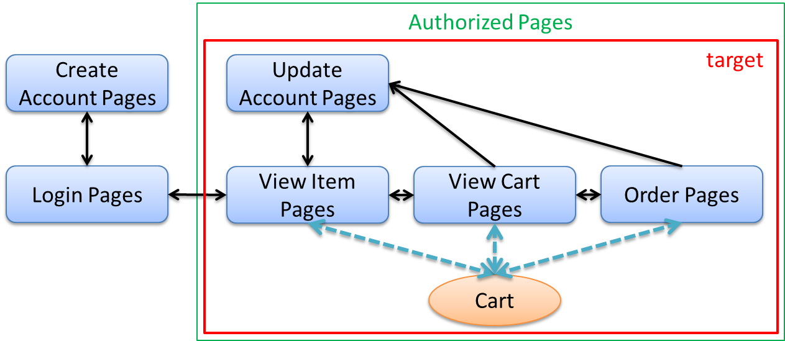
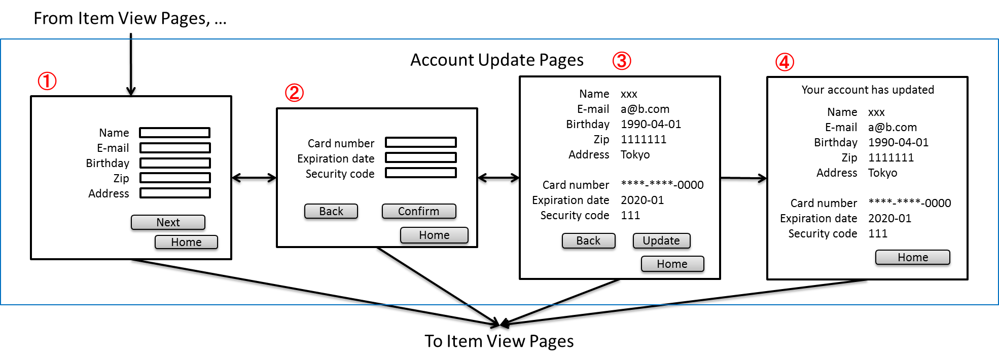
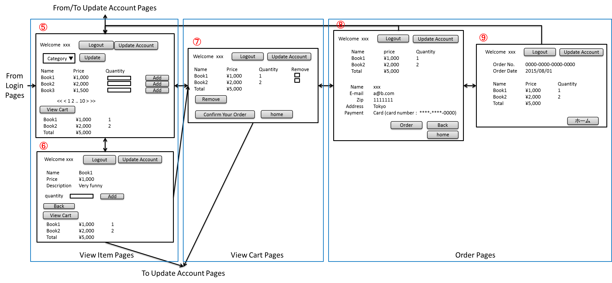

セッションチュートリアル
********************************************************************************

.. only:: html

 .. contents:: 目次
    :depth: 3
    :local:

始めに
================================================================================

学習の流れ
--------------------------------------------------------------------------------

このチュートリアルでは、簡易webアプリケーションの作成を通じてセッション管理対象となるデータの設計方法やセッションを利用するための具体的な実装方法を学習する。
本チュートリアルは以下の流れで実施する

#. 作成するwebアプリケーションの要件を確認する
#. 要件を満たすようなContollerの設計とデータの設計を行う手順を確認する
#. 設計情報をもとに実装する

このチュートリアルで学ぶこと
--------------------------------------------------------------------------------

* セッション管理対象となるデータの設計方法
    * セッションに格納するデータの選択
    * セッション中のデータの破棄
* 本FWにおけるセッションの具体的な利用方法
    * @SessionAttributeを使用する方法
    * セッションスコープのBeanを使用する方法

対象読者
--------------------------------------------------------------------------------

* チュートリアル：Todoアプリケーションを実施している
* チュートリアル：Spring Securityを実施している

検証環境
--------------------------------------------------------------------------------

本チュートリアルは以下の環境で動作確認している。

.. tabularcolumns:: |p{0.30\linewidth}|p{0.70\linewidth}|
.. list-table::
    :header-rows: 1
    :widths: 30 70

    * - 種別
      - プロダクト
    * - OS
      - Windows 7
    * - JVM
      - `Java <http://www.oracle.com/technetwork/java/javase/downloads/index.html>`_ 1.8
    * - IDE
      - `Spring Tool Suite <http://spring.io/tools/sts/all>`_ 3.6.4.RELEASE (以降「STS」と呼ぶ)
    * - Build Tool
      - `Apache Maven <http://maven.apache.org/download.cgi>`_ 3.3.3 (以降「Maven」と呼ぶ)
    * - Application Server
      - `Pivotal tc Server <https://network.pivotal.io/products/pivotal-tcserver>`_ Developer Edition v3.1 (STSに同封)
    * - Web Browser
      - `Google Chrome <https://www.google.co.jp/chrome/browser/desktop/index.html>`_ 42.0.2311.90 m
    * - Version control
      - `git <https://git-scm.com/>`_ 1.9.5

アプリケーションの概要と要件
================================================================================

概要
--------------------------------------------------------------------------------

簡易ECサイトを作成する。
ECサイトにおいて、ユーザは以下が行える。

* アカウントでログインできる
* アカウントを作成する
* 作成したアカウント情報を変更する
* ECサイトで扱っている商品一覧を見る
* 商品の詳細を見る
* 購入したい商品をカートに登録する
* カートに登録した商品をカートから削除する
* カート内の商品を注文する

アプリケーションの概要を以下の図に示す。図中のXxxPagesは画面群を表しており、1つのユースケースに対応する。
本チュートリアルでは、作成する簡易ECサイトの一部の機能・画面を作成する。

要件
--------------------------------------------------------------------------------

機能要件
^^^^^^^^^^^^^^^^^^^^^^^^^^^^^^^^^^^^^^^^^^^^^^^^^^^^^^^^^^^^^^^^^^^^^^^^^^^^^^^^

以下の機能を持つアプリケーションを作成する。

* ログイン機能を作成する **(作成済み)**
* アカウント作成機能を作成する **(作成済み)**
* アカウント情報変更機能を作成する
* 商品一覧表示機能を作成する **(作成済み)**
* 商品詳細表示機能を作成する **(作成済み)**
* カートアイテム登録機能を作成する
* カートアイテム削除機能を作成する
* 商品注文機能を作成する

本チュートリアルの初期資材として提供されるプロジェクトでは、あらかじめ一部の機能が作成されている。
本チュートリアルでは、未完成の機能を作成する。
また、未完成の機能においても、ドメイン層・インフラストラクチャ層の実装は作成済みである。
したがって、本チュートリアルでは、未完成機能の画面とアプリケーション層の作成を行う。

アプリケーションの概要で示した図にあるもののうち、本チュートリアルで作成する画面は以下のとおりである。

* Update Account Pages
* View Cart Pages
* Order Pages
* View Item Pages(カートの中身を表示する部分のみ)

非機能要件
^^^^^^^^^^^^^^^^^^^^^^^^^^^^^^^^^^^^^^^^^^^^^^^^^^^^^^^^^^^^^^^^^^^^^^^^^^^^^^^^

実際のアプリケーションを作成する際に以下の非機能要件を考慮する必要があるが、
本チュートリアルでは以下のような非機能要件があることを前提に設計・作成を行う。
以下で示されている各要件の具体的な数値は学習のための仮想的な値であり、
本チュートリアルで作成したアプリケーションが実際に要件を満たすわけではない。

可用性

* 運用期間：24時間
* 年に数日の計画停止日あり
* 1時間ほどの停止は許容
* 障害復帰は1営業日以内を目標とする
* 稼働率：99%

性能

* ユーザ数：10,000人
* 同時アクセス数：200人
* オンライン処理件数：10000件 / 月
* ユーザ数・同時アクセス数・オンライ処理件数ともに1年で1.2倍の増大が見込まれる

セキュリティ

* 個人情報、クレジットカード情報といった重要情報を扱う
* セキュアコーディングが必要

基盤構成
^^^^^^^^^^^^^^^^^^^^^^^^^^^^^^^^^^^^^^^^^^^^^^^^^^^^^^^^^^^^^^^^^^^^^^^^^^^^^^^^

本チュートリアルで作成するアプリケーションは以下の基盤上で動作させるものとする。

* Web・AP・DBの各サーバは2台構成とする。
* APサーバのメモリ搭載量は8GB、2つ空きスロットあり

.. _development_policy:

作成方針
================================================================================

前述の要件をもとに、アプリケーションの作成方針を決定する。
本チュートリアルではドメイン層・インフラストラクチャ層は作成済みであるため、
アプリケーション層に関連する項目のみを対象とする。
また、本チュートリアルはセッションの利用方法を学習することを目的としているため、
セッション管理に直接関連しない項目は記載を省略する。

.. warning::

    本章では、セッションを利用するプロセスの一例を示しているという点に留意する。
    実際の開発では、案件ごとにある作業要領・作業手順に従う必要がある。

画面定義
--------------------------------------------------------------------------------

要件をもとにアプリケーションが表示する画面を定義する。
画面定義プロセスの詳細は省略する。

最終的に定義した画面のイメージは以下のとおりである。

入出力データの抽出
--------------------------------------------------------------------------------

アプリケーションの画面で扱うデータを抽出する。
前述の画面イメージをもとに以下のデータが抽出できる。
また、ここでは抽出したデータのライフサイクルも検討している。

 .. tabularcolumns::  |p{0.05\linewidth}|p{0.15\linewidth}|p{0.40\linewidth}|p{0.40\linewidth}|
 .. list-table::
    :header-rows: 1
    :widths: 5 15 40 40
    
    * - 項番
      - データ項目名
      - データの要素
      - ライフサイクル
    * - | (1)
      - | アカウント更新情報
      - | アカウント名、メールアドレス、誕生日、郵便番号、住所、カード番号、有効期限、セキュリティコード
      - | 画面①からの入力によって生成され、①～③を遷移する間は保持される。画面①～③以外に遷移した場合に破棄される。
    * - | (2)
      - | アカウント情報
        | **(作成済み)**
      - | アカウント名、メールアドレス、パスワード、誕生日、郵便番号、住所、カード番号、有効期限、セキュリティコード
      - | ログイン時に生成され、セッションが継続している限り保持される。セッションが破棄されると同時に破棄される。
    * - | (3)
      - | カテゴリ情報
        | **(作成済み)**
      - | カテゴリ
      - | 画面⑤に遷移した際に生成され、①～⑧を遷移する間は保持される。画面⑨に遷移した場合に破棄される。
    * - | (4)
      - | ページ情報
        | **(作成済み)**
      - | ページ
      - | 画面⑤に遷移した際に生成され、①～⑧を遷移する間は保持される。画面⑨に遷移した場合に破棄される。
    * - | (5)
      - | 商品概要情報
        | **(作成済み)**
      - | 商品名、単価、(商品ID)
      - | 画面⑤に遷移する際に生成され、そのリクエスト間のみ保持される。
    * - | (6)
      - | カート登録情報1
        | **(作成済み)**
      - | 数量、(商品ID)
      - | 画面⑤からの入力によって生成され、そのリクエスト間のみ保持される。
    * - | (7)
      - | 商品詳細情報
        | **(作成済み)**
      - | 商品名、単価、説明、(商品ID)
      - | 画面⑥に遷移する際に生成され、そのリクエスト間のみ保持される。
    * - | (8)
      - | カート登録情報2
        | **(作成済み)**
      - | 数量、(商品ID)
      - | 画面⑥からの入力によって生成され、そのリクエスト間のみ保持される。
    * - | (9)
      - | カート情報
      - | 商品名、単価、数量、(商品ID)
      - | 画面⑤または⑥でカート登録機能を利用することで生成され、①～⑧を遷移する間は保持される。画面⑨に遷移した場合に破棄される。
    * - | (10)
      - | カート削除情報
      - | 商品IDリスト
      - | 画面⑦からの入力によって生成され、そのリクエスト間のみ保持される。
    * - | (11)
      - | 注文情報
      - | 注文ID、注文日時、(アカウントID)、商品名、単価、数量
      - | 画面⑨に遷移する際に生成され、そのリクエスト間のみ保持される。

URLの抽出
--------------------------------------------------------------------------------

画面イメージをもとに、アプリケーションが処理をするURLを決定する。

各画面から発生するイベントごとにURLとパラメータを設定する。
それぞれ、次の規約通りに名称を付与する。

* URL：/<ユースケース名>
* パラメータ：?<処理名>

ただし、本アプリケーションではアカウント作成と更新でユースケースが分かれるため、
それぞれ /account/create, /account/update というURLとする。

また、各URLを処理するControllerも決定する。
基本的に１つのユースケースを1つのControllerで処理させる。

最終的に、抽出されたURLは以下のように整理できる。

 .. tabularcolumns::  |p{0.05\linewidth}|p{0.20\linewidth}|p{0.10\linewidth}|p{0.20\linewidth}|p{0.25\linewidth}|p{0.20\linewidth}|
 .. list-table::
    :header-rows: 1
    :widths: 5 20 10 20 25 20
    
    * - 項番
      - 処理名
      - HTTPメソッド
      - パス
      - Controller名
      - 画面
    * - | (1)
      - | アカウント情報変更画面1表示処理
      - | GET
      - | /account/update?form1
      - | AccountUpdateController
      - | /account/updateForm1
    * - | (2)
      - | アカウント情報変更画面2表示処理
      - | POST
      - | /account/update?form2
      - | AccountUpdateController
      - | /account/updateForm2
    * - | (3)
      - | アカウント情報変更確認画面表示処理
      - | POST
      - | /account/update?confirm
      - | AccountUpdateController
      - | /account/updateConfirm
    * - | (4)
      - | アカウント情報変更処理
      - | POST
      - | /account/update
      - | AccountUpdateController
      - | アカウント情報変更完了画面表示処理へリダイレクト
    * - | (5)
      - | アカウント情報変更完了画面表示処理
      - | GET
      - | /account/update?finish
      - | AccountUpdateController
      - | /account/updateFinish
    * - | (6)
      - | アカウント情報変更画面1に戻る処理
      - | POST
      - | /account/update?redoform1
      - | AccountUpdateController
      - | /account/updateForm1
    * - | (7)
      - | アカウント情報変更画面2に戻る処理
      - | POST
      - | /account/update?redoform2
      - | AccountUpdateController
      - | /account/updateForm2
    * - | (8)
      - | ホームに戻る処理
      - | GET
      - | /account/update?home
      - | AccountUpdateController
      - | ホーム画面表示処理にリダイレクト
    * - | (9)
      - | 商品をカートへ追加処理
      - | POST
      - | /addToCart
      - | GoodsController **(作成済み)**
      - | 商品一覧画面表示処理へ
    * - | (10)
      - | カート画面表示処理
      - | GET
      - | /cart
      - | CartController
      - | cart/viewCart
    * - | (11)
      - | 商品をカートから削除処理
      - | POST
      - | /cart
      - | CartController
      - | カート画面表示処理へリダイレクト
    * - | (12)
      - | 注文確認画面表示処理
      - | GET
      - | /order?confirm
      - | OrderController
      - | order/confirm
    * - | (13)
      - | 注文処理
      - | POST
      - | /order
      - | OrderController
      - | 注文完了画面表示処理へリダイレクト
    * - | (14)
      - | 注文完了画面表示処理
      - | GET
      - | /order?finish
      - | OrderController
      - | order/finish

セッション利用有無の判断
--------------------------------------------------------------------------------

複数画面にわたって情報を保持する必要がある場合、セッションを利用することで実現が容易となる。一方で、セッションを利用する場合、そのデメリットも考慮する必要がある。
本チュートリアルでは、ガイドラインの :doc:`../ArchitectureInDetail/SessionManagement`
を参考にセッションを利用するか否かを判断する。

ガイドラインには、まずセッションを使わない方針で検討して本当に必要なデータのみセッションに格納することを推奨するとの記述がある。
本チュートリアルでもセッションを使わない方針で検討を行う。
検討する必要があるデータは次に挙げる4点である。それぞれ個別に検討する。

 .. tabularcolumns::  |p{0.25\linewidth}|p{0.85\linewidth}|
 .. list-table::
    :header-rows: 1
    :widths: 15 85
    
    * - データ項目
      - 検討内容
    * - | アカウント更新情報
      - | アカウント更新情報は3画面にまたがって保持されるため、hiddenを用いたデータの持ち回りが必要となる。しかし、アカウント更新情報にはカード番号等の重要情報が含まれる。hiddenを用いた持ち回りでは、重要情報がマスクされずHTMLのソースに書かれてしまうため、セキュリティ上問題となる。そのため、本チュートリアルではセッションを利用することを検討する。
    * - | カート情報
      - | カート情報は8画面にまたがって保持されるため、hiddenを用いたデータの持ち回りが必要となる。この場合、作成するほぼすべての画面でデータ持ち回りの処理を記述しなければならない。そのため、画面の実装コストを抑えるためにも、本チュートリアルではセッションを利用することを検討する。
    * - | カート削除情報
      - | カート削除情報は1画面でのみ利用されるため、リクエストスコープでデータを扱えばよい。
    * - | 注文情報
      - | 注文情報は1画面でのみ利用されるため、リクエストスコープでデータを扱えばよい。

以上から、アカウント更新情報とカート情報の2つについて、セッションを利用することを検討する。

次に、セッションを利用することのデメリットを検証する。
この検証によって、デメリットの影響が無視できないと判断される場合はセッションは利用しない。

セッション利用によるデメリットとして以下の4点が挙げられる。

* 複数タブ、複数ブラウザで利用した場合、互いの操作によってデータの整合性が失われる可能性がある(ことを考慮する必要がある)。
* メモリ上で管理されるため、管理するデータのサイズによってはメモリ枯渇の恐れがある。
* スケールアウトの実施や高い可用性の獲得を目的としてAPサーバを多重化した際に、セッションの同期化を考慮する必要がある。
* セッションキー名の競合を防ぐための管理コストが発生する。

上記の観点について、それぞれ検討する。

 .. tabularcolumns::  |p{0.25\linewidth}|p{0.85\linewidth}|
 .. list-table::
    :header-rows: 1
    :widths: 15 85
    
    * - 観点
      - 検討内容
    * - | データの整合性
      - | 本アプリケーションでは、複数のブラウザやタブからの操作を許容しない。そのため、データの整合性を担保する対策は不要である。
    * - | メモリ使用量
      - | セッションの利用を検討しているデータのサイズを見積もる。文字列要素は最大300バイト(日本語最大100文字を想定)、日付要素は7バイト、数値要素は4バイトで考えると、以下のようになる。
      
        * アカウント変更情報(文字列：6項目、日付：2項目)： 最大1.8Kバイト

        * カート情報(最大20商品×(文字列:2項目、数値：2項目))： 最大12Kバイト

        | 同時接続人数1万人を考慮しても使用量は140MBであり、その他のメモリ使用量を考えてもメモリ搭載量64GBを大幅に下回るため、メモリ枯渇が発生する可能性は小さい。
    * - | APサーバの多重化
      - | 本アプリケーションでは高い可用性は求められていないため、ロードバランサの機能を使って同一セッション内で発生するリクエストを全て同じAPサーバに振り分けることでレプリケーションを考慮しない。また、ユーザ増加率も大きくないため、スケールアウト実施によるレプリケーションも考慮する必要はない。
    * - | セッションキーの管理
      - | セッションに格納するデータ数が多くないため、セッションキーの管理コストは限定的なものであるといえる。

.. note::

    データの整合性を保つ必要がある場合、ガイドラインではトランザクショントークンチェックを使用して回避する方法を挙げている。ただし、この場合ユーザビリティの低いアプリケーションとなることに注意する。具体的な実現方法は \ :doc:`../ArchitectureInDetail/DoubleSubmitProtection`\  を参照されたい。

.. warning::

    メモリ枯渇を防ぐために、セッションに格納するデータは基本的に入力データに限る。検索結果等の出力データはサイズが大きくなりやすい一方、画面操作で編集することができない読み取り専用であることが多いため、セッションに格納するには向いていない。

.. note::

    レプリケーションの設定はAPサーバに依存する。そのため、レプリケーションを考慮する必要がある場合は、APサーバの設定を確認すること。

この結果から、セッションを利用することで発生するデメリットの影響は大きくないといえる。
最終的にセッションに格納するデータは以下のとおりである。

* アカウント変更情報
* カート情報

.. note::

    本チュートリアルでは、セッションを利用してデータの持ち回りを実現するという判断を下した。
    しかし、検討の結果、セッションを利用しないという判断を下すことも考えられる。
    セッションを利用しない場合は、一例としてhiddenを利用してデータを持ち回りを実現する。
    

.. warning::

    ここで判断したデータ以外にもセッションに格納されるデータが存在する場合がある。
    ガイドラインにある項目のうち、以下の項目を利用する場合にセッションが使用される。
    
    * Spring Securityを利用した認証・認可・CSRF対策を利用している
    * 二重送信防止のためのトランザクショントークンチェックを利用している

セッションを利用する際の考慮事項
--------------------------------------------------------------------------------

セッションを利用することが決まった場合、以降に挙げる項目を考慮する必要がある。
それぞれの項目を検討する。

セッション中のデータを利用するための実装方法
^^^^^^^^^^^^^^^^^^^^^^^^^^^^^^^^^^^^^^^^^^^^^^^^^^^^^^^^^^^^^^^^^^^^^^^^^^^^^^^^

本項では、各データに対してセッション中のデータを利用するための実装方法を決定する。

ガイドラインでは、データの利用場所に応じて2種類の実装方法を提供している。
:doc:`../ArchitectureInDetail/SessionManagement` では、1つのController内で完結するデータかどうかによって利用方法を区別している。
したがって、セッションに格納するデータのライフサイクルとURLマッピングによって実装方法が決定される。
このとき、データのライフサイクルに合わせてControllerの処理範囲を変える等、適宜URLマッピングを見直す必要がある。

本チュートリアルでは、アカウント変更情報は1つのController内でのみ使用され、カート情報は複数のControllerで使用される。
最終的に整理した結果が以下である。

 .. tabularcolumns::  |p{0.30\linewidth}|p{0.30\linewidth}|p{0.40\linewidth}|
 .. list-table::
    :header-rows: 1
    :widths: 30 30 40
    
    * - データ
      - 特性
      - セッション中のデータ利用方法
    * - | アカウント変更情報
      - | 1つのController内でのみ利用される
      - | @SessionAttributeアノテーションを用いた方法
    * - | カート情報
      - | 複数のController間で利用される
      - | SpringのセッションスコープのBeanを用いた方法

セッションの同期化
^^^^^^^^^^^^^^^^^^^^^^^^^^^^^^^^^^^^^^^^^^^^^^^^^^^^^^^^^^^^^^^^^^^^^^^^^^^^^^^^

同一ユーザの複数のリクエストによって、セッションに格納されているオブジェクトに同時にアクセスする可能性がある。
そのため、セッションの同期化を行わない場合、想定外のエラーや、動作を引き起こす原因になりうる。

ガイドラインでは、 :doc:`../ArchitectureInDetail/SessionManagement` にてBeanProcessorを利用した同期化の実現方法が挙げられているため、本チュートリアルではこれを利用する。

セッションタイムアウト
^^^^^^^^^^^^^^^^^^^^^^^^^^^^^^^^^^^^^^^^^^^^^^^^^^^^^^^^^^^^^^^^^^^^^^^^^^^^^^^^

セッションを利用する場合、セッションのタイムアウト時間を設定する必要がある。
タイムアウト時間が長すぎれば、不要なリソースをメモリ上に持ち続けることになり、
タイムアウト時間が短すぎれば、ユーザの利便性が低下する。
そのため、要件に合わせて適切な時間を設定する必要がある。

本チュートリアルでは、メモリリソースが十分に用意されていることもあり、APサーバのデフォルト値30分に設定する。

また、セッションタイムアウト後のリクエストに対する処理も検討する必要がある。
ガイドラインでは、  :doc:`../ArchitectureInDetail/SessionManagement` にてセッションタイムアウト後のリクエストを処理する方法が挙げられている。

本チュートリアルでは、タイムアウト後はログイン画面に遷移するように設定する。

作成方針の全体
--------------------------------------------------------------------------------

最終的な作成方針の全体イメージ図を以下に示す。

.. figure:: images/materialSessionTutorialDesignOverview.png
   :alt: overview of design
   :width: 95%

プロジェクトの構成
================================================================================

プロジェクトの作成
--------------------------------------------------------------------------------

すでに述べているように、本チュートリアルは一部機能が作成された状態からスタートする。
そのため、すでに作成済みのプロジェクトを用いて開発を進める。
プロジェクトの取得にはGitを利用する。

 .. code-block:: bash
 
    $ git clone https://github.com/xxx

.. todo::

    gitのURLを正しいものにする

なお、インポート方法は、 :doc:`../TutorialTodo/index`
で説明済みのため、本チュートリアルでは説明を割愛する。

プロジェクトの構成
--------------------------------------------------------------------------------

gitで取得した初期プロジェクトの構成について述べる。
取得したプロジェクトとブランクプロジェクトとの差分のみを以下に示す。

.. code-block:: console

    session-tutorial-init-domain
        └── src
            └── main
                 ├── java
                 │   └── com
                 │       └── example
                 │           └── session
                 │               └── domain
                 │                   ├── model  ... (1)
                 │                   │  ├── Account.java  ... (2)
                 │                   │  ├── Cart.java  ... (3)
                 │                   │  ├── CartItem.java  ... (3)
                 │                   │  ├── Goods.java
                 │                   │  ├── Order.java  ... (4)
                 │                   │  └── OrderLine.java  ... (4)
                 │                   ├── repository  ... (5)
                 │                   │  ├── account
                 │                   │  │  └── AccountRepository.java
                 │                   │  ├── goods
                 │                   │  │  └── GoodsRepository.java
                 │                   │  └── order
                 │                   │      └── OrderRepository.java
                 │                   └── service  ... (6)
                 │                       ├── account
                 │                       │  └── AccountService.java
                 │                       ├── goods
                 │                       │  └── GoodsService.java
                 │                       ├── order
                 │                       │  ├── EmptyCartOrderException.java
                 │                       │  ├── InvalidCartOrderException.java
                 │                       │  └── OrderService.java
                 │                       └── userdetails
                 │                           ├── AccountDetails.java
                 │                           └── AccountDetailsService.java
                 └── resources
                      ├── com
                      │  └── example
                      │      └── session
                      │          └── domain
                      │              └── repository  ... (7)
                      │                  ├── account
                      │                  │  └── AccountRepository.xml
                      │                  ├── goods
                      │                  │  └── GoodsRepository.xml
                      │                  └── order
                      │                      └── OrderRepository.xml
                      └── META-INF
                           ├── dozer
                           │  └── order-mapping.xml  ... (8)
                           └── spring
                               └── session-tutorial-init-codelist.xml  ... (9)

.. tabularcolumns::  |p{0.20\linewidth}|p{0.80\linewidth}|
.. list-table::
   :header-rows: 1
   :widths: 20 80
   
   * - 項番
     - 説明
   * - | (1)
     - | 本アプリケーションで使用するmodelを扱うパッケージ。
       | チュートリアルを進める上で理解しておく必要があるmodelは以下で詳しく説明する。
   * - | (2)
     - | ユーザアカウント情報を保持するクラス。
   * - | (3)
     - | ユーザがカートに登録した商品の情報を保持するクラス。
       | 全体を `Cart` が管理し、個別の商品を `CartItem` が管理する。
   * - | (4)
     - | ユーザが注文した商品の情報を保持するクラス。
       | 全体を `Order` が管理し、個別の商品を `OrderLine` が管理する。
   * - | (5)
     - | 本アプリケーションで使用するrepositoryを扱うパッケージ。
   * - | (6)
     - | 本アプリケーションで使用するserviceを扱うパッケージ。
   * - | (7)
     - | repositoryで使用するマッピングファイルを格納するディレクトリ。
   * - | (8)
     - | Dozer(Bean Mapper)のマッピング定義ファイル。
       | `Cart` から `Order` への変換が定義されている。
   * - | (9)
     - | 本アプリケーションで使用するコードリストを定義したBean定義ファイル。

.. code-block:: console

    session-tutorial-init-env
        └── src
            └── main
                 └── resources
                     └── database  ... (1)
                         ├── H2-dataload.sql
                         └── H2-schema.sql

.. tabularcolumns::  |p{0.20\linewidth}|p{0.80\linewidth}|
.. list-table::
   :header-rows: 1
   :widths: 20 80
   
   * - ファイル名
     - 説明
   * - | (1)
     - | 本アプリケーションでインメモリデータベース(H2 Database)をセットアップするためのSQLを格納するディレクトリ。

.. code-block:: console

    session-tutorial-init-web
        └── src
            └── main
                 ├── java
                 │   └── com
                 │       └── example
                 │           └── session
                 │               └── app  ... (1)
                 │                   ├── account 
                 │                   │  ├── AccountCreateController.java 
                 │                   │  ├── AccountCreateForm.java 
                 │                   │  ├── IlleagalOperationException.java  
                 │                   │  └── IlleagalOperationExceptionHandler.java
                 │                   ├── goods
                 │                   │  ├── GoodsController.java  
                 │                   │  └── GoodsViewForm.java
                 │                   ├── login
                 │                   │  └── LoginController.java
                 │                   └── validation
                 │                       ├── Confirm.java
                 │                       └── ConfirmValidator.java
                 ├── resources
                 │   ├── i18n
                 │   │  └── application-messages.properties  ... (2)
                 │   ├── META-INF
                 │   │   └── spring  ... (3)
                 │   │       ├── spring-mvc.xml
                 │   │       └── spring-security.xml
                 │   └── ValidationMessages.properties  ... (2)
                 └── webapp
                      ├── resources  ... (4)
                      │  ├── app
                      │  │  └── css
                      │  │      └── styles.css
                      │  └── vendor
                      │      └── bootstrap-3.0.0
                      │          └── css
                      │              └── bootstrap.css
                      └── WEB-INF
                          └── views  ... (5)
                              ├── account
                              │  ├── createConfirm.jsp
                              │  ├── createFinish.jsp
                              │  └── createForm.jsp
                              ├── common
                              │  ├── error
                              │  │  └── illegalOperationError.jsp
                              │  └── include.jsp
                              ├── goods
                              │  ├── showGoods.jsp
                              │  └── showGoodsDetails.jsp
                              └── login
                                  └── loginForm.jsp

.. tabularcolumns::  |p{0.20\linewidth}|p{0.80\linewidth}|
.. list-table::
   :header-rows: 1
   :widths: 20 80
   
   * - 項番
     - 説明
   * - | (1)
     - | 本アプリケーションで使用するアプリケーション層のクラスを格納するためのパッケージ。
   * - | (2)
     - | 本アプリケーションで使用するメッセージが定義されているプロパディファイル
   * - | (3)
     - | 本アプリケーションで使用するコンポーネントが定義されているBean定義ファイル
   * - | (4)
     - | 本アプリケーションで使用する静的リソースファイル
   * - | (5)
     - | 本アプリケーションで使用するjspが格納されているディレクトリ

動作確認
--------------------------------------------------------------------------------

アプリケーション開発を行う前に、取得したプロジェクトの動作確認を行う。
STSにインポートしたプロジェクトを対象として、アプリケーションサーバを起動する
アプリケーションサーバの起動方法は、  :doc:`../TutorialTodo/index`
で説明済みのため、本チュートリアルでは説明を割愛する。

アプリケーションサーバ起動後、 `<http://localhost:8080/session-tutorial-init-web/loginForm>`_ にアクセスすると以下の画面が表示される。

.. figure:: images/materialSessionTutorialLoginPage.png
   :alt: Login Page
   :width: 40%
   
ログイン画面上にある"here"のリンクを選択すると、アカウント作成を行うことができる。

.. figure:: images/materialSessionTutorialCreateAccountPages.png
   :alt: Create Account Pages
   :width: 95%

ログイン画面にて、(E-mail="a@b.com"、Password="demo")をフォーム入力するとログインすることができる。
ログイン後は商品一覧が表示される。
商品名を選択すると商品詳細を表示できる。

.. figure:: images/materialSessionTutorialViewItemPages.png
   :alt: View Item Pages
   :width: 65%
   
   

簡易ECサイトアプリケーションの作成
================================================================================

アカウント情報変更機能を作成する
--------------------------------------------------------------------------------

ユーザに情報を入力させてアカウント情報を更新する機能を作成する。

:ref:`development_policy` で説明したとおり、アカウント変更情報は ``@SessionAttributesアノテーション`` を利用して管理する。

以下にアカウント情報変更機能で実装する画面の情報を示す。

 .. tabularcolumns::  |p{0.30\linewidth}|p{0.15\linewidth}|p{0.25\linewidth}|p{0.30\linewidth}|
 .. list-table::
    :header-rows: 1
    :widths: 30 15 25 30
    
    * - 処理名
      - HTTPメソッド
      - パス
      - 画面
    * - | アカウント情報変更画面1表示処理
      - | GET
      - | /account/update?form1
      - | /account/updateForm1
    * - | アカウント情報変更画面2表示処理
      - | GET
      - | /account/update?form2
      - | /account/updateForm2
    * - | アカウント情報変更確認画面表示処理
      - | GET
      - | /account/update?confirm
      - | /account/updateConfirm
    * - | アカウント情報変更処理
      - | POST
      - | /account/update
      - | アカウント情報変更完了画面表示処理へリダイレクト
    * - | アカウント情報変更完了画面表示処理
      - | GET
      - | /account/update?finish
      - | /account/updateFinish
    * - | アカウント情報変更画面1に戻る処理
      - | GET
      - | /account/update?redoform1
      - | /account/updateForm1
    * - | アカウント情報変更画面2に戻る処理
      - | GET
      - | /account/update?redoform2
      - | /account/updateForm2
    * - | ホームに戻る処理
      - | GET
      - | /account/update?back
      - | ホーム画面表示処理にリダイレクト

フォームオブジェクトの作成
^^^^^^^^^^^^^^^^^^^^^^^^^^^^^^^^^^^^^^^^^^^^^^^^^^^^^^^^^^^^^^^^^^^^^^^^^^^^^^^^

アカウント変更情報を保持するクラスを作成する。

``/session-tutorial-init-web/src/main/java/com/example/session/app/account/AccountUpdateForm.java``

.. code-block:: java
 
    package com.example.session.app.account;
     
    import java.io.Serializable;
    import java.util.Date;
     
    import javax.validation.constraints.NotNull;
    import javax.validation.constraints.Size;
     
    import org.hibernate.validator.constraints.Email;
    import org.springframework.format.annotation.DateTimeFormat;
     
    public class AccountUpdateForm implements Serializable {  // (1)
     
        /**
         *
         */
        private static final long serialVersionUID = 1L;
     
        private String id;
     
        // (2)
        @NotNull(groups = { Wizard1.class })
        @Size(min = 1, max = 255, groups = { Wizard1.class })
        private String name;
     
        @NotNull(groups = { Wizard1.class })
        @Size(min = 1, max = 255, groups = { Wizard1.class })
        @Email(groups = { Wizard1.class })
        private String email;
     
        @NotNull(groups = { Wizard1.class })
        @DateTimeFormat(iso = DateTimeFormat.ISO.DATE)
        private Date birthday;
     
        @NotNull(groups = { Wizard1.class })
        @Size(min = 7, max = 7, groups = { Wizard1.class })
        private String zip;
     
        @NotNull(groups = { Wizard1.class })
        @Size(min = 1, max = 255, groups = { Wizard1.class })
        private String address;
     
        @Size(min = 16, max = 16, groups = { Wizard2.class })
        private String cardNumber;
     
        @DateTimeFormat(pattern = "yyyy-MM")
        private Date cardExpirationDate;
     
        @Size(min = 1, max = 255, groups = { Wizard2.class })
        private String cardSecurityCode;
     
        public String getId() {
            return id;
        }
     
        public void setId(String id) {
            this.id = id;
        }
     
        public String getName() {
            return name;
        }
     
        public void setName(String name) {
            this.name = name;
        }
     
        public String getEmail() {
            return email;
        }
     
        public void setEmail(String email) {
            this.email = email;
        }
     
        public Date getBirthday() {
            return birthday;
        }
     
        public void setBirthday(Date birthday) {
            this.birthday = birthday;
        }
     
        public String getZip() {
            return zip;
        }
     
        public void setZip(String zip) {
            this.zip = zip;
        }
     
        public String getAddress() {
            return address;
        }
     
        public void setAddress(String address) {
            this.address = address;
        }
     
        public String getCardNumber() {
            return cardNumber;
        }
     
        public void setCardNumber(String cardNumber) {
            this.cardNumber = cardNumber;
        }
     
        public Date getCardExpirationDate() {
            return cardExpirationDate;
        }
     
        public void setCardExpirationDate(Date cardExpirationDate) {
            this.cardExpirationDate = cardExpirationDate;
        }
     
        public String getCardSecurityCode() {
            return cardSecurityCode;
        }
     
        public void setCardSecurityCode(String cardSecurityCode) {
            this.cardSecurityCode = cardSecurityCode;
        }
     
        public String getLastFourOfCardNumber() {
            if (cardNumber == null) {
                return "";
            }
            return cardNumber.substring(cardNumber.length() - 4);
        }
     
        public static interface Wizard1 {
     
        }
     
        public static interface Wizard2 {
     
        }
    }

.. tabularcolumns:: |p{0.10\linewidth}|p{0.90\linewidth}|
.. list-table::
    :widths: 10 90
    :header-rows: 1

    * - 項番
      - 説明
    * - | (1)
      - | このクラスのインスタンスをセッションに格納するため、Serializableを実装しておく。
    * - | (2)
      - | 画面遷移ごとに入力チェックの対象を指定するために、バリデーションのグループ化を行う。
        | 上記例では、1ページ目の入力項目と2ページ目の入力項目にそれぞれに対応した入力チェックを実現するために、2つのグループを作成している。

Controllerの作成
^^^^^^^^^^^^^^^^^^^^^^^^^^^^^^^^^^^^^^^^^^^^^^^^^^^^^^^^^^^^^^^^^^^^^^^^^^^^^^^^

Controllerを作成する。
Controllerでは、入力情報を受け取るフォームを ``@SessionAttributes`` アノテーションで管理させる記述が必要である。

``/session-tutorial-init-web/src/main/java/com/example/session/app/account/AccountUpdateController.java``

.. code-block:: java

    package com.example.session.app.account;

    import javax.inject.Inject;

    import org.dozer.Mapper;
    import org.springframework.beans.propertyeditors.StringTrimmerEditor;
    import org.springframework.security.web.bind.annotation.AuthenticationPrincipal;
    import org.springframework.stereotype.Controller;
    import org.springframework.validation.BindingResult;
    import org.springframework.validation.annotation.Validated;
    import org.springframework.web.bind.WebDataBinder;
    import org.springframework.web.bind.annotation.InitBinder;
    import org.springframework.web.bind.annotation.ModelAttribute;
    import org.springframework.web.bind.annotation.RequestMapping;
    import org.springframework.web.bind.annotation.RequestMethod;
    import org.springframework.web.bind.annotation.SessionAttributes;
    import org.springframework.web.bind.support.SessionStatus;
    import org.springframework.web.servlet.mvc.support.RedirectAttributes;
    import org.terasoluna.gfw.common.message.ResultMessages;

    import com.example.session.app.account.AccountUpdateForm.Wizard1;
    import com.example.session.app.account.AccountUpdateForm.Wizard2;
    import com.example.session.domain.model.Account;
    import com.example.session.domain.service.account.AccountService;
    import com.example.session.domain.service.userdetails.AccountDetails;

    @Controller
    @SessionAttributes(value = { "accountUpdateForm" }) // (1)
    @RequestMapping("account")
    public class AccountUpdateController {

        @Inject
        AccountService accountService;

        @Inject
        Mapper beanMapper;

        @InitBinder
        public void initBinder(WebDataBinder binder) {
            binder.registerCustomEditor(String.class, new StringTrimmerEditor(true));
        }

        @ModelAttribute(value = "accountUpdateForm") // (2)
        public AccountUpdateForm setUpAccountForm() {
            return new AccountUpdateForm();
        }

        @RequestMapping(value = "update", params = "form1")
        public String showUpdateForm1(
                @AuthenticationPrincipal AccountDetails userDetails,
                AccountUpdateForm form) { // (3)

            Account account = accountService.findOne(userDetails.getAccount()
                    .getEmail());
            beanMapper.map(account, form);

            return "account/updateForm1";
        }

        @RequestMapping(value = "update", params = "form2")
        public String showUpdateForm2(
                @Validated((Wizard1.class)) AccountUpdateForm form,
                BindingResult result) {

            if (result.hasErrors()) {
                return "account/updateForm1";
            }

            return "account/updateForm2";
        }

        @RequestMapping(value = "update", params = "redoForm1")
        public String redoUpdateForm1() {
            return "account/updateForm1";
        }

        @RequestMapping(value = "update", params = "confirm")
        public String confirmUpdate(
                @Validated(Wizard2.class) AccountUpdateForm form,
                BindingResult result) {

            if (result.hasErrors()) {
                return "account/updateForm2";
            }

            return "account/updateConfirm";
        }

        @RequestMapping(value = "update", params = "redoForm2")
        public String redoUpdateForm2() {
            return "account/updateForm2";
        }

        @RequestMapping(value = "update", method = RequestMethod.POST)
        public String update(
                @AuthenticationPrincipal AccountDetails userDetails,
                @Validated({ Wizard1.class, Wizard2.class }) AccountUpdateForm form,
                BindingResult result, RedirectAttributes attributes, SessionStatus sessionStatus) {

            if (result.hasErrors()) {
                ResultMessages messages = ResultMessages.error();
                messages.add("e.st.ac.5001");
                throw new IllegalOperationException(messages);
            }

            Account account = beanMapper.map(form, Account.class);
            accountService.update(account);
            userDetails.setAccount(account);
            attributes.addFlashAttribute("account", account);
            sessionStatus.setComplete();  // (4)

            return "redirect:/account/update?finish";
        }

        @RequestMapping(value = "update", method = RequestMethod.GET, params = "finish")
        public String finishUpdate() {
            return "account/updateFinish";
        }

        @RequestMapping(value = "update", method = RequestMethod.GET, params = "home")
        public String home(SessionStatus sessionStatus) {
            sessionStatus.setComplete();
            return "redirect:/goods";
        }

    }

.. tabularcolumns:: |p{0.10\linewidth}|p{0.90\linewidth}|
.. list-table::
    :widths: 10 90
    :header-rows: 1

    * - 項番
      - 説明
    * - | (1)
      - | ``@SessionAttributes`` アノテーションのvalue属性に、セッションに格納するオブジェクトの属性名を指定する。
        | 上記例は、属性名が ``"accountUpdateForm"`` のオブジェクトが、セッションに格納される。
    * - | (2)
      - | Modelオブジェクトに格納する属性名を、value属性に指定する。
        | 上記例では、返却したオブジェクトが、 ``"accountUpdateForm"`` という属性名でセッションに格納される。
        | value属性を指定した場合、セッションにオブジェクトを格納した後のリクエストで、 ``@ModelAttribute`` アノテーションの付与されたメソッドが呼び出されなくなるため、無駄なオブジェクトの生成が行われないというメリットがある。
    * - | (3)
      - | ``@SessionAttributes`` アノテーションによって管理されたオブジェクトを利用するには、そのオブジェクトを受け取れるようメソッドに引数を追加する。
        | 入力チェックが必要がであれば ``@Validated`` アノテーションを利用する。
        | 上記例では、 ``AccountUpdateForm`` のデフォルトの属性名である ``"accountUpdateForm"`` を属性名にもつオブジェクトが引数として渡される。
    * - | (4)
      - | ``SessionStatus`` オブジェクトの ``setComplete`` メソッドを呼び出し、オブジェクトをセッションから削除する。
      

.. warning:: 

    ``@SessionAttributes`` アノテーションで管理しているオブジェクトは、明示的に削除を行わない限りセッション中に残り続ける。
    そのため、Controllerが扱う画面外に遷移して再度戻ってきた場合にも保持していたデータを参照できる。
    メモリの枯渇を防ぐために、不要になったデータは必ず削除すること。

.. warning::

    ブラウザのボタンでバックされたり、URLを直接入力して画面遷移した場合は、``setComplete`` メソッドが呼ばれず、セッションがクリアされずに残ってしまう点に留意する必要がある。

JSPの作成
^^^^^^^^^^^^^^^^^^^^^^^^^^^^^^^^^^^^^^^^^^^^^^^^^^^^^^^^^^^^^^^^^^^^^^^^^^^^^^^^

``@SessionAttributes`` アノテーションで管理しているフォームオブジェクトにデータの受け渡しをする画面を作成する。

1ページ目の入力画面

``/session-tutorial-init-web/src/main/webapp/WEB-INF/views/account/updateForm1.jsp``

.. code-block:: jsp

    <!DOCTYPE html>
    <html>
    <head>
    <meta charset="UTF-8" />
    <title>Account Update Page</title>
    <link rel="stylesheet"
        href="${pageContext.request.contextPath}/resources/app/css/styles.css">
    </head>
    <body>

        

            <%-- (1) --%>
            <form:form action="${pageContext.request.contextPath}/account/update"
                method="post" modelAttribute="accountUpdateForm">

                <h2>Account Update Page 1/2</h2>
                <table>
                    <tr>
                        <td><form:label path="name" cssErrorClass="error-label">name</form:label></td>
                        <%-- (2) --%>
                        <td><form:input path="name" cssErrorClass="error-input" /> <form:errors
                                path="name" cssClass="error-messages" /></td>
                    </tr>
                    <tr>
                        <td><form:label path="email" cssErrorClass="error-label">e-mail</form:label></td>
                        <td><form:input path="email" cssErrorClass="error-input" /> <form:errors
                                path="email" cssClass="error-messages" /></td>
                    </tr>
                    <tr>
                        <td><form:label path="birthday" cssErrorClass="error-label">birthday</form:label></td>
                        <td><fmt:formatDate value="${accountUpdateForm.birthday}"
                                pattern="yyyy-MM-dd" var="formattedBirthday" /> <input
                            type="date" id="birthday" name="birthday"
                            value="${formattedBirthday}"> <form:errors path="birthday"
                                cssClass="error-messages" /></td>
                    </tr>
                    <tr>
                        <td><form:label path="zip" cssErrorClass="error-label">zip</form:label></td>
                        <td><form:input path="zip" cssErrorClass="error-input" /> <form:errors
                                path="zip" cssClass="error-messages" /></td>
                    </tr>
                    <tr>
                        <td><form:label path="address" cssErrorClass="error-label">address</form:label></td>
                        <td><form:input path="address" cssErrorClass="error-input" />
                            <form:errors path="address" cssClass="error-messages" /></td>
                    </tr>
                    <tr>
                        <td>&nbsp;</td>
                        <td><input type="submit" name="form2" id="next" value="next" /></td>
                    </tr>
                </table>
            </form:form>

            <form method="get"
                action="${pageContext.request.contextPath}/account/update">
                <input type="submit" name="home" id="home" value="home" />
            </form>
        

    </body>
    </html>

.. tabularcolumns:: |p{0.10\linewidth}|p{0.90\linewidth}|
.. list-table::
    :widths: 10 90
    :header-rows: 1

    * - 項番
      - 説明
    * - | (1)
      - | 入力データを受け取るフォームオブジェクトの属性名をmodelAttribute属性に指定する。
        | 上記例は、属性名が ``"accountUpdateForm"`` のオブジェクトが入力データを受け取る。
    * - | (2)
      - | form:inputタグのpath属性に入力データを格納するオブジェクトの要素名を指定する。
        | この方法を利用すると、指定したオブジェクトの要素名にすでにデータがある場合、その値が入力フォームのデフォルト値となる。

2ページ目の入力画面

``/session-tutorial-init-web/src/main/webapp/WEB-INF/views/account/updateForm2.jsp``

.. code-block:: jsp

    <!DOCTYPE html>
    <html>
    <head>
    <meta charset="UTF-8" />
    <title>Account Update Page</title>
    <link rel="stylesheet"
        href="${pageContext.request.contextPath}/resources/app/css/styles.css">
    </head>
    <body>

        

            <form:form action="${pageContext.request.contextPath}/account/update"
                method="post" modelAttribute="accountUpdateForm">

                <h2>Account Update Page 2/2</h2>
                <table>
                    <tr>
                        <td><form:label path="cardNumber" cssErrorClass="error-label">your card number</form:label></td>
                        <td><form:input path="cardNumber" cssErrorClass="error-input" />
                            <form:errors path="cardNumber" cssClass="error-messages" /></td>
                    </tr>
                    <tr>
                        <td><form:label path="cardExpirationDate"
                                cssErrorClass="error-label">expiration date of
                                your card</form:label></td>
                        <td><fmt:formatDate
                                value="${accountUpdateForm.cardExpirationDate}" pattern="yyyy-MM"
                                var="formattedCardExpirationDate" /><input type="month"
                            name="cardExpirationDate" id="cardExpirationDate"
                            value="${formattedCardExpirationDate}"> <form:errors
                                path="cardExpirationDate" cssClass="error-messages" /></td>
                    </tr>
                    <tr>
                        <td><form:label path="cardSecurityCode"
                                cssErrorClass="error-label">security code of
                                your card</form:label></td>
                        <td><form:input path="cardSecurityCode"
                                cssErrorClass="error-input" /> <form:errors
                                path="cardSecurityCode" cssClass="error-messages" /></td>
                    </tr>
                    <tr>
                        <td>&nbsp;</td>
                        <td><input type="submit" name="redoForm1" id="back"
                            value="back" /><input type="submit" name="confirm" id="confirm"
                            value="confirm" /></td>
                    </tr>
                </table>
            </form:form>

            <form method="get"
                action="${pageContext.request.contextPath}/account/update">
                <input type="submit" name="home" id="home" value="home" />
            </form>
        

    </body>
    </html>

確認画面

``/session-tutorial-init-web/src/main/webapp/WEB-INF/views/account/updateConfirm.jsp``

.. code-block:: jsp

    <!DOCTYPE html>
    <html>
    <head>
    <meta charset="UTF-8" />
    <title>Account Update Page</title>
    <link rel="stylesheet"
        href="${pageContext.request.contextPath}/resources/app/css/styles.css">
    </head>
    <body>
        

            <form:form action="${pageContext.request.contextPath}/account/update"
                method="post">

                <h3>Your account will be updated with below information. Please
                    push "update" button if it's OK.</h3>
                <table>
                    <tr>
                        <td><label for="name">name</label></td>
                        <td>${f:h(accountUpdateForm.name)}</td>
                    </tr>
                    <tr>
                        <td><label for="email">e-mail</label></td>
                        <td>${f:h(accountUpdateForm.email)}</td>
                    </tr>
                    <tr>
                        <td><label for="birthday">birthday</label></td>
                        <td><fmt:formatDate
                                    value="${accountUpdateForm.birthday}" pattern="yyyy-MM-dd" /></td>
                    </tr>
                    <tr>
                        <td><label for="zip">zip</label></td>
                        <td>${f:h(accountUpdateForm.zip)}</td>
                    </tr>
                    <tr>
                        <td><label for="address">address</label></td>
                        <td>${f:h(accountUpdateForm.address)}</td>
                    </tr>
                    <tr>
                        <td><label for="cardNumber">your card number</label></td>
                        <td>****-****-****-${f:h(accountUpdateForm.lastFourOfCardNumber)}</td>
                    </tr>
                    <tr>
                        <td><label for="cardExpirationDate">expiration date of
                                your card</label></td>
                        <td><fmt:formatDate
                                    value="${accountUpdateForm.cardExpirationDate}"
                                    pattern="yyyy-MM" /></td>
                    </tr>
                    <tr>
                        <td><label for="cardSecurityCode">security code of
                                your card</label></td>
                        <td>${f:h(accountUpdateForm.cardSecurityCode)}</td>
                    </tr>
                    <tr>
                        <td>&nbsp;</td>
                        <td><input type="submit" name="redoForm2" id="back"
                            value="back" /><input type="submit" id="update" value="update" /></td>
                    </tr>
                </table>
            </form:form>

            <form method="get"
                action="${pageContext.request.contextPath}/account/update">
                <input type="submit" name="home" id="home" value="home" />
            </form>
        

    </body>
    </html>

完了画面

``/session-tutorial-init-web/src/main/webapp/WEB-INF/views/account/updateFinish.jsp``

.. code-block:: jsp

    <!DOCTYPE html>
    <html>
    <head>
    <meta charset="UTF-8" />
    <title>Account Update Page</title>
    <link rel="stylesheet"
        href="${pageContext.request.contextPath}/resources/app/css/styles.css">
    </head>
    <body>
        

            <h3>Your account has updated.</h3>
            <table>
                <tr>
                    <td><label for="name">name</label></td>
                    <td>${f:h(account.name)}</td>
                </tr>
                <tr>
                    <td><label for="email">e-mail</label></td>
                    <td>${f:h(account.email)}</td>
                </tr>
                <tr>
                    <td><label for="birthday">birthday</label></td>
                    <td><fmt:formatDate
                                value="${account.birthday}" pattern="yyyy-MM-dd" /></td>
                </tr>
                <tr>
                    <td><label for="zip">zip</label></td>
                    <td>${f:h(account.zip)}</td>
                </tr>
                <tr>
                    <td><label for="address">address</label></td>
                    <td>${f:h(account.address)}</td>
                </tr>
                <tr>
                    <td><label for="cardNumber">your card number</label></td>
                    <td>****-****-****-${f:h(account.lastFourOfCardNumber)}</td>
                </tr>
                <tr>
                    <td><label for="cardExpirationDate">expiration date of
                            your card</label></td>
                    <td><fmt:formatDate
                                value="${account.cardExpirationDate}" pattern="yyyy-MM" /></td>
                </tr>
                <tr>
                    <td><label for="cardSecurityCode">security code of your
                            card</label></td>
                    <td>${f:h(account.cardSecurityCode)}</td>
                </tr>
            </table>

            <form method="get"
                action="${pageContext.request.contextPath}/account/update">
                <input type="submit" name="home" id="home" value="home" />
            </form>

        

    </body>
    </html>

動作確認
^^^^^^^^^^^^^^^^^^^^^^^^^^^^^^^^^^^^^^^^^^^^^^^^^^^^^^^^^^^^^^^^^^^^^^^^^^^^^^^^

ここまでの実装でアカウント情報更新を行うことができるようになっている。
商品一覧表示画面の上部にある「Account Update」のボタンを押下することでアカウント情報更新画面に遷移する。
現在、ログインしているアカウントの情報が初期値としてフォームに表示される。
フォームの値を変更して次の画面に進んでいくことで、最終的にアカウントの情報が更新される。

ここまでの実装で入力値を受け取るフォームをセッションに格納しているため、
データの持ち回りが簡単に実現できる。
また、「home」ボタンを押した際にセッションが破棄されるため、
「home」ボタンを押した後にアカウント情報更新画面に遷移すると、変更情報がリセットされる。

カートアイテム登録機能を作成する
--------------------------------------------------------------------------------

指定した数量で商品をカートに登録する機能を作成する。

:ref:`development_policy` で説明したとおり、カート情報はセッションスコープのBeanとして管理する。

以下にカートアイテム登録機能で実装する画面の情報を示す。

 .. tabularcolumns::  |p{0.30\linewidth}|p{0.15\linewidth}|p{0.25\linewidth}|p{0.30\linewidth}|
 .. list-table::
    :header-rows: 1
    :widths: 30 15 25 30
    
    * - 処理名
      - HTTPメソッド
      - パス
      - 画面
    * - | 商品をカートへ追加処理
      - | POST
      - | /addToCart
      - | 商品一覧画面表示処理へ

セッションスコープBeanを定義
^^^^^^^^^^^^^^^^^^^^^^^^^^^^^^^^^^^^^^^^^^^^^^^^^^^^^^^^^^^^^^^^^^^^^^^^^^^^^^^^

カート情報を保持するオブジェクトは、 ``Cart.java`` としてすでに作成済みである。
そのため、このオブジェクトをセッションスコープのBeanとして扱えるように設定を加える。

セッションスコープのBeanを使用する方法として、 :doc:`../ArchitectureInDetail/SessionManagement` に2種類の設定方法が記載されている。
本チュートリアルでは、Bean定義ファイル(XML)に定義する方法を使用する。

.. warning::
    
    セッションスコープのBeanとして登録するためには対象のオブジェクトが `Serializable` である必要がある

Bean定義ファイルを用いてセッションスコープのBeanを定義するには、Bean定義ファイルに以下を追加すればよい。

``/session-tutorial-base-domain/src/main/resources/META-INF/spring/session-tutorial-base-domain.xml``

.. code-block:: xml

    <bean id="cart" class="com.example.session.domain.model.Cart" scope="session">
        <aop:scoped-proxy />
    </bean>

フォームオブジェクトの作成
^^^^^^^^^^^^^^^^^^^^^^^^^^^^^^^^^^^^^^^^^^^^^^^^^^^^^^^^^^^^^^^^^^^^^^^^^^^^^^^^

注文する商品の情報を保持するクラスを作成する。

``/session-tutorial-init-web/src/main/java/com/example/session/app/goods/GoodAddForm.java``

.. code-block:: java

    package com.example.session.app.goods;

    import java.io.Serializable;

    import javax.validation.constraints.Min;
    import javax.validation.constraints.NotNull;

    public class GoodAddForm implements Serializable {

        /**
         *
         */
        private static final long serialVersionUID = 1L;

        @NotNull
        private String goodsId;

        @NotNull
        @Min(1)
        private int quantity;

        public String getGoodsId() {
            return goodsId;
        }

        public void setGoodsId(String goodsId) {
            this.goodsId = goodsId;
        }

        public int getQuantity() {
            return quantity;
        }

        public void setQuantity(int quantity) {
            this.quantity = quantity;
        }
    }

Controllerの作成
^^^^^^^^^^^^^^^^^^^^^^^^^^^^^^^^^^^^^^^^^^^^^^^^^^^^^^^^^^^^^^^^^^^^^^^^^^^^^^^^

Controllerを作成する。 

一部リクエストを処理するためにすでに作成されているため、以下のコードを追加する。

``/session-tutorial-init-web/src/main/java/com/example/session/app/goods/GoodsController.java``

.. code-block:: java
    :emphasize-lines: 32-34, 59-77

    package com.example.session.app.goods;

    import javax.inject.Inject;

    import org.springframework.data.domain.Page;
    import org.springframework.data.domain.Pageable;
    import org.springframework.stereotype.Controller;
    import org.springframework.ui.Model;
    import org.springframework.validation.BindingResult;
    import org.springframework.validation.annotation.Validated;
    import org.springframework.web.bind.annotation.ModelAttribute;
    import org.springframework.web.bind.annotation.PathVariable;
    import org.springframework.web.bind.annotation.RequestMapping;
    import org.springframework.web.bind.annotation.RequestMethod;
    import org.springframework.web.bind.annotation.SessionAttributes;
    import org.springframework.web.servlet.mvc.support.RedirectAttributes;
    import org.terasoluna.gfw.common.message.ResultMessages;

    import com.example.session.domain.model.Cart;
    import com.example.session.domain.model.CartItem;
    import com.example.session.domain.model.Goods;
    import com.example.session.domain.service.goods.GoodsService;

    @Controller
    @RequestMapping("goods")
    @SessionAttributes(value = { "goodViewForm" })
    public class GoodsController {

    	@Inject
    	GoodsService goodsService;

    	// (1)
    	@Inject
    	Cart cart;

    	@ModelAttribute(value = "goodViewForm")
    	public GoodViewForm setUpCategoryId() {
    		return new GoodViewForm();
    	}

    	@RequestMapping(value = "", method = RequestMethod.GET)
    	String showGoods(GoodViewForm form, Pageable pageable, Model model) {

    		Page<Goods> page = goodsService.findByCategoryId(form.getCategoryId(),
    				pageable);
    		model.addAttribute("page", page);
    		return "goods/showGoods";
    	}

    	@RequestMapping(value = "/{goodsId}", method = RequestMethod.GET)
    	public String showGoodsDetail(@PathVariable String goodsId, Model model) {

    		Goods goods = goodsService.findOne(goodsId);
    		model.addAttribute(goods);

    		return "/goods/showGoodsDetail";
    	}

    	@RequestMapping(value = "/addToCart", method = RequestMethod.POST)
    	public String addToCart(@Validated GoodAddForm form, BindingResult result,
    			RedirectAttributes attributes) {

    		if (result.hasErrors()) {
    			ResultMessages messages = ResultMessages.error()
    					.add("e.st.go.5001");
    			attributes.addFlashAttribute(messages);
    			return "redirect:/goods";
    		}

    		Goods goods = goodsService.findOne(form.getGoodsId());
    		CartItem cartItem = new CartItem();
    		cartItem.setGoods(goods);
    		cartItem.setQuantity(form.getQuantity());
    		cart.add(cartItem); // (2)

    		return "redirect:/goods";
    	}
    }

.. tabularcolumns:: |p{0.10\linewidth}|p{0.90\linewidth}|
.. list-table::
    :widths: 10 90
    :header-rows: 1

    * - 項番
      - 説明
    * - | (1)
      - | セッションスコープのBeanをDIコンテナから取得する。
    * - | (2)
      - | セッションスコープのBeanにデータを追加する。
        | 画面に情報を表示させるために、オブジェクトをModelに追加する必要はない。

JSPの作成
^^^^^^^^^^^^^^^^^^^^^^^^^^^^^^^^^^^^^^^^^^^^^^^^^^^^^^^^^^^^^^^^^^^^^^^^^^^^^^^^

カートの中身を表示するためのJSPを作成する。

JSPもすでに作成されているため、以下に示すコードをbodyタグの最後に追加する。

``/session-tutorial-init-web/src/main/webapp/WEB-INF/views/goods/showGoods.jsp``

.. code-block:: jsp
    :emphasize-lines: 45, 53-59, 72-97

    <!DOCTYPE html>
    <html>
    <head>
    <meta charset="UTF-8" />
    <title>Item List Page</title>
    <link rel="stylesheet"
        href="${pageContext.request.contextPath}/resources/app/css/styles.css">
    <link rel="stylesheet"
        href="${pageContext.request.contextPath}/resources/vendor/bootstrap-3.0.0/css/bootstrap.css"
        type="text/css" media="screen, projection">
    </head>
    <body>

        <sec:authentication property="principal" var="userDetails" />
        

            welcome&nbsp;&nbsp; ${f:h(userDetails.account.name)}
            <form method="post" action="${pageContext.request.contextPath}/logout">
                <input type="submit" id="logout" value="logout" />
                <sec:csrfInput />
            </form>
            <form method="get"
                action="${pageContext.request.contextPath}/account/update">
                <input type="submit" name="form1" id="updateAccount"
                    value="Account Update" />
            </form>
        

         
         

        

            
select a category

            <form:form method="get"
                action="${pageContext.request.contextPath}/goods/"
                modelAttribute="goodViewForm">
                <form:select path="categoryId" items="${CL_CATEGORIES}" />
                <input type="submit" id="update" value="update" />
            </form:form>
             
            <t:messagesPanel />
            <table>
                <tr>
                    <th>Name</th>
                    <th>Price</th>
                    <th>Quantity</th>
                </tr>
                <c:forEach items="${page.content}" var="goods" varStatus="status">
                    <tr>
                        <td><a id="${f:h(goods.name)}"
                            href="${pageContext.request.contextPath}/goods/${f:h(goods.id)}">${f:h(goods.name)}</a></td>
                        <td><fmt:formatNumber value="${f:h(goods.price)}"
                                type="CURRENCY" currencySymbol="&yen;" maxFractionDigits="0" /></td>
                        <td><form:form method="post"
                                action="${pageContext.request.contextPath}/goods/addToCart"
                                modelAttribute="goodAddForm">
                                <input type="text" name="quantity" id="quantity${status.index}" value="1" />
                                <input type="hidden" name="goodsId" value="${f:h(goods.id)}" />
                                <input type="submit" id="add${status.index}" value="add" />
                            </form:form></td>
                    </tr>
                </c:forEach>
            </table>
            <t:pagination page="${page}" outerElementClass="pagination" />
        

        

            

                <fmt:formatNumber value="${page.totalElements}" />
                results   ${f:h(page.number + 1) } / ${f:h(page.totalPages)}
                Pages
            

        

        

            <%-- (1) --%>
            <spring:eval var="cart" expression="@cart" />
            <form method="get" action="${pageContext.request.contextPath}/cart">
                <input type="submit" id="viewCart" value="view cart" />
            </form>
            <table>
                <%-- (2) --%>
                <c:forEach items="${cart.cartItems}" var="cartItem" varStatus="status">
                    <tr>
                        <td>${f:h(cartItem.goods.name)}</td>
                        <td><fmt:formatNumber
                                    value="${cartItem.goods.price}" type="CURRENCY"
                                    currencySymbol="&yen;" maxFractionDigits="0" /></td>
                        <td>${f:h(cartItem.quantity)}</td>
                    </tr>
                </c:forEach>
                <tr>
                    <td>Total</td>
                    <td><fmt:formatNumber
                                value="${f:h(cart.totalAmount)}" type="CURRENCY"
                                currencySymbol="&yen;" maxFractionDigits="0" /></td>
                    <td></td>
                </tr>
            </table>
        

    </body>
    </html>

.. tabularcolumns:: |p{0.10\linewidth}|p{0.90\linewidth}|
.. list-table::
    :widths: 10 90
    :header-rows: 1

    * - 項番
      - 説明
    * - | (1)
      - | セッションスコープのBeanの中身を画面に表示させるために、Beanを変数に格納する。
        | 上記例では、セッションスコープにあるCartオブジェクトを変数cartに格納している。
    * - | (2)
      - | (1)で作成した変数を通して、セッションスコープのBeanの中身を参照する。
        | 上記例では、変数varを通してセッションスコープのBeanの中身を参照している。

.. note::

     変数に格納せず単にBeanの中身を表示させるだけであればvar属性は不要である。
     上記例では、 ``<spring:eval expression="@cart" />`` で表示できる。

``/session-tutorial-init-web/src/main/webapp/WEB-INF/views/goods/showGoodsDetail.jsp``

.. code-block:: jsp
    :emphasize-lines: 44-51, 57-81

    <!DOCTYPE html>
    <html>
    <head>
    <meta charset="UTF-8" />
    <title>Item List Page</title>
    <link rel="stylesheet"
        href="${pageContext.request.contextPath}/resources/app/css/styles.css">
    </head>
    <body>

        <sec:authentication property="principal" var="userDetails" />
        

            welcome&nbsp;&nbsp; ${f:h(userDetails.account.name)}
            <form:form method="post"
                action="${pageContext.request.contextPath}/logout">
                <input type="submit" id="logout" value="logout" />
            </form:form>
            <form method="get"
                action="${pageContext.request.contextPath}/account/update">
                <input type="submit" name="form1" id="updateAccount"
                    value="Account Update" />
            </form>
        

         
         

        

            <table>
                <tr>
                    <th>Name</th>
                    <td>${f:h(goods.name)}</td>
                </tr>
                <tr>
                    <th>Price</th>
                    <td><fmt:formatNumber value="${f:h(goods.price)}"
                            type="CURRENCY" currencySymbol="&yen;" maxFractionDigits="0" /></td>
                </tr>
                <tr>
                    <th>Description</th>
                    <td>${f:h(goods.description)}</td>
                </tr>
            </table>
            <form:form method="post"
                action="${pageContext.request.contextPath}/goods/addToCart"
                modelAttribute="AddToCartForm">
                Quantity<input type="text" id="quantity" name="quantity"
                    value="1" />
                <input type="hidden" name="goodsId" value="${f:h(goods.id)}" />
                <input type="submit" id="add" value="add" />
            </form:form>

            <form method="get" action="${pageContext.request.contextPath}/goods">
                <input type="submit" id="home" value="home" />
            </form>
        

        

            <spring:eval var="cart" expression="@cart" />
            <form method="get" action="${pageContext.request.contextPath}/cart">
                <input type="submit" value="view cart" />
            </form>
            <table>
                <c:forEach items="${cart.cartItems}" var="cartItem"
                    varStatus="status">
                    <tr>
                        <td>${f:h(cartItem.goods.name)}</td>
                        <td><fmt:formatNumber
                                    value="${cartItem.goods.price}" type="CURRENCY"
                                    currencySymbol="&yen;" maxFractionDigits="0" /></td>
                        <td>${f:h(cartItem.quantity)}</td>
                    </tr>
                </c:forEach>
                <tr>
                    <td>Total</td>
                    <td><fmt:formatNumber
                                value="${f:h(cart.totalAmount)}" type="CURRENCY"
                                currencySymbol="&yen;" maxFractionDigits="0" /></td>
                    <td></td>
                </tr>
            </table>
        

    </body>
    </html>

動作確認
^^^^^^^^^^^^^^^^^^^^^^^^^^^^^^^^^^^^^^^^^^^^^^^^^^^^^^^^^^^^^^^^^^^^^^^^^^^^^^^^

ここまでの実装でカートに商品を登録することができるようになっている。
商品一覧表示画面で、ある商品の「add」のボタンを押下することで、同ページカートの中身が表示されるようになる。

ここまでの実装でカートオブジェクトをセッションに格納しているため、
アカウント情報更新画面に遷移して戻ってきてもカートの情報は保存されている。

カートアイテム削除機能を作成する
--------------------------------------------------------------------------------

指定した商品をカートから削除する機能を作成する。

削除する商品を指定するために、チェックボックスを利用する。

以下にカートアイテム削除機能で実装する画面の情報を示す。

 .. tabularcolumns::  |p{0.30\linewidth}|p{0.15\linewidth}|p{0.25\linewidth}|p{0.30\linewidth}|
 .. list-table::
    :header-rows: 1
    :widths: 30 15 25 30
    
    * - 処理名
      - HTTPメソッド
      - パス
      - 画面
    * - | カート画面表示処理
      - | GET
      - | /cart
      - | cart/viewCart
    * - | 商品をカートから削除処理
      - | POST
      - | /cart
      - | カート画面表示処理へリダイレクト

フォームオブジェクトの作成
^^^^^^^^^^^^^^^^^^^^^^^^^^^^^^^^^^^^^^^^^^^^^^^^^^^^^^^^^^^^^^^^^^^^^^^^^^^^^^^^

削除対象となる商品のIDを保持するクラスを作成する。

``/session-tutorial-init-web/src/main/java/com/example/session/app/cart/CartForm.java``

.. code-block:: java

    package com.example.session.app.cart;

    import java.util.Set;

    import org.hibernate.validator.constraints.NotEmpty;

    public class CartForm {

        @NotEmpty
        private Set<String> removedItemsIds;

        public Set<String> getRemovedItemsIds() {
            return removedItemsIds;
        }

        public void setRemovedItemsIds(Set<String> removedItemsIds) {
            this.removedItemsIds = removedItemsIds;
        }
    }

Controllerの作成
^^^^^^^^^^^^^^^^^^^^^^^^^^^^^^^^^^^^^^^^^^^^^^^^^^^^^^^^^^^^^^^^^^^^^^^^^^^^^^^^

Controllerを作成する。

``/session-tutorial-init-web/src/main/java/com/example/session/app/cart/CartController.java``

.. code-block:: java

    package com.example.session.app.cart;

    import javax.inject.Inject;

    import org.springframework.stereotype.Controller;
    import org.springframework.ui.Model;
    import org.springframework.validation.BindingResult;
    import org.springframework.validation.annotation.Validated;
    import org.springframework.web.bind.annotation.ModelAttribute;
    import org.springframework.web.bind.annotation.RequestMapping;
    import org.springframework.web.bind.annotation.RequestMethod;
    import org.terasoluna.gfw.common.message.ResultMessages;

    import com.example.session.domain.model.Cart;

    @Controller
    @RequestMapping("cart")
    public class CartController {

        // (1)
        @Inject
        Cart cart;

        @ModelAttribute
        CartForm setUpForm() {
            return new CartForm();
        }

        @RequestMapping(method = RequestMethod.GET)
        String viewCart(Model model) {
            return "cart/viewCart";
        }

        @RequestMapping(method = RequestMethod.POST)
        String removeFromCart(@Validated CartForm cartForm,
                BindingResult bindingResult, Model model) {
            if (bindingResult.hasErrors()) {
                ResultMessages messages = ResultMessages.error()
                        .add("e.st.ca.5001");
                model.addAttribute(messages);
                return viewCart(model);
            }
            cart.remove(cartForm.getRemovedItemsIds()); // (2)
            return "redirect:/cart";
        }
    }

.. tabularcolumns:: |p{0.10\linewidth}|p{0.90\linewidth}|
.. list-table::
    :widths: 10 90
    :header-rows: 1

    * - 項番
      - 説明
    * - | (1)
      - | セッションスコープのBeanをDIコンテナからから取得する。
    * - | (2)
      - | セッションスコープのBeanのデータを削除する。

JSPの作成
^^^^^^^^^^^^^^^^^^^^^^^^^^^^^^^^^^^^^^^^^^^^^^^^^^^^^^^^^^^^^^^^^^^^^^^^^^^^^^^^

カート一覧を表示し、削除したい商品を選択するためのJSPを作成する。
この画面から商品注文が行える。

``/session-tutorial-init-web/src/main/webapp/WEB-INF/views/cart/viewCart.jsp``

.. code-block:: jsp

    <!DOCTYPE html>
    <html>
    <head>
    <meta charset="UTF-8" />
    <title>View Cart Page</title>
    <link rel="stylesheet"
        href="${pageContext.request.contextPath}/resources/app/css/styles.css">
    </head>
    <body>

        <sec:authentication property="principal" var="userDetails" />

        

            welcome ${f:h(userDetails.account.name)}
            <form:form method="post"
                action="${pageContext.request.contextPath}/logout">
                <input type="submit" id="logout" value="logout" />
            </form:form>
            <form method="get"
                action="${pageContext.request.contextPath}/account/update">
                <input type="submit" name="form1" id="updateAccount"
                    value="Account Update" />
            </form>
        

         
         

        

            <spring:eval var="cart" expression="@cart" />
            <form:form method="post"
                action="${pageContext.request.contextPath}/cart"
                modelAttribute="cartForm">
                <form:errors path="removedItemsIds" cssClass="error-messages" />
                <t:messagesPanel />
                <table>
                    <tr>
                        <th>Name</th>
                        <th>Price</th>
                        <th>Quantity</th>
                        <th>Remove</th>
                    </tr>
                    <c:forEach items="${cart.cartItems}" var="cartItem"
                        varStatus="status">
                        <tr>
                            <td>${f:h(cartItem.goods.name)}</td>
                            <td><fmt:formatNumber
                                        value="${cartItem.goods.price}" type="CURRENCY"
                                        currencySymbol="&yen;" maxFractionDigits="0" /></td>
                            <td>${f:h(cartItem.quantity)}</td>
                            <%-- (1) --%>
                            <td><input type="checkbox" name="removedItemsIds"
                                id="removedItemsIds${status.index}"
                                value="${f:h(cartItem.goods.id)}" /></td>
                        </tr>
                    </c:forEach>
                    <tr>
                        <td>Total</td>
                        <td><fmt:formatNumber
                                    value="${f:h(cart.totalAmount)}" type="CURRENCY"
                                    currencySymbol="&yen;" maxFractionDigits="0" /></td>
                        <td></td>
                        <td></td>
                    </tr>
                </table>
                <input type="submit" id="remove" value="remove" />
            </form:form>
        

        

            <form method="get" action="${pageContext.request.contextPath}/order">
                <input type="submit" id="confirm" name="confirm"
                    value="confirm your order" />
            </form>
            <form method="get" action="${pageContext.request.contextPath}/goods">
                <input type="submit" id="home" value="home" />
            </form>
        

    </body>
    </html>

.. tabularcolumns:: |p{0.10\linewidth}|p{0.90\linewidth}|
.. list-table::
    :widths: 10 90
    :header-rows: 1

    * - 項番
      - 説明
    * - | (1)
      - | チェックボックスを利用して、削除する商品を指定する。
        | チェックボックスが選択された状態で削除ボタンが押されると、該当商品のIDがサーバに送信される。

動作確認
^^^^^^^^^^^^^^^^^^^^^^^^^^^^^^^^^^^^^^^^^^^^^^^^^^^^^^^^^^^^^^^^^^^^^^^^^^^^^^^^

ここまでの実装でカートに登録された商品を削除することができるようになっている。
商品一覧表示画面で「viewCart」ボタンを押下することでカート表示画面に遷移する。
カート表示画面で削除したい商品をチェックして「remove」ボタンを押すことで、商品をカートから削除できる。

商品注文機能を作成する
--------------------------------------------------------------------------------

カートに登録されている商品を注文する機能を作成する。

注文完了後カートの中身は空になる。

以下に商品注文機能で実装する画面の情報を示す。

 .. tabularcolumns::  |p{0.30\linewidth}|p{0.15\linewidth}|p{0.25\linewidth}|p{0.30\linewidth}|
 .. list-table::
    :header-rows: 1
    :widths: 30 15 25 30
    
    * - 処理名
      - HTTPメソッド
      - パス
      - 画面
    * - | 注文確認画面表示処理
      - | GET
      - | /order?confirm
      - | order/confirm
    * - | 注文処理
      - | POST
      - | /order
      - | 注文完了画面表示処理へリダイレクト
    * - | 注文完了画面表示処理
      - | GET
      - | /order?finish
      - | order/finish

Controllerの作成
^^^^^^^^^^^^^^^^^^^^^^^^^^^^^^^^^^^^^^^^^^^^^^^^^^^^^^^^^^^^^^^^^^^^^^^^^^^^^^^^

Controllerを作成する。

``/session-tutorial-init-web/src/main/java/com/example/session/app/order/OrderController.java``

.. code-block:: java

    package com.example.session.app.order;

    import javax.inject.Inject;

    import org.springframework.http.HttpStatus;
    import org.springframework.security.web.bind.annotation.AuthenticationPrincipal;
    import org.springframework.stereotype.Controller;
    import org.springframework.ui.Model;
    import org.springframework.web.bind.annotation.ExceptionHandler;
    import org.springframework.web.bind.annotation.RequestMapping;
    import org.springframework.web.bind.annotation.RequestMethod;
    import org.springframework.web.bind.annotation.RequestParam;
    import org.springframework.web.bind.annotation.ResponseStatus;
    import org.springframework.web.servlet.ModelAndView;
    import org.springframework.web.servlet.mvc.support.RedirectAttributes;
    import org.terasoluna.gfw.common.exception.BusinessException;
    import org.terasoluna.gfw.common.message.ResultMessages;

    import com.example.session.domain.model.Cart;
    import com.example.session.domain.model.Order;
    import com.example.session.domain.service.order.EmptyCartOrderException;
    import com.example.session.domain.service.order.InvalidCartOrderException;
    import com.example.session.domain.service.order.OrderService;
    import com.example.session.domain.service.userdetails.AccountDetails;

    @Controller
    @RequestMapping("order")
    public class OrderController {

    	@Inject
    	OrderService orderService;

    	// (1)
    	@Inject
    	Cart cart;

    	@RequestMapping(method = RequestMethod.GET, params = "confirm")
    	String confirm(@AuthenticationPrincipal AccountDetails userDetails,
    			Model model) {
    		if (cart.isEmpty()) {
    			ResultMessages messages = ResultMessages.error()
    					.add("e.st.od.5001");
    			model.addAttribute(messages);
    			return "cart/viewCart";
    		}
    		model.addAttribute("account", userDetails.getAccount());
    		model.addAttribute("signature", cart.calcSignature());
    		return "order/confirm";
    	}

    	@RequestMapping(method = RequestMethod.POST)
    	String order(@AuthenticationPrincipal AccountDetails userDetails,
    			@RequestParam String signature, RedirectAttributes attributes) {
    		// (2)
    		Order order = orderService.purchase(userDetails.getAccount(), cart,
    				signature);
    		attributes.addFlashAttribute(order);
    		return "redirect:/order?finish";
    	}

    	@RequestMapping(method = RequestMethod.GET, params = "finish")
    	String finish() {
    		return "order/finish";
    	}

    	// (3)
    	@ExceptionHandler({ EmptyCartOrderException.class,
    			InvalidCartOrderException.class })
    	@ResponseStatus(HttpStatus.CONFLICT)
    	ModelAndView handleOrderException(BusinessException e) {
    		return new ModelAndView("common/error/businessError").addObject(e
    				.getResultMessages());
    	}
    }

.. tabularcolumns:: |p{0.10\linewidth}|p{0.90\linewidth}|
.. list-table::
    :widths: 10 90
    :header-rows: 1

    * - 項番
      - 説明
    * - | (1)
      - | セッションスコープのBeanをDIコンテナからから取得する。
    * - | (2)
      - | ドメイン層にあるServiceのメソッドにて、セッションスコープのBeanの中身を空にしている。
        | これによりセッションスコープのBeanの破棄が行われたことになる。
        | また、今回のアプリケーションでは、セッションスコープのBeanにある情報をBean破棄後に遷移する画面で使用する。
        | そのため、セッションスコープのBeanにあった情報を別のオブジェクトに入れなおしてフラッシュスコープに追加している。
    * - | (3)
      - | ServiceのメソッドでBusiness例外が発生する可能性があるため、このメソッドでエラーハンドリングを行っている。
        | これにより、Business例外が発生した場合、指定したエラー画面に遷移することになる。

.. warning::

    セッションスコープのBeanの破棄を行う方法は@SessionAttributeで管理させるオブジェクトの破棄方法とは異なる。
    セッションスコープBeanの破棄はDIコンテナに任せるべきであり、アプリケーションから破棄すべきでない。
    そのため、セッションスコープのBeanの破棄を行うには、セッションスコープBeanのフィールドをリセットするだけで良い。
    セッションタイムアウト時またはログアウト時にBean自体が破棄される。

JSPの作成
^^^^^^^^^^^^^^^^^^^^^^^^^^^^^^^^^^^^^^^^^^^^^^^^^^^^^^^^^^^^^^^^^^^^^^^^^^^^^^^^

注文内容と支払情報を表示するJSPを作成する。

``/session-tutorial-init-web/src/main/webapp/WEB-INF/views/order/confirm.jsp``

.. code-block:: jsp

    <!DOCTYPE html>
    <html>
    <head>
    <meta charset="UTF-8" />
    <title>Order Page</title>
    <link rel="stylesheet"
        href="${pageContext.request.contextPath}/resources/app/css/styles.css">
    </head>
    <body>

        <sec:authentication property="principal" var="userDetails" />

        

            welcome ${f:h(userDetails.account.name)}
            <form:form method="post"
                action="${pageContext.request.contextPath}/logout">
                <input type="submit" id="logout" value="logout" />
            </form:form>
            <form method="get"
                action="${pageContext.request.contextPath}/account/update">
                <input type="submit" name="form1" id="updateAccount"
                    value="Account Update" />
            </form>
        

         
         

        

            <spring:eval var="cart" expression="@cart" />

            <h3>Below items will be ordered. Please push "order" button if
                it's OK.</h3>
            <table>
                <tr>
                    <th>Name</th>
                    <th>Price</th>
                    <th>Quantity</th>
                </tr>
                <c:forEach items="${cart.cartItems}" var="cartItem"
                    varStatus="status">
                    <tr>
                        <td>${f:h(cartItem.goods.name)}</td>
                        <td><fmt:formatNumber
                                    value="${cartItem.goods.price}" type="CURRENCY"
                                    currencySymbol="&yen;" maxFractionDigits="0" /></td>
                        <td>${f:h(cartItem.quantity)}</td>
                    </tr>
                </c:forEach>
                <tr>
                    <td>Total</td>
                    <td><fmt:formatNumber
                                value="${f:h(cart.totalAmount)}" type="CURRENCY"
                                currencySymbol="&yen;" maxFractionDigits="0" /></td>
                    <td></td>
                </tr>
            </table>

            <table>
                <tr>
                    <td><label for="name">name</label></td>
                    <td>${f:h(account.name)}</td>
                </tr>
                <tr>
                    <td><label for="email">e-mail</label></td>
                    <td>${f:h(account.email)}</td>
                </tr>
                <tr>
                    <td><label for="zip">zip</label></td>
                    <td>${f:h(account.zip)}</td>
                </tr>
                <tr>
                    <td><label for="address">address</label></td>
                    <td>${f:h(account.address)}</td>
                </tr>
                <tr>
                    <%-- (1) --%>
                    <td>payment</td>
                    <td><c:choose>
                                <c:when test="${empty account.cardNumber}">
                                cash
                            </c:when>
                                <c:otherwise>
                                card (card number : ****-****-****-${f:h(account.lastFourOfCardNumber)})
                            </c:otherwise>
                            </c:choose></td>
                </tr>
            </table>
        

        

            <form:form method="post"
                action="${pageContext.request.contextPath}/order">
                <input type="hidden" name="signature" value="${f:h(signature)}" />
                <input type="submit" id="order" value="order" />
            </form:form>
            <form method="get" action="${pageContext.request.contextPath}/cart">
                <input type="submit" id="back" value="back" />
            </form>
        

        

            <form method="get" action="${pageContext.request.contextPath}/goods">
                <input type="submit" id="home" value="home" />
            </form>
        

    </body>
    </html>

.. tabularcolumns:: |p{0.10\linewidth}|p{0.90\linewidth}|
.. list-table::
    :widths: 10 90
    :header-rows: 1

    * - 項番
      - 説明
    * - | (1)
      - | アカウント情報としてカード番号が登録されている場合支払方法がカード払いとなる。
        | 登録されていない場合は現金払いとなる。

注文確定後の情報を表示するJSPを作成する。

``/session-tutorial-init-web/src/main/webapp/WEB-INF/views/order/finish.jsp``

.. code-block:: jsp

    <!DOCTYPE html>
    <html>
    <head>
    <meta charset="UTF-8" />
    <title>Order Page</title>
    <link rel="stylesheet"
        href="${pageContext.request.contextPath}/resources/app/css/styles.css">
    </head>
    <body>

        <sec:authentication property="principal" var="userDetails" />

        

            welcome ${f:h(userDetails.account.name)}
            <form:form method="post"
                action="${pageContext.request.contextPath}/logout">
                <input type="submit" id="logout" value="logout" />
            </form:form>
            <form method="get"
                action="${pageContext.request.contextPath}/account/update">
                <input type="submit" name="form1" id="updateAccount"
                    value="Account Update" />
            </form>
        

         
         

        

            <h3>Your order has been accepted</h3>
            <table>
                <tr>
                    <td><label for="orderNumber">order number</label></td>
                    <td>${f:h(order.id)}</td>
                </tr>
                <tr>
                    <td><label for="orderDate">order date</label></td>
                    <td><fmt:formatDate
                                value="${order.orderDate}" pattern="yyyy-MM-dd　hh:mm:ss" /></td>
                </tr>
            </table>
            <table>
                <tr>
                    <th>Name</th>
                    <th>Price</th>
                    <th>Quantity</th>
                </tr>
                <c:forEach items="${order.orderLines}" var="orderLine" varStatus="status">
                    <tr>
                        <td>${f:h(orderLine.goods.name)}</td>
                        <td><fmt:formatNumber
                                    value="${orderLine.goods.price}" type="CURRENCY"
                                    currencySymbol="&yen;" maxFractionDigits="0" /></td>
                        <td>${f:h(orderLine.quantity)}</td>
                    </tr>
                </c:forEach>
                <tr>
                    <td>Total</td>
                    <td><fmt:formatNumber
                                value="${f:h(order.totalAmount)}" type="CURRENCY"
                                currencySymbol="&yen;" maxFractionDigits="0" /></td>
                    <td></td>
                </tr>
            </table>
        

        

            <form method="get" action="${pageContext.request.contextPath}/goods">
                <input type="submit" id="home" value="home" />
            </form>
        

    </body>
    </html>

動作確認
^^^^^^^^^^^^^^^^^^^^^^^^^^^^^^^^^^^^^^^^^^^^^^^^^^^^^^^^^^^^^^^^^^^^^^^^^^^^^^^^

ここまでの実装でカートに登録された商品を注文することができるようになっている。
カート表示画面で「confirm your order」ボタンを押下することで注文確認画面に遷移する。
注文確認画面で「order」ボタンを押下することで、注文が完了する。

ここまでの実装で、注文完了時にセッションにあるカートオブジェクトが削除される。
そのため、注文完了後に商品一覧画面に戻るとカートの中身がクリアされている。

セッションの同期化とタイムアウトの設定
--------------------------------------------------------------------------------

最後にセッション同期化とタイムアウトの設定を行う。

セッションの同期化はBeanProcessorを利用して実現する。

``/session-tutorial-init-web/src/main/java/com/example/session/app/config/EnableSynchronizeOnSessionPostProcessor.java``

.. code-block:: java
    
    package com.example.session.app.config;

    import org.springframework.beans.BeansException;
    import org.springframework.beans.factory.config.BeanPostProcessor;
    import org.springframework.web.servlet.mvc.method.annotation.RequestMappingHandlerAdapter;

    public class EnableSynchronizeOnSessionPostProcessor implements
            BeanPostProcessor {

        @Override
        public Object postProcessBeforeInitialization(Object bean, String beanName)
                throws BeansException {
            return bean;
        }

        @Override
        public Object postProcessAfterInitialization(Object bean, String beanName)
                throws BeansException {
            if (bean instanceof RequestMappingHandlerAdapter) {
                RequestMappingHandlerAdapter adapter = (RequestMappingHandlerAdapter) bean;
                adapter.setSynchronizeOnSession(true); // (1)
            }
            return bean;
        }
    }

.. tabularcolumns:: |p{0.10\linewidth}|p{0.90\linewidth}|
.. list-table::
    :widths: 10 90
    :header-rows: 1

    * - 項番
      - 説明
    * - | (1)
      - | setSynchronizeOnSessionメソッドの引数にtrueを指定することで、同一セッション内でのリクエストが同期化される。

``/session-tutorial-init-web/src/main/resources/META-INF/spring/spring-mvc.xml``

.. code-block:: xml
    
    <!-- Bean Processor -->
    <bean class="com.example.session.app.config.EnableSynchronizeOnSessionPostProcessor" />

タイムアウト時間はweb.xmlで設定する。
デフォルト値の30分を採用する。

``/session-tutorial-init-web/src/main/webapp/WEB-INF/web.xml`` (デフォルトで設定済み)

.. code-block:: xml
    
    <session-config>
        <!-- 30min -->
        <session-timeout>30</session-timeout>
    </session-config>

タイムアウト後のリクエスト検知はSpring Securityの機能を利用する。

``/session-tutorial-init-web/src/main/resources/META-INF/spring/spring-security.xml``

.. code-block:: xml
    
    <!-- (1) -->
    <sec:session-management invalid-session-url="/loginForm" />

.. tabularcolumns:: |p{0.10\linewidth}|p{0.90\linewidth}|
.. list-table::
    :widths: 10 90
    :header-rows: 1

    * - 項番
      - 説明
    * - | (1)
      - | sec:session-managementタグのinvalid-session-url属性にタイムアウト後のリクエストを検知した際の遷移先を記述する。

終わりに
================================================================================

本チュートリアルでは以下の内容を学習した。

* セッション管理対象となるデータの設計方法
    * セッションに格納するデータの選択
    * セッションを利用するか否かの判断フローの一例
    * セッション中のデータの破棄
* 本FWにおけるセッションの具体的な利用方法
    * @SessionAttributeを使用する方法
    * セッションスコープのBeanを使用する方法
    * 各利用方法におけるセッション内データの参照方法
    * 各利用方法におけるセッションの破棄方法

